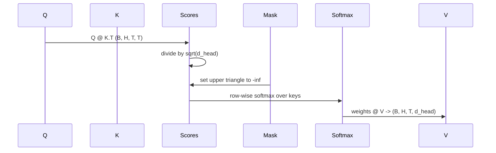

# 多头自注意力

> 一个线性投影，三个视图，H 个并行头，一个 mask。这就是模型实际使用的注意力模块。

**类型：** 构建
**语言：** Python
**前置课程：** Phase 04 课程、Phase 07 transformer 课程、本阶段第 30 至 32 课
**时间：** 约 90 分钟

## 学习目标
- 将批量 Query/Key/Value 投影实现为单个线性层，然后拆分为 H 个头。
- 使用正确的归一化和 dtype 处理计算 scaled dot-product attention。
- 应用因果 mask，防止某个位置关注未来位置。
- 检查固定输入的逐头注意力权重，推理每个头在关注什么。
- 在一个 toy 任务上训练小型注意力模块，观察 loss 随头的特化而下降。

## 背景

注意力是让一个 token 的表示从同一序列中其他 token 拉取信息的函数。自注意力意味着 query、key 和 value 都来自同一输入。多头意味着投影被拆分为 H 个并行的注意力问题，其输出被拼接后再投影回来。

高效实现模式是一个线性层从 `D` 投影到 `3 * D`，然后切分为三个视图，再 reshape 为 H 个大小为 `D // H` 的头。矩阵乘法、softmax 和加权求和作为批量张量运算执行，使各头在加速器上并行运行。

本课构建该模块。它还添加了因果 mask，使同一代码可以作为 decoder-only 语言模型中的注意力层。下一课将该模块堆叠为完整的 transformer，再下一课训练它。

## 形状约定

输入是 `(B, T, D)`。输出是 `(B, T, D)`。Mask 是 `(T, T)` 或可广播到该形状。模块内部中间张量的形状为 `(B, H, T, d_head)`，其中 `d_head = D // H`。约束条件是 `D % H == 0`。

```mermaid
flowchart LR
    A["(B, T, D) input"] --> B[Linear D -> 3D]
    B --> C["split into Q, K, V"]
    C --> D["reshape to (B, H, T, d_head)"]
    D --> E["scores = Q @ K.T / sqrt(d_head)"]
    E --> F[apply causal mask]
    F --> G[softmax over keys]
    G --> H["context = weights @ V"]
    H --> I["reshape to (B, T, D)"]
    I --> J[output Linear D -> D]
    J --> K["(B, T, D) output"]
```

两个线性层（QKV 投影和输出投影）是模块中仅有的参数。Mask、softmax、矩阵乘法和 reshape 都是无参数的。

## QKV 拆分

朴素实现有三个独立的线性层，分别用于 Q、K 和 V。高效实现用一个输出 `3 * D` 特征的单层，然后拆分结果。两者在数学上等价，因为三个独立的 `(D, D)` 权重矩阵乘法恰好等于一个由它们堆叠而成的 `(3D, D)` 权重的单次矩阵乘法。

高效版本更快，因为加速器只启动一次 matmul 而非三次。初始化也更简单，因为三个子矩阵位于同一个参数张量中，可以一起初始化。

## 头的 reshape

拆分后，Q、K、V 各自为 `(B, T, D)`。要将其变为 H 个并行注意力问题，我们 reshape 为 `(B, T, H, d_head)` 然后转置为 `(B, H, T, d_head)`。头维度现在紧邻 batch 维度，因此 PyTorch 将逐头注意力视为跨 `B * H` 个独立实例的批量操作。

d_head 维度保持在最后，使得分数矩阵乘法 `Q @ K.transpose(-2, -1)` 对其进行收缩。结果是 `(B, H, T, T)` 的逐头注意力分数。

## 缩放

分数在 softmax 之前除以 `sqrt(d_head)`。没有这个缩放，点积会随 `d_head` 增长而增大，将 softmax 推入一个条目几乎占据全部概率质量、其余条目趋近于零的区域。该区域的梯度很小，学习停滞。除以 `sqrt(d_head)` 使分数的方差在不同头大小下大致保持恒定。

## 因果 mask

Decoder-only 语言模型在预测下一个 token 时只能以过去为条件。Mask 强制执行这一点。具体来说，在 softmax 之前，`(T, T)` 分数矩阵对角线以上的每个条目被替换为负无穷。Softmax 之后这些位置的权重为零。

我们在构造时将 mask 注册为 buffer，使其与模型位于同一设备上且不属于梯度图。Mask 覆盖该模块将见到的最大上下文长度。前向传播时我们切取左上角的 `(T, T)` 部分。

## 输出投影

在逐头上下文向量 `(B, H, T, d_head)` 之后，我们转置回 `(B, T, H, d_head)`，reshape 为 `(B, T, D)`，然后应用最终的 `(D, D)` 线性投影。输出投影让模型混合各头。没有它，H 个头只能通过后续层重新组合，模块会被人为约束。

## 注意力权重检查

本课在前向传播中暴露了一个 `return_weights=True` 标志。设置后，模块在输出旁边返回形状为 `(B, H, T, T)` 的逐头注意力权重。Demo 在短输入上打印一个头的权重热力图，让你看到因果三角结构和逐位置的关注焦点。

在训练好的模型中，不同的头学到不同的模式。有些头关注紧邻的前一个 token。有些头关注序列开头。有些头几乎均匀地分散注意力。检查钩子是可解释性工作的入口。

## 训练 demo

`main.py` 底部的 demo 将注意力模块连接到一个小型 LM head，在一个重复任务上训练整个模型。输入的每一行是一个随机 id 在上下文中重复。目标是输入右移一位，因此模型必须学会下一个 token 与前一个相同。损失是交叉熵。在 H=4、D=32、T=12、词表大小 64 的配置下，loss 从随机值（约 `log(64) ~ 4.16`）在三个 epoch 内降到远低于 `1.0`（CPU 上运行）。

Demo 的目的不是训练一个有用的模型。目的是确认梯度流过模块的每个部分，且各头在一个答案显而易见的问题上学到了东西。

## 本课不涉及的内容

不添加前馈模块。真实模型中的 transformer 层是注意力后接一个两层 MLP，每个子层周围有残差连接和 layer norm。下一课添加这些。

不实现旋转位置编码或 AliBi。两者都在同一模块的 QKV 投影步骤应用，但它们是独立的教学单元。本课构建的模块通过在 matmul 之前变换 Q 和 K 即可兼容两者。

不实现推理用的 KV cache。跨前向传播缓存 key 和 value 是使自回归解码快速的优化。它改变了 K 和 V 张量的形状约定但不改变 Q。它属于推理课程。

## 如何阅读代码

`main.py` 定义了 `MultiHeadSelfAttention`。该类持有两个线性层和一个注册的 mask buffer。前向传播依次执行投影、reshape、计算分数、mask、softmax、加权、reshape 和再投影。底部的 demo 构建一个小模型，将注意力与token嵌入、位置嵌入和 LM head 包装在一起，在复制任务上训练三个 epoch，打印 loss 曲线和逐头注意力热力图。`code/tests/test_attention.py` 中的测试固定了形状约定、因果性、softmax 性质、头拆分性质和梯度流。

运行 demo，然后将 `n_heads` 从 4 增加到 8（保持 `d_model=32`，即 `d_head=4`），观察热力图的变化。
