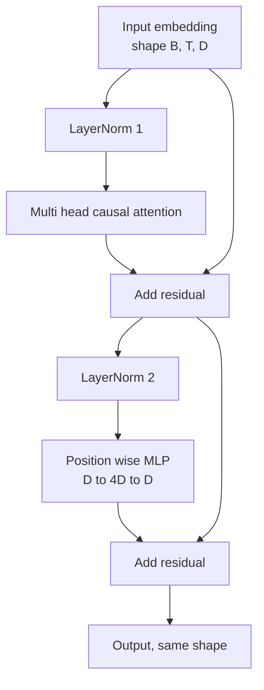
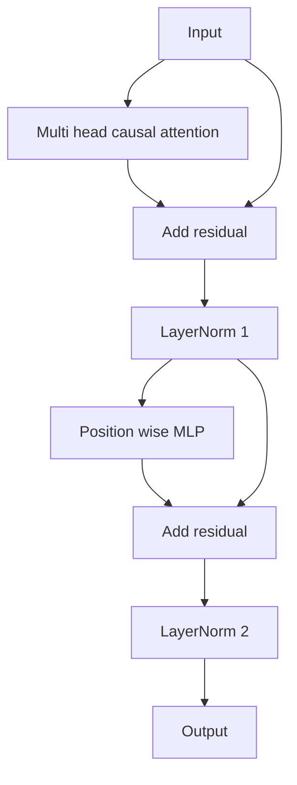

# 从零构建 Transformer Block

> 一个 block 是每个现代 decoder LLM 的基本单元。Layer norm、多头注意力、残差、MLP、残差。Pre-LN 变体无需 warmup 即可稳定训练。Post-LN 变体是原始论文发布的版本。本课并排构建两者，展示哪个能在常见学习率下撑过 12 层堆叠。

**类型：** 构建
**语言：** Python
**前置课程：** Phase 19 第 30 至 33 课（tokenizer、嵌入、注意力数学、批量数据加载器）
**时间：** 约 90 分钟

## 学习目标

- 用 PyTorch 从四个组件构建 transformer block：LayerNorm、多头因果注意力、残差连接、逐位置 MLP。
- 将 LayerNorm 放置在两种配置中（pre-LN 和 post-LN），并解释为什么其中一种无需 warmup 即可稳定训练。
- 在多头注意力内部实现因果 mask，使 token `i` 无法看到 token `j > i`。
- 在 12 层堆叠上追踪两种变体的梯度流，并读懂结果。
- 将该 block 作为即插即用单元，在下一课组装 1.24 亿参数的 GPT 时复用。

## 问题

Transformer 就是一个 block 重复堆叠。把 block 搞错一次，重复十二次，你就会发布一个在第一个 epoch 发散的模型，或者一路需要 warmup hack 的模型。本课中你会看到的两种失败模式并不罕见。它们在学习者第一次朴素堆叠 block 时就会出现。一种是注意力层关注了未来。另一种是 LayerNorm 放在了无法在深度上驯服残差信号的位置。

一旦看到问题，修复就是机械性的。Block 恰好有两条残差路径和两个归一化位置。正确选择位置，堆叠的其余部分就只是记账。

## 概念

每个 decoder-only transformer block 是一个函数，接收形状为 `(batch, sequence, embedding)` 的张量，返回相同形状的张量。内部有两个子层完成工作。



这是 pre-LN 变体。LayerNorm 位于残差分支内部，在子层之前。残差连接携带未归一化的信号向前传递。

Post-LN 变体将 LayerNorm 移到残差加法之后。



形状相同。训练行为不同。使用 post-LN 时，通过残差路径回传的梯度必须经过 LayerNorm。在深度十二、学习率 `3e-4` 时，该梯度缩小得足够快，需要 warmup schedule。Pre-LN 让残差路径保持未归一化，因此梯度能干净地传播到嵌入层。GPT-2 及之后的模型都采用 pre-LN 配置，原因就在于此。

### 因果多头注意力

注意力子层将输入三路投影为 query、key、value 张量。每个从 `(B, T, D)` reshape 为 `(B, H, T, D/H)`，其中 `H` 是头数。Scaled dot-product attention 逐头计算 `softmax(Q K^T / sqrt(d_k))`，将上三角 mask 为负无穷，通过 softmax 应用 mask，然后乘以 `V`。各头拼接回单个 `(B, T, D)` 张量并再投影一次。Mask 是使模型具有因果性的唯一部分。忘记 mask，你就在训练一个作弊的模型。

### MLP

逐位置 MLP 对每个 token 独立应用相同的两层网络。隐藏宽度是嵌入宽度的四倍，激活函数是 GELU，第二个线性层后接 dropout。MLP 内部没有 token 之间的交互。所有 token 混合都发生在注意力中。

### 残差连接做两件事

它们使梯度路径在深度上是加性的，从而在十二层中保持梯度范数在合理范围内。它们还让每个 block 学习对运行表示的加性更新，而非完全替换。这两个效果是 block 能扩展的原因。

## 构建

`code/main.py` 实现了：

- `class LayerNorm`：可学习的 scale 和 shift，带偏置的 eps，逐 token 向量应用。
- `class MultiHeadAttention`：`num_heads`、`head_dim = d_model // num_heads`、融合 QKV 投影、注册的因果 mask、注意力 dropout 和残差 dropout。
- `class FeedForward`：两个线性层、GELU 激活、dropout。
- `class TransformerBlock`：带 `pre_ln` 标志，在两种变体之间切换。
- 一个 demo，构建 6 层 pre-LN 堆叠和 6 层 post-LN 堆叠，使用相同输入，打印 (a) 输出形状，(b) 一次反向传播后嵌入处的梯度范数。

运行：

```bash
python3 code/main.py
```

输出：两个堆叠的形状检查，梯度范数并排对比。Pre-LN 堆叠的嵌入梯度比 post-LN 堆叠在相同学习率下大一个数量级，这就是 pre-LN 无需 warmup 即可训练的经验信号。

## 技术栈

- `torch` 用于张量数学、autograd 和 `nn.Module` 管道。
- 不使用 `transformers`，不使用预训练权重。Block 从原语实现。

## 生产中的实践模式

三个模式将教科书式的 block 变成可以发布的东西。

**融合 QKV 投影。** 三个独立线性层需要三次 kernel 启动和三次 matmul。一个宽度为 `3 * d_model` 的线性层在一次启动中完成相同工作，然后沿最后一个轴拆分输出。融合路径在每个加速器上都更快，与 GPT-2、LLaMA 和 Mistral 的参考实现一致。

**注册的因果 mask buffer。** Mask 只取决于最大上下文长度。在构造时用 `register_buffer` 分配一次，每次前向传播切取活跃窗口，跳过逐次调用的分配。忘记这一点会让 mask 在长上下文时成为分配器热点。

**Dropout 放在两个位置，不是三个。** Dropout 属于注意力 softmax 之后（attention dropout）和 MLP 第二个线性层之后（residual dropout）。在残差本身上加 dropout 会破坏让梯度在深度上流动的加性恒等式。一些早期实现搞错了这一点，代价是脆弱的训练。

## 使用

- 本课的 block 可以直接插入第 35 课的 GPT 组装中，无需修改。
- Pre-LN 变体是每个现代开源 LLM 使用的配置。Post-LN 变体是 2017 年原始注意力论文使用的配置。了解两者足以阅读你将遇到的任何 decoder 架构。
- 将 GELU 换成 SiLU 就得到 LLaMA 系列的激活函数。将 LayerNorm 换成 RMSNorm 就得到 LLaMA 系列的归一化。骨架相同。

## 练习

1. 给 block 中每个线性层添加 `bias=False` 标志。现代开源 LLM 的线性层不带偏置。测量在 12 层 768 维模型中节省了多少参数。
2. 用手写的 RMSNorm 替换 `nn.LayerNorm`，验证输出形状不变。
3. 添加一个标志，返回第一个头的注意力权重作为 `(B, T, T)` 张量。绘制上三角以确认 softmax 后为零。
4. 构建一个健全性检查：将 `(2, 16, 384)` 张量以 `H=6` 通过两种变体，断言当权重初始化相同且 dropout 设为零时，前向输出不同（例如 `not torch.allclose`）。

## 关键术语

| 术语 | 常见说法 | 实际含义 |
|------|----------|----------|
| Pre-LN | "Pre norm" | LayerNorm 在残差分支内部，位于每个子层之前；残差携带未归一化的信号 |
| Post-LN | "Post norm" | LayerNorm 在残差加法之后；2017 年论文发布的版本，需要 warmup |
| 因果 mask | "三角 mask" | 注意力 logits 的上三角设为负无穷，使 token i 无法读取 j > i 的 token |
| 融合 QKV | "合并投影" | 一个宽度为 3D 的线性层代替三个宽度为 D 的线性层；一次 kernel，一次 matmul |
| 残差流 | "跳跃连接" | 从上到下流过每个 block 的未归一化张量；每个 block 向其添加内容 |

## 延伸阅读

- Phase 7 第 02 课（从零实现自注意力）了解本 block 底层的注意力数学。
- Phase 7 第 05 课（完整 transformer）了解同一骨架的编码器-解码器版本。
- Phase 10 第 04 课（预训练 mini GPT）了解本 block 插入的训练流程。
- Phase 19 第 35 课（本轨道）将十二个这样的 block 堆叠为 GPT 模型。
