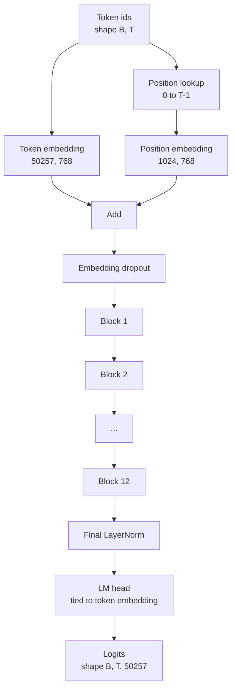
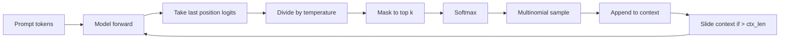

# GPT 模型组装

> 十二个 block 堆叠，一个token嵌入，一个可学习位置嵌入，一个最终 LayerNorm，一个权重绑定的语言模型 head。这就是完整的 1.24 亿参数 GPT 模型。本课将这些部件组装为一个可工作的类，计算参数量以确认模型匹配参考 124M 的形状，并使用多项式采样、temperature 和 top-k 生成文本。

**类型：** 构建
**语言：** Python
**前置课程：** Phase 19 第 30 至 34 课
**时间：** 约 90 分钟

## 学习目标

- 将第 34 课的 transformer block 组装为完整的 GPT 模型：token嵌入、位置嵌入、N 个 block、最终 LayerNorm、语言模型 head。
- 复现 1.24 亿参数配置：vocab 50257、context 1024、embedding 768、十二个头、十二层。
- 将语言模型 head 的权重绑定到token嵌入，并解释为什么在此规模下节省了约 3800 万参数。
- 使用多项式采样、temperature 缩放和 top-k 截断从 prompt 生成文本，用滑动窗口维持上下文长度。
- 对照 124M 目标测量参数量和前向传播开销。

## 问题

Transformer block 本身什么都做不了。你需要将 token id 转为向量，混入位置信息，通过堆叠运行，然后投影回词表 logits。忘记这四步中的任何一步，模型要么无法前向传播，要么丢失位置信息，要么无法"说话"。

模型的形状也很重要。参考 GPT-2 small 在上述配置下恰好是 1.24 亿参数。这些数字不是魔法。Vocab 50257 乘以 embedding 768 是 token 表。Position 1024 乘以 768 是位置表。十二个 block 每个约 700 万参数，共 8400 万。最终 head 通过 weight tying 复用 token 表。把各部分加起来就得到 1.24 亿。如果你构建的模型参数量与参考不匹配，说明接线有误。

## 概念



Token id 变为 token 向量。Position id 变为位置向量。两者相加后送入堆叠。最终 LayerNorm 是 block 之外在每个现代变体中都保留的唯一部分。LM head 复用token嵌入矩阵，这就是 weight tying 的含义。

### Weight tying

Token嵌入的形状是 `(vocab, d_model)`。语言模型 head 需要从 `d_model` 投影回 `vocab`。两者互为转置。绑定两者意味着字面上是同一个参数张量，使用两次。在 vocab 50257 和 d_model 768 时，该矩阵是 3800 万参数。不绑定，你付两次代价。绑定后只付一次，而且梯度信号也更干净，因为嵌入和 head 一起更新。

### 位置嵌入是可学习的，不是正弦的

GPT-2 使用可学习位置嵌入。位置表是一个形状为 `(1024, 768)` 的参数张量。模型在每次前向传播时查找位置 0 到 T-1 并加到token嵌入上。这是最简单的位置方案（RoPE、ALiBi、T5 相对偏置是替代方案），也是 124M 参考使用的方案。

### 生成：temperature、top-k、多项式采样

生成是自回归的。每一步，模型在每个位置返回完整词表上的 logits。你只取最后一个位置，除以 temperature，可选地将除 top k 之外的所有 logits mask 为负无穷，softmax 得到概率，然后从结果分布中采样一个 token。



三个旋钮，三种不同行为。Temperature 接近零退化为贪心。Temperature 为一匹配模型的自然分布。Top-k 为一是贪心。Top-k 为四十过滤长尾。组合很重要；下一课的训练将生成作为定性评估信号。

## 构建

`code/main.py` 实现了：

- `class GPTConfig` dataclass，124M 默认值：`vocab_size=50257`、`context_length=1024`、`d_model=768`、`num_heads=12`、`num_layers=12`、`mlp_expansion=4`、`dropout=0.1`、`use_bias=True`、`weight_tying=True`。
- `class GPTModel`：token嵌入、位置嵌入、embedding dropout、十二个 `TransformerBlock`、最终 LayerNorm，以及在标志开启时绑定到token嵌入的 `lm_head`。
- `count_parameters` 辅助函数，返回唯一参数量（因此 weight tying 在计数中被尊重）。
- `generate` 函数，执行 temperature、top-k、多项式采样和滑动窗口上下文。
- 一个 demo，构建模型，打印参数量与参考 124M 的对比，从固定 prompt 生成短序列以展示端到端流水线。

运行：

```bash
python3 code/main.py
```

输出：参数量与 124M 参考的对比、从随机 prompt 生成的 token id、以及当 tying 开启时 LM head 和token嵌入共享存储的确认。

为保持 demo 快速，脚本还用一个小配置（`d_model=64`、`num_layers=2`）端到端运行并内联打印生成的 token 序列。124M 配置被构建但只执行其参数量计算和一次前向传播。

## 技术栈

- `torch` 用于张量数学、autograd 和模块管道。
- `code/main.py` 在本地重新实现了第 34 课的相同 block 模式。

## 生产中的实践模式

三个模式区分了能运行的模型和能发布的模型。

**残差投影初始化要小。** 注意力的输出投影和 MLP 的第二个线性层都直接馈入残差加法。用与其他线性层相同的标准差初始化它们会使残差流随深度增长，将最终 LayerNorm 推入过热区域。将这两个投影的 std 缩放 `1 / sqrt(2 * num_layers)`；残差流在十二层中保持在合理范围。

**缓存位置 id 张量，不要重新计算。** `torch.arange(T)` 在每次前向传播时分配新内存。在 `__init__` 中为最大上下文分配一次，每次调用切取前 T 个条目，跳过分配器往返。

**在参数级别绑定权重，不只是复制。** 设置 `lm_head.weight = token_embedding.weight` 共享张量；复制则不会。优化器需要更新一个参数，autograd 图需要一次累积。如果你复制，head 会偏离嵌入，weight tying 就毫无意义。

## 使用

- 本课的模型类与下一课训练的形状相同。
- 将可学习位置嵌入替换为 RoPE，就得到 LLaMA 系列，无需改动 block 或 head。
- 将 GELU 替换为 SiLU，将 LayerNorm 替换为 RMSNorm，就得到 LLaMA 系列的其余变化。
- 生成函数适用于任何 logits 来源，不仅限于本模型。你可以在第 37 课从预训练 GPT-2 文件拉取 logits，复用相同的生成循环。

## 练习

1. 解除 LM head 与token嵌入的绑定并重新计算参数量。验证差值为 50257 乘以 768 = 3800 万。
2. 将可学习位置嵌入替换为构造时计算的正弦表。确认模型仍能前向传播且参数量减少 786,432。
3. 给生成添加 `greedy=True` 标志，跳过采样直接取 argmax。确认序列在多次运行中是确定性的。
4. 添加 `repetition_penalty` 旋钮，在 softmax 之前将 prompt 或生成历史中任何 token 的 logit 除以一个常数。在固定 prompt 上展示大于一的值减少输出中的重复次数。
5. 在 `top_k` 旁边添加 `top_p`（nucleus）采样。两行检查：保留 token 的概率之和超过 `top_p`。

## 关键术语

| 术语 | 常见说法 | 实际含义 |
|------|----------|----------|
| Weight tying | "绑定嵌入" | LM head 和token嵌入共享同一个参数张量；节省 vocab 乘以 d_model 个参数，匹配 GPT-2 参考 |
| 位置嵌入 | "可学习位置" | 形状为 (context length, d_model) 的独立表，加到 token 向量上；端到端学习 |
| 滑动窗口上下文 | "上下文上限" | 当 prompt 加生成 token 超过上下文长度时，丢弃最旧的 token 使活跃窗口适配 |
| Top-k 采样 | "K 截断" | 保留值最高的 K 个 logits，将其余 mask 为负无穷，对剩余部分 softmax |
| Temperature | "采样温度" | softmax 前将 logits 除以 T；T < 1 锐化，T = 1 保持自然分布，T > 1 平坦化 |

## 延伸阅读

- Phase 19 第 34 课了解本模型堆叠的 block。
- Phase 19 第 36 课了解用交叉熵损失驱动本模型的训练循环。
- Phase 19 第 37 课了解将预训练 GPT-2 权重加载到此架构中。
- Phase 7 第 07 课（GPT 因果语言建模）了解下一 token 预测的数学。
- Phase 10 第 04 课（预训练 mini GPT）了解同一架构上的原始训练流程。
