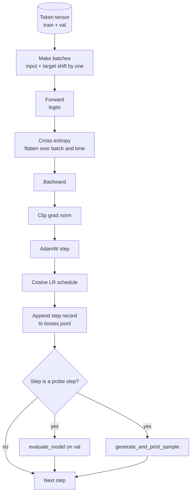

# 训练循环与评估

> 不做测量的循环是在说谎。本课构建驱动 GPT 模型的训练循环：带 weight decay 分组的 AdamW、warmup 加 cosine 学习率调度、`calc_loss_batch` 辅助函数、在留出数据上的 `evaluate_model` 评估、每 K 步的 `generate_and_print_sample` 定性探针，以及可绘图的 JSONL 损失日志。同一骨架可以训练你将来构建的每一个 decoder LLM。

**类型：** 构建
**语言：** Python
**前置课程：** Phase 19 第 30 至 35 课
**时间：** 约 90 分钟

## 学习目标

- 构建一个训练循环，使用正确的输入-目标对齐计算下一 token 预测的交叉熵损失。
- 配置 AdamW，将 weight decay 应用于权重张量而非 LayerNorm 或偏置张量。
- 实现带线性 warmup 和 cosine 衰减的学习率调度，并读取随时间变化的 LR。
- 使用 `evaluate_model` 在留出集上评估，使 eval loss 在不同运行间可比较。
- 每 K 步用 `generate_and_print_sample` 生成定性样本，在 loss 曲线之前捕捉发散。
- 将逐步损失持久化到 JSONL，以便重新加载、绘图，并将训练日志作为交付物。

## 问题

一个只打印 loss 而不做其他事情的训练脚本会以三种方式失败。它无法告诉你 loss 下降是否出于正确原因（模型可能过拟合训练集而从未学到东西）。它无法告诉你发散是否正在开始（loss 可能在一步中飙升然后恢复，或一步飙升然后崩溃）。它无法告诉你模型学到了什么（loss 是标量；生成的样本是一段话）。除非循环做测量，否则这三种失败都是隐藏的。

本课的循环以三种方式测量。每步的训练 batch loss。每 K 步的留出 batch loss。每 K 步从固定 prompt 生成的续写。训练日志落地为 JSONL，使产出物成为循环的证词。

## 概念



两个不太直观的部分是损失对齐和 AdamW decay 分组。

### 损失对齐

模型在每个位置预测下一个 token。如果输入 batch 是 token `[t0, t1, t2, t3]`，目标 batch 必须是 `[t1, t2, t3, t4]`。交叉熵在展平形状 `(batch * seq, vocab)` 对展平目标 `(batch * seq,)` 上计算。忘记位移，你就在训练模型预测自身，loss 会收敛到零但什么有用的都没学到。

### AdamW decay 分组

Weight decay 正则化权重张量但不正则化归一化 scale 或偏置。对 LayerNorm scale 施加 decay 会慢慢将 scale 驱向零并破坏归一化。对偏置施加 decay 在数学上无害但浪费计算。标准分组是：矩阵形状的张量（线性权重、嵌入表）施加 decay，看起来像 scale 或 shift 的不施加。

### Warmup 加 cosine 调度

Warmup 在几百步内将学习率从零爬升到目标值，让优化器状态有时间填充。Cosine 衰减在剩余步数中将学习率降回接近零，使最终阶段以小步长微调权重。这个组合是开源 LLM 训练中最常见的调度，因为它消除了前一千步和最后一千步中大部分脆弱时刻。

### 留出集评估

`evaluate_model` 从验证集运行固定数量的 batch，累积 loss，除以 batch 数，返回。无梯度。无 dropout。给定相同种子和相同划分，该数字在不同运行间可复现。将留出 loss 与训练 loss 并排报告是发现过拟合的方法。

### 定性采样作为早期信号

一个训练 loss 下降良好但生成样本全是同一个 token 的模型是坏的。一个 loss 曲线看起来平坦但生成样本逐渐锐化为连贯词语的模型正在学习。定性探针比阅读完整曲线更快，能捕捉标量遗漏的模式。

## 构建

`code/main.py` 实现了：

- `make_batches(token_ids, batch_size, context_length)`：将长 token 张量切片为输入和目标对。
- `calc_loss_batch(model, inputs, targets)`：前向传播、展平、返回标量交叉熵。
- `evaluate_model(model, val_loader, max_batches)`：无梯度迭代固定数量的验证 batch，返回平均 loss。
- `generate_and_print_sample(model, prompt, max_new_tokens)`：在固定 prompt 上运行第 35 课的生成函数并打印结果。
- `build_param_groups(model, weight_decay)`：生成两组 AdamW 参数列表。
- `cosine_with_warmup(step, warmup_steps, total_steps, max_lr, min_lr)`：返回给定步数的 LR。
- `train(...)`：运行循环，持久化 `outputs/losses.jsonl`，每 `eval_every` 步打印 eval loss 和样本。
- 一个 demo，在合成数据上训练小模型少量步数，写入 JSONL 日志，在探针点打印 eval loss 和样本。Demo 在 CPU 上远不到一分钟即可完成。

运行：

```bash
python3 code/main.py
```

输出：逐步 loss 行、每个探针步的 eval loss、每个探针步的生成样本，以及最终的 `outputs/losses.jsonl`（可用 `json.loads` 逐行加载）。

## 技术栈

- `torch` 用于 autograd、优化器和模块。
- `main.py` 在本地重新实现了第 35 课的 `GPTModel` 和支持模块。

## 生产中的实践模式

三个模式将教科书循环变成可以通宵运行的东西。

**梯度范数裁剪不可商量。** 一个坏 batch（异常数据、LR 尖峰、数值边界情况）产生巨大梯度，抹掉数小时的训练。`torch.nn.utils.clip_grad_norm_(params, max_norm=1.0)` 在 `backward` 之后、`step` 之前保持优化器在安全范围内。裁剪值是自由参数；1 是在大多数设置中存活的默认值。

**可恢复的 JSONL 日志，而非 pickle 状态。** 逐步 loss 记录为 `{"step": int, "train_loss": float, "lr": float}` 行的 JSONL 是持久的：任何崩溃都留下可读的产出物，你可以 grep，可以用三十行 Python 绘图，可以通过读取最后一步来恢复训练。Pickle 状态将你绑定到产生该文件的确切模块布局，跨重构时很脆弱。

**Eval batch 从固定切片抽取。** 验证 token 在脚本启动时被切片为 batch，而非动态生成。可复现性取决于 eval batch 在不同运行间完全相同；否则比较两次运行的 eval loss 测量的是 batch shuffle 而非模型。

## 使用

- 本课的循环与训练 124M 模型在真实数据上的骨架相同。将合成 token 张量换成 `datasets` 风格的加载器，循环无需修改即可运行。
- JSONL 日志是将训练运行转化为证据的交付物。下一课用它来比较新训练的 checkpoint 与预训练的。
- 定性样本探针是标量 loss 无法替代的万能捕手。

## 练习

1. 添加 `weight_decay_groups()` 单元测试，确认 scale 和 bias 参数落入无 decay 组，线性和嵌入权重落入 decay 组。
2. 将合成随机 token 替换为小文本文件的字节，使 demo 在可读内容上训练。验证生成样本使用了文件中存在的字符。
3. 给 cosine 调度添加 `min_lr` 下限为 `max_lr` 的 10%，重新绘图。
4. 除 JSONL 日志外，每 `eval_every` 步保存一个 checkpoint。添加 `resume_from` 标志，重新加载模型状态和优化器状态。
5. 在 loss 旁边记录逐步吞吐量（每秒 token 数），确认其保持在稳定区间。

## 关键术语

| 术语 | 常见说法 | 实际含义 |
|------|----------|----------|
| 损失对齐 | "位移一" | 输入 token 在位置 0..T-1，目标 token 在位置 1..T；交叉熵在展平形状上计算 |
| Decay 分组 | "两组" | AdamW 对矩阵形状张量施加 weight decay，对 scale 或 bias 张量不施加 |
| Warmup | "爬坡" | 学习率在固定步数内从零爬升到目标值，让优化器状态有时间填充 |
| Eval batch | "留出 batch" | 验证 token 张量的固定切片，脚本启动时切一次，每次探针时完全相同地使用 |
| 定性探针 | "样本打印" | 每 K 步从固定 prompt 生成的短续写，用于捕捉仅靠 loss 无法发现的失败模式 |

## 延伸阅读

- Phase 19 第 35 课了解循环驱动的模型。
- Phase 19 第 37 课了解将预训练权重加载到同一模型中。
- Phase 10 第 04 课（预训练 mini GPT）了解在真实数据上的流程。
- Phase 10 第 10 课（评估）了解交叉熵损失之外的更广泛评估面。
