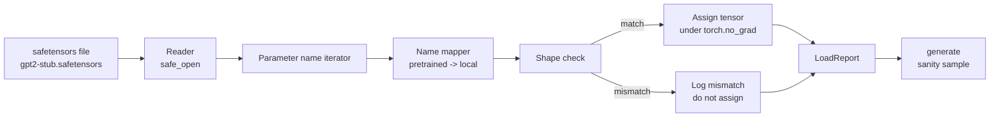

# 加载预训练权重

> 从零训练一个 1.24 亿参数的模型是预算决策；加载一个已发布的 checkpoint 是日常操作。本课将预训练的 GPT-2 风格权重从 safetensors 文件加载到第 35 课的精确架构中，逐一讲解参数名称映射，并通过生成续写来验证加载成功。无网络、无第三方加载器、无不透明的魔法。

**类型：** 构建
**语言：** Python
**前置课程：** Phase 19 第 30 至 36 课
**时间：** 约 90 分钟

## 学习目标

- 使用 `safetensors` Python 库读取 safetensors 文件并检查张量名称和形状。
- 将每个预训练参数名称映射到第 35 课 GPT 模型内部的参数。
- 处理已发布 GPT-2 权重与本轨道模型之间的两种命名约定差异：`wte/wpe/h.N.attn.c_attn/c_proj` 和 `mlp.c_fc/c_proj` 对应本地命名的 `tok_embed/pos_embed/blocks.N.attn.qkv/out_proj` 和 `mlp.fc1/fc2`。
- 在任何权重赋值之前检测并拒绝形状不匹配，给出清晰错误。
- 用加载的权重生成短续写，确认 token 来自加载的分布而非随机初始化的分布。

## 问题

已发布的权重不是为你的架构打包的。它们携带原始实现使用的名称。预训练文件有 `transformer.h.0.attn.c_attn.weight`，形状 `(2304, 768)`；你的模型期望 `blocks.0.attn.qkv.weight`，形状 `(2304, 768)`（同一矩阵但布局约定不同），或者你的模型使用 `nn.Linear`，它以转置方式存储矩阵。同一个参数以三种微妙不同的身份出现（名称、形状、字节布局），加载器必须协调这三者。

盲目复制的加载器把正确的张量放在错误的位置，你得到一个生成胡言乱语的模型。形状不同时拒绝复制但不记录任何信息的加载器让你猜测哪个张量没有落地。本课的加载器是显式的：每次赋值都被记录，每个形状都被检查，`LoadReport` 汇总命中、缺失和形状不匹配，让你能读懂发生了什么。

## 概念



名称映射器只是一个字符串到字符串的函数。形状检查是一个 if。赋值在 `torch.no_grad()` 内发生，使 autograd 不追踪加载。报告持有每个名称的结果。

### GPT-2 命名约定

已发布的 GPT-2 权重使用如下名称：

| 预训练名称 | 形状 | 含义 |
|------------|------|------|
| `wte.weight` | (50257, 768) | Token嵌入 |
| `wpe.weight` | (1024, 768) | 位置嵌入 |
| `h.N.ln_1.weight` | (768,) | Block N 的 LayerNorm 1 scale |
| `h.N.ln_1.bias` | (768,) | Block N 的 LayerNorm 1 shift |
| `h.N.attn.c_attn.weight` | (768, 2304) | 融合 QKV 线性权重 |
| `h.N.attn.c_attn.bias` | (2304,) | 融合 QKV 线性偏置 |
| `h.N.attn.c_proj.weight` | (768, 768) | 注意力输出投影 |
| `h.N.attn.c_proj.bias` | (768,) | 注意力输出投影偏置 |
| `h.N.ln_2.weight` | (768,) | LayerNorm 2 scale |
| `h.N.ln_2.bias` | (768,) | LayerNorm 2 shift |
| `h.N.mlp.c_fc.weight` | (768, 3072) | MLP fc1 权重 |
| `h.N.mlp.c_fc.bias` | (3072,) | MLP fc1 偏置 |
| `h.N.mlp.c_proj.weight` | (3072, 768) | MLP fc2 权重 |
| `h.N.mlp.c_proj.bias` | (768,) | MLP fc2 偏置 |
| `ln_f.weight` | (768,) | 最终 LayerNorm scale |
| `ln_f.bias` | (768,) | 最终 LayerNorm shift |

需要预先规划的两个意外。`c_attn`、`c_proj`、`c_fc` 线性层存储的矩阵相对于 `nn.Linear.weight` 期望的是转置的。加载器在赋值时转置。LM head 根本不在文件中；模型依赖与 `wte` 的 weight tying，因此 head 在 `wte` 落地后通过别名设置。

### 本地命名约定

本轨道的模型使用描述性名称：

| 本地名称 | 含义 |
|----------|------|
| `tok_embed.weight` | Token嵌入 |
| `pos_embed.weight` | 位置嵌入 |
| `blocks.N.ln1.scale` | Block N 的 LayerNorm 1 scale |
| `blocks.N.ln1.shift` | LayerNorm 1 shift |
| `blocks.N.attn.qkv.weight` | 融合 QKV |
| `blocks.N.attn.qkv.bias` | 融合 QKV 偏置 |
| `blocks.N.attn.out_proj.weight` | 注意力输出投影 |
| `blocks.N.attn.out_proj.bias` | 输出投影偏置 |
| `blocks.N.ln2.scale` | LayerNorm 2 scale |
| `blocks.N.ln2.shift` | LayerNorm 2 shift |
| `blocks.N.mlp.fc1.weight` | MLP fc1 |
| `blocks.N.mlp.fc1.bias` | MLP fc1 偏置 |
| `blocks.N.mlp.fc2.weight` | MLP fc2 |
| `blocks.N.mlp.fc2.bias` | MLP fc2 偏置 |
| `final_ln.scale` | 最终 LayerNorm scale |
| `final_ln.shift` | 最终 LayerNorm shift |

映射是一个固定函数。本课将其作为加载器迭代的字典提供。

### Stub fixture

真实 GPT-2 权重有 0.5 GB。Demo 不下载它们；它在首次运行时生成一个小的 safetensors fixture，使用精确的 GPT-2 命名约定和适合 d_model 192（而非 768）的 12 block 模型的形状。Fixture 具有正确的结构来执行加载器中的每条代码路径。将 fixture 换成真实文件，加载器无需修改即可工作。

## 构建

`code/main.py` 实现了：

- 第 35 课 `GPTModel` 的小型副本，使本课自包含。
- `make_pretrained_to_local(num_layers)`：展开逐层条目。
- `load_safetensors(model, path)`：迭代名称、映射、检查形状、转置 conv1d 风格权重、在 `torch.no_grad()` 下赋值。返回 `LoadReport`。
- `make_stub_safetensors(path, cfg)`：生成使用精确预训练命名约定的 fixture 文件。
- 一个 demo：首次运行时创建 `outputs/gpt2-stub.safetensors`，构建新模型，捕获随机初始化的一次生成续写，加载 stub，捕获另一次续写，打印两者，验证两者不同（加载确实改变了模型）。

运行：

```bash
python3 code/main.py
```

输出：fixture 路径、逐名称加载日志、`LoadReport` 摘要、加载前的续写、加载后的续写，以及一个故意注入 fixture 的坏张量上的形状不匹配（以执行失败路径）。

## 技术栈

- `safetensors` 用于磁盘格式和流式读取器。
- `torch` 用于模型和赋值数学。
- 不使用 `transformers`、不使用 `huggingface_hub`、无网络调用。

## 生产中的实践模式

三个模式让加载器在面对你未创建的权重时存活。

**赋值前始终验证文件。** 打开文件，列出每个张量名称及其 dtype 和形状，运行完整映射和形状检查，只有成功后才开始赋值。半加载的模型是静默失败机器。

**记录每次赋值的源名称和目标名称。** 当某些东西看起来不对时，日志告诉你哪个张量落在了哪里；替代方案是读十六进制转储。本课的 `LoadReport` dataclass 追踪 `loaded`、`missing`、`unexpected` 和 `shape_mismatch` 列表，最后打印摘要。

**LM head 是 weight tying 别名，不是单独的副本。** 加载 `tok_embed` 后设置 `model.lm_head.weight = model.tok_embed.weight` 是规范模式。将嵌入矩阵复制到新的 `lm_head.weight` 参数会破坏绑定并悄悄使参数量翻倍。

## 使用

- 加载器适用于任何使用预训练命名约定的 safetensors 文件。真实 GPT-2 文件（small / medium / large / xl）无需代码修改即可工作；只有模型配置不同。
- 同一模式扩展到 LLaMA、Mistral、Qwen 权重，只需更新名称映射。形状检查和报告保持不变。
- 加载后的健全性生成是快速门控：如果加载后的样本看起来像加载前的样本，说明加载没有改变模型，意味着映射静默地错过了每个张量。

## 练习

1. 给加载器添加 `dtype` 参数，在赋值时将每个张量转换为目标 dtype（`bfloat16`、`float16`、`float32`）。确认 `float32` 模型可以降精度到 `bfloat16` 并仍能生成。
2. 添加 `expected_layers` 参数，拒绝加载 `h.N` 索引与模型 `num_layers` 不匹配的 checkpoint。
3. 将加载器插入第 35 课的生成函数，并排产生两个样本：一个来自随机初始化，一个来自加载的 fixture。
4. 添加导出路径：使用预训练命名约定将当前模型状态写入新的 safetensors 文件。往返加载器并确认报告零形状不匹配。
5. 扩展 `NAME_MAP` 以处理 LLaMA 命名约定（无偏置、RMSNorm、融合 qkv 布局），在你生成的 stub LLaMA fixture 上重新运行加载器。

## 关键术语

| 术语 | 常见说法 | 实际含义 |
|------|----------|----------|
| 名称映射 | "Key 重映射" | 从预训练张量名称到本地参数名称的函数；通常是一个字面字典，每层索引通过循环展开 |
| 形状不匹配 | "Bad shape" | 预训练张量在映射名称下存在但维度与本地参数不一致；加载器拒绝赋值并记录该对 |
| 加载时转置 | "Conv1d 布局" | 已发布的 GPT-2 以 nn.Linear 期望的转置方式存储注意力和 MLP 投影；加载器在赋值时转置 |
| Weight tying 别名 | "共享 LM head" | 设置 model.lm_head.weight = model.tok_embed.weight 使 head 和嵌入共享存储；head 不在文件中正是因为这个 |
| 加载报告 | "覆盖率摘要" | 一个小 dataclass，追踪 loaded、missing、unexpected 和 shape_mismatch 列表；打印它是判断加载是否成功的方式 |

## 延伸阅读

- Phase 19 第 35 课了解接收权重的架构。
- Phase 19 第 36 课了解产生相同形状 checkpoint 的训练循环。
- Phase 10 第 11 课（量化）了解内存紧张时如何处理加载的权重。
- Phase 10 第 13 课（构建完整 LLM 流水线）了解加载和推理的完整生命周期。
