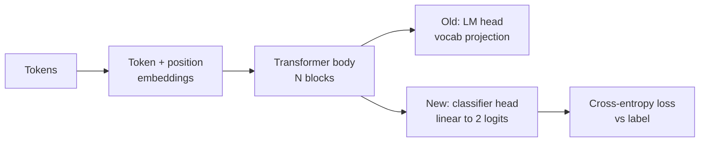
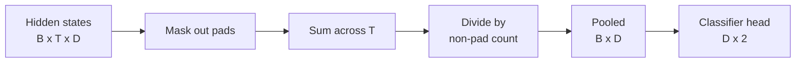
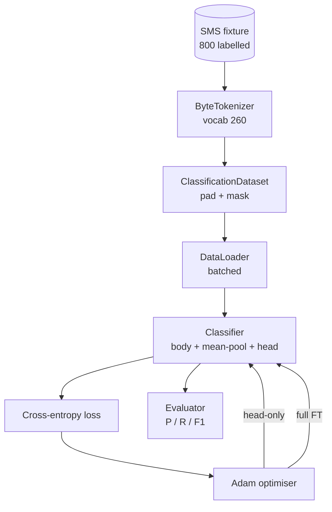

# Capstone 第 38 课：通过 Head 替换进行分类器微调

> Track B 的第一个 capstone。预训练语言模型是一叠自注意力 block，末端接一个 token 预测 head。当你想要垃圾邮件 vs 正常邮件时，head 是错的但 body 大部分是对的。本课把 head 拆掉，在池化表示上粘一个二分类线性层，然后用两种方式训练分类器：仅最后一层，和全量微调。评估指标是留出集上的 precision、recall 和 F1。你将学到每种策略的收益和代价。

**类型：** 构建
**语言：** Python (torch, numpy)
**前置课程：** Phase 19 第 30-37 课（NLP LLM 轨道：tokenizer、嵌入表、注意力模块、transformer body、预训练循环、checkpoint、生成、perplexity）
**时间：** 约 90 分钟

## 学习目标

- 在不重新初始化 body 的情况下，将语言模型 head 替换为分类 head。
- 实现两种训练方案：冻结 body（仅 head）和全量微调，共享同一个训练循环。
- 构建一个 tokenizer 感知的数据流水线，处理 padding、mask padding 和池化注意力输出。
- 从原始 logits 计算 precision、recall、F1 和混淆矩阵。
- 推理参数量、训练时间和提升空间之间的权衡。

## 问题

你在通用语料上预训练了一个小型 transformer。输出 head 将最后隐藏状态投影到 1000 token 的词表。现在你有 800 条标注为垃圾邮件或正常邮件的短信，想要一个二分类器。存在三种选择。

错误的选择是在 800 个样本上从零训练一个新分类器。预训练模型的 body 已经编码了有用的结构：词身份、位置、简单共现。丢弃它浪费了构建它的计算。

两种正确的选择是冻结 body 的 head 替换，和 body 可训练的 head 替换。仅 head 训练快速，内存几乎免费，在这么少的数据上很少过拟合。全量微调更慢，在小数据上可能过拟合，但当下游领域偏离预训练语料时能达到更高准确率。

本课构建两者，让你在同一 fixture 上比较。

## 概念

模型是函数 `f_theta(tokens) -> hidden_states`。Head 是函数 `g_phi(hidden) -> logits`。替换 head 意味着保留 `theta` 并替换 `g_phi`。Body 的参数是昂贵的部分。Head 是单个线性层。

两组可训练参数很重要：

- `theta`（body）：每个注意力 block 数万个权重。
- `phi`（head）：`hidden_dim * num_classes` 个权重加一个偏置。

在仅 head 训练中，你对 `phi` 计算梯度，对 `theta` 置零。PyTorch 通过对 body 参数设置 `requires_grad=False` 来实现。优化器只看到 head，body 保持冻结。

在全量微调中，你让梯度流回整个堆叠。Body 的权重漂移以适应分类目标。风险是小数据上的灾难性遗忘：body 的预训练被过拟合噪声冲刷掉。

## 池化问题

分类器需要每个序列一个向量，而非每个 token 一个向量。三种常见选择：

- **Mean pool**：对序列上的隐藏状态取平均，按 attention mask 加权。
- **CLS pool**：前置一个特殊 token，只使用其输出。这是 BERT 的做法。
- **Last-token pool**：使用最后一个非 padding token。这是 GPT 类分类器的做法。

本课使用带显式 attention-mask 加权的 mean pooling。它最简单，在不同序列长度上给出稳定信号，且不需要预训练 CLS token。

## 数据

八百条短信，平衡的 400 垃圾邮件和 400 正常邮件，在 `code/main.py` 中确定性生成。生成器使用固定种子，选择模板并替换槽位填充，发出 5 到 25 个 token 长的消息。真实数据集有本 fixture 没有的噪声。Fixture 的目的是可复现性。

数据按 80/20 划分：640 训练，160 测试。划分是分层的，测试集保持 50/50 平衡。已知平衡的留出集让 precision 和 recall 可以被诚实地解读。

## 指标

二分类，class 1 为正类（垃圾邮件）。计数为：

- `TP`：预测垃圾邮件，实际是垃圾邮件。
- `FP`：预测垃圾邮件，实际是正常邮件。
- `FN`：预测正常邮件，实际是垃圾邮件。
- `TN`：预测正常邮件，实际是正常邮件。

三个核心指标：

- `precision = TP / (TP + FP)`。被标记为垃圾邮件的消息中，实际是垃圾邮件的比例？
- `recall = TP / (TP + FN)`。实际垃圾邮件中，模型标记了多少？
- `F1 = 2 * P * R / (P + R)`。两者的调和平均。

混淆矩阵将四个计数打印为 2x2 网格。Demo 为两种训练方案都将其输出到 stdout。

## 架构

Body 是一个刻意很小的 transformer：vocab 260、hidden 64、4 头、2 block、最大序列 32。它小到可以在 CPU 上九十秒内将两种方案都训练到收敛。本课中它没有预训练；取而代之的是 `pretrain_quick` 辅助函数在同一 fixture 的文本上做五个 epoch 的 LM 训练，给 body 一个非平凡的起点。这使本课自包含。

## 你将构建什么

实现是一个 `main.py` 加一个测试模块（`code/tests/test_main.py`）。

1. `ByteTokenizer`：将字节映射为 id，保留一个 pad id。
2. `Block`：带多头注意力和前馈层的 transformer block。Pre-norm。
3. `LMBody`：token + 位置嵌入加一叠 block。返回隐藏状态。
4. `MeanPool`：序列轴上的 mask 加权平均。
5. `Classifier`：body、pool、线性 head。Body 在两种方案中是同一实例。
6. `freeze_body` 和 `unfreeze_body`：切换 body 参数的 `requires_grad`。
7. `train_classifier`：一个共享循环。接受模型和为可训练参数组配置的优化器。
8. `evaluate`：运行测试集并返回 `Metrics(precision, recall, f1, confusion)`。
9. `run_demo`：简短预训练 body，然后训练和评估仅 head，然后全量，打印两份报告，成功退出零。

## 为什么比较很重要

仅 head 方案通常训练更快且欠拟合更优雅。在此 fixture 上，你通常会看到二十个 epoch 的仅 head 训练后 precision 接近 0.9、recall 接近 0.85。全量微调大约需要三倍时间，最终结果在几个百分点内浮动，取决于随机种子。

本课不选赢家。它教你读懂数字和代价。在 800 个样本和小 body 上，仅 head 是正确选择。在 80,000 个样本和更大 body 上，全量微调开始有回报。你从本课带走的约定是 API：同一个 `train_classifier` 函数处理两者，切换只需一次调用。

## 扩展目标

- 添加第三种方案，只解冻最后一个 block。这有时被称为部分微调。它比全量 FT 便宜，比仅 head 学到更多。
- 添加学习率调度器。Head 上的 cosine 调度加 body 上更小的常数率是常见的生产设置。
- 将 mean pooling 替换为可学习的 attention pool：一个带单个可学习 query 的小注意力层。这在较长序列上通常优于 mean pool。

实现给你提供了钩子。测试固定了约定。数字由你来推动。
