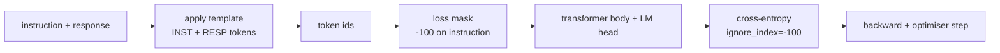
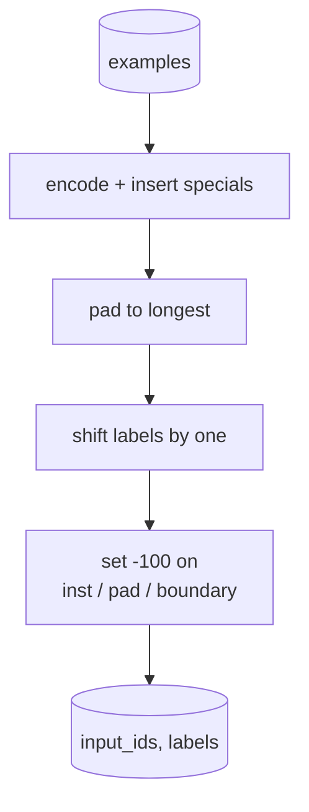
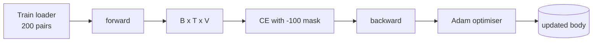

# Capstone 第 39 课：通过监督微调进行指令微调

> 预训练的 base 模型可以延续序列但无法遵循指令。监督微调（SFT）是修复这一问题的最小改动：给模型配对的指令和期望回复示例，训练 body 预测回复 token。关键在于你只想让 loss 计算回复部分，而非指令部分。本课构建一个 Alpaca 风格的 SFT 循环，使用自定义 collate 函数将指令 token 用 `ignore_index=-100` mask 掉，在 200 个指令-回复对上训练，并在留出集上用 exact-match 评估。

**类型：** 构建
**语言：** Python (torch, numpy)
**前置课程：** Phase 19 第 30-37 课（NLP LLM 轨道：tokenizer、嵌入表、注意力模块、transformer body、预训练循环、checkpoint、生成、perplexity）
**时间：** 约 90 分钟

## 学习目标

- 将配对的指令-回复数据格式化为带显式边界 token 的单一因果序列。
- 构建一个 collate 函数，mask 指令 token 使交叉熵只计算回复 token。
- 在 SFT 目标下训练小型 transformer body，观察 eval 指标变化。
- 实现尊重回复起始边界的贪心和 temperature 采样生成。
- 在生成的补全上计算留出集 exact-match。

## 问题

在下一 token 预测上训练的 base 模型不知道什么是指令。给它字符串 `"What is the capital of France?"` 它会继续问题或编造新句子。模型有语言能力但没有格式约定。

SFT 约定是一个字符串模板。每个训练样本变成一个带三个区域的单一序列：

```text
<INST> What is the capital of France? <RESP> The capital of France is Paris.
```

边界 token 是训练时保留的特殊 token。模型学到 `<RESP>` 之后的一切是回复，回复是被评分的部分。Base 模型的下一 token 目标仍然适用；只是在每个样本都有这种形状的语料上训练。

但有一个陷阱。如果你将整个序列喂给普通交叉熵损失，你也在训练模型预测指令 token。指令是给定的。你想要那些位置上零梯度。修复方法是 mask。

## 概念



`ignore_index` 是 `torch.nn.functional.cross_entropy` 的特性。任何等于 `ignore_index` 的目标位置贡献零 loss 和零梯度。PyTorch 中的约定是 `-100`。Collate 函数为每个样本构建两个张量：`input_ids`（完整序列）和 `labels`（`input_ids` 的副本，指令位置被覆写为 `-100`）。

模型在前向传播中看到整个序列；注意力可以关注指令。Loss 只计算回复 token。这正是你想要的：以指令为条件，预测回复。

## 数据

两百个指令-回复对在 `main.py` 中确定性生成。它们覆盖六种任务类型：

- 事实单轮（X 的首都）
- 算术
- 列表提取
- 一句话摘要
- 代码（print、sort）
- 定义

每种任务有模板化的指令和确定性的回复。这是刻意简单的。Exact-match 很脆弱，本课使用正确答案是一个特定字符串的 fixture。真实 SFT 数据集需要模糊指标；原理相同。

划分为 160 训练、40 测试。测试集覆盖所有六种任务类型，可以报告逐类别 exact-match。

## 分词和 Padding

Tokenizer 是字节级的，有三个保留特殊 token：

- `INST_ID = 256`：标记指令区域的开始。
- `RESP_ID = 257`：标记指令和回复之间的边界。
- `PAD_ID = 258`：变长 batch 的 padding。

序列是 `[INST] inst_bytes [RESP] resp_bytes [PAD]*`。Collate 函数：

1. 对每个样本分词。
2. 将 batch 中每个样本 pad 到 batch 中最长序列的长度。
3. 构建 `labels` = `input_ids` 右移一位（因果 LM 目标），其中：
   - 指令区域替换为 `-100`。
   - Padding 区域替换为 `-100`。
   - `RESP_ID` 边界位置本身替换为 `-100`（你不训练模型预测边界 token；它预测的是边界之后的内容）。



位移是标准因果技巧：`input_ids` 的位置 `i` 预测位置 `i+1`，所以 `labels[i] = input_ids[i+1]`（最后一个位置从输入中丢弃，第一个从目标中丢弃）。Mask 在位移之后应用以落在正确位置。

## 训练



循环是标准 PyTorch SFT 循环。Adam，学习率约 3e-4 到 1e-3，在此 fixture 上十到二十个 epoch，无调度器。模型足够小（hidden 96、2 block、最大长度 64），可以在 CPU 上两分钟内训练到收敛。

每五个 epoch 循环在留出集上运行一次小型 eval 并打印 exact-match。观察 exact-match 从 epoch 一的 0.0 到 epoch 十五的约 0.85 是本课的回报：你可以看到模型同时学习格式和答案。

## 生成

评估时模型获得指令前缀 `[INST] inst_bytes [RESP]` 并生成 token 直到：

- 序列达到 `max_len`，或
- 模型发出特殊停止启发式：两个连续的句末字节（`.`、`!`、`?`）。

本课提供贪心解码加可选的 temperature 采样器。Exact-match 使用贪心，因为 temperature 会使指标随机化。真实系统通常采样然后模糊判断；那个流水线是第 41 课。

## Exact-Match 评估

Exact-match 是最严格的文本指标。预测的回复字符串被归一化（小写、去除空白、折叠双空格）并与同样归一化的参考回复比较。指标对每个样本要么是 1 要么是 0。聚合值是均值。

真实 SFT 流水线用 token 级 F1（第 41 课）和 judge 模型补充 exact-match。Exact-match 仍然有用因为它是无歧义的；如果它说 0.7，恰好 70% 的测试指令逐字符产生了金标准回复。

## 你将构建什么

实现是一个 `main.py` 加测试。

1. `InstructionTokenizer`：带保留特殊 token 的字节级编码器。编码指令前缀或完整对。
2. `make_dataset`：用固定种子跨六种任务类型生成 200 对。
3. `SFTDataset`：每个样本返回 `(input_ids, labels)`，已准备好 mask。
4. `sft_collate`：动态 padding，构建 batch 张量，在指令和 pad 位置设置 `-100`。
5. `TinyGPT`：transformer body 加绑定或非绑定 LM head。
6. `train_sft`：SFT 循环，带逐 epoch eval 钩子。
7. `generate`：从前缀因果解码，贪心或采样，带停止启发式。
8. `exact_match`：归一化字符串比较，返回 `[0, 1]` 中的浮点数。
9. `run_demo`：构建数据，训练二十个 epoch，评估，打印逐类别分解，成功退出零。

## 为什么 mask 很重要

没有 mask，loss 将指令 token 视为目标。模型学习预测指令。这是一个不同的目标，以两种方式产生更差的模型。第一，模型容量浪费在重建用户总是提供的输入上。第二，回复 loss 在梯度总和中更小，因为大多数 batch 中指令 token 多于回复 token；优化器在你关心的部分上的有效学习率低于你的意图。Mask 不是润色；它就是目标。

## 扩展目标

- 添加学习率 warmup 后接 cosine 衰减。SFT 比预训练对 LR 更敏感。
- 添加逐 token loss 日志并绘制训练过程中的 loss 曲线。注意早期 epoch 由模板 token（`<RESP>`、常见前缀）主导，后期 epoch 由实际答案 token 主导。
- 将 eval 扩展到 BLEU-1 或 chrF。Exact-match 低估了产生相同答案的改写的模型。
- 添加多轮格式的 chat 模板，在包含后续对话的 fixture 上训练。

实现给你提供了格式约定、mask 和循环。从 base 模型到指令遵循者的目标变化就是一个 collate 函数。
