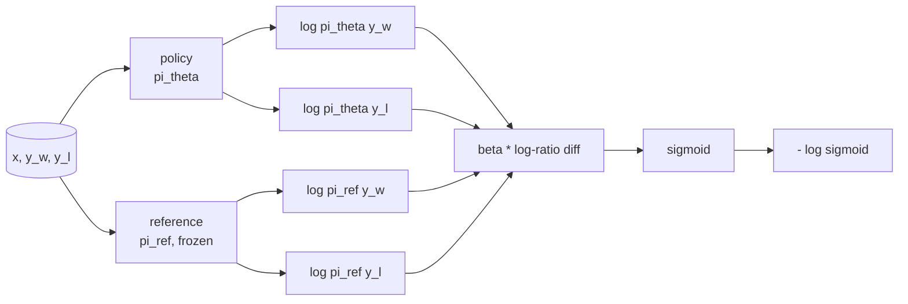
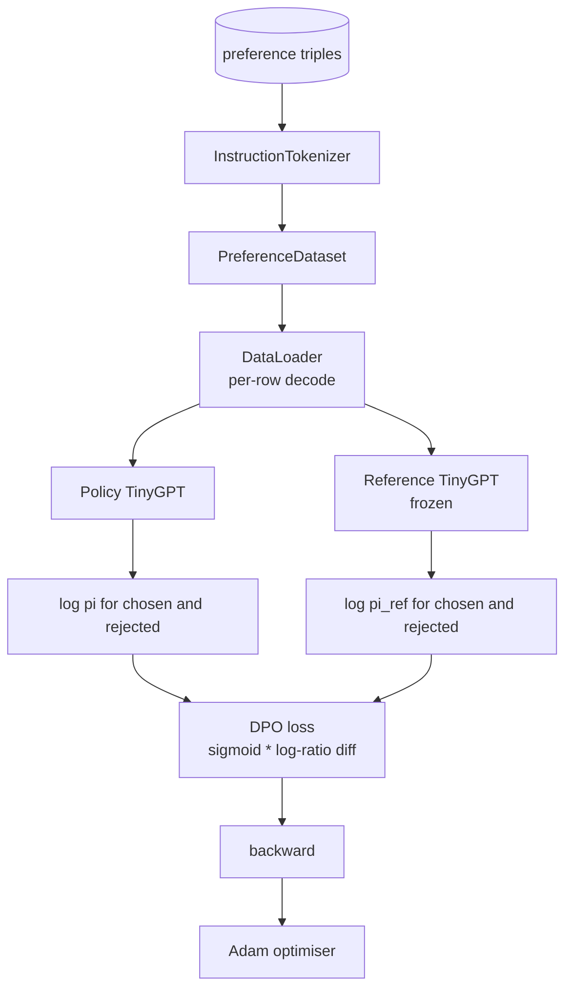

# Capstone 第 40 课：从零实现直接偏好优化

> 奖励模型和 PPO 是经典的 RLHF 技术栈。DPO 将该栈折叠为单一监督损失，直接对偏好对拟合策略。本课从奖励差恒等式推导 DPO 损失，提供可工作的参考模型加策略模型，计算逐 token 对数概率，并在 chosen 和 rejected 补全的偏好 fixture 上训练小型 transformer。测试固定了损失数学和梯度方向，确保实现与论文一致。

**类型：** 构建
**语言：** Python (torch, numpy)
**前置课程：** Phase 19 第 30-37 课（NLP LLM 轨道：tokenizer、嵌入表、注意力模块、transformer body、预训练循环、checkpoint、生成、perplexity）
**时间：** 约 90 分钟

## 学习目标

- 将 DPO 损失推导为缩放对数比差的 sigmoid，并将其与隐式奖励联系起来。
- 构建参考模型 + 策略模型对，参考冻结，策略可训练。
- 在两个模型下计算序列级对数概率，mask prompt token。
- 在 `(prompt, chosen, rejected)` 三元组上训练策略，观察 chosen 对数概率相对于 rejected 上升。
- 用测试固定损失数学、梯度符号和参考不变性。

## 问题

你有一个 SFT 模型。它遵循指令，但输出质量参差不齐；有些补全清晰，有些冗长或错误。你还有一个小型偏好对数据集：对于同一 prompt，人类标记了一个补全为 chosen，另一个为 rejected。

经典 RLHF 答案是两阶段流水线。在偏好上训练奖励模型。用 PPO 对奖励优化策略。这可行但昂贵：PPO 期间两个模型在内存中，KL 控制使策略接近参考，奖励模型脆弱时的 reward hacking。

DPO 用单一监督损失替代两个阶段。奖励模型从不显式存在。策略直接在偏好对上训练，带有对 SFT 参考的显式 KL 惩罚。在 Bradley-Terry 偏好模型下相同的最优解，代码少得多。

## 概念

从 Bradley-Terry 模型开始。给定 prompt `x` 和两个补全 `y_w`（chosen）和 `y_l`（rejected），人类偏好 `y_w` 的概率是

```text
P(y_w > y_l | x) = sigmoid( r(x, y_w) - r(x, y_l) )
```

其中 `r` 是某个潜在奖励函数。RLHF 先从偏好拟合 `r`，然后训练策略 `pi` 以带 KL 锚的方式最大化 `r`：

```text
max_pi   E_{x, y~pi} [ r(x, y) ] - beta * KL(pi || pi_ref)
```

DPO 推导观察到该目标下的最优策略 `pi*` 有关于 `r` 的闭式解：

```text
pi*(y | x) = (1/Z(x)) * pi_ref(y | x) * exp( r(x, y) / beta )
```

对 `r` 重新整理：

```text
r(x, y) = beta * ( log pi*(y | x) - log pi_ref(y | x) ) + beta * log Z(x)
```

`log Z(x)` 项对 `y_w` 和 `y_l` 相同（它取决于 `x` 而非 `y`），因此在计算偏好差时抵消：

```text
r(x, y_w) - r(x, y_l) = beta * ( log pi_theta(y_w|x) - log pi_ref(y_w|x)
                                - log pi_theta(y_l|x) + log pi_ref(y_l|x) )
```

代入 Bradley-Terry sigmoid 并对偏好对取负对数似然：

```text
L_DPO(theta) = - E_{(x, y_w, y_l)} [
  log sigmoid( beta * ( log pi_theta(y_w|x) - log pi_ref(y_w|x)
                       - log pi_theta(y_l|x) + log pi_ref(y_l|x) ) )
]
```

这就是损失。它是每个样本一个标量上的 sigmoid，由四个对数概率计算得出。无单独奖励模型。无 PPO。损失中无 KL 项；KL 约束已烘焙在闭式推导中。



## 梯度的符号

任何训练运行前的有用健全性检查。对 `log pi_theta(y_w | x)` 求梯度：

```text
d L_DPO / d log pi_theta(y_w | x) = - beta * (1 - sigmoid(z))
```

其中 `z` 是 sigmoid 的参数。这对所有 `z` 为负，意味着：增加策略对 chosen 补全的对数概率会降低损失。对称地，对 `log pi_theta(y_l | x)` 的梯度为正：增加 rejected 对数概率会增加损失。训练将 chosen 推高、rejected 推低。参考是冻结的；它不动。

## 数据

十二个偏好三元组随课程提供。每个是 `(prompt, chosen, rejected)`。Chosen 补全简短精确。Rejected 冗长、跑题或错误。这些对覆盖与第 39 课相同的任务族（首都、算术、列表），因此从 SFT base 开始的策略有合理的起点。

Fixture 刻意很小。DPO 在生产中使用数万对；这里的重点是损失数学和循环在小数据集上端到端运行，且 chosen-versus-rejected 对数概率差距可见地增长。

## 参考不变性

DPO 实现必须小心处理参考模型。参考是冻结的 SFT 模型。三个性质必须成立：

- 参考参数永远不接收梯度。
- 参考对数概率在 epoch 之间永远不变。
- 策略从与参考相同的权重开始。（最优 `theta` 是参考加上学习到的更新；将策略初始化为参考的副本是定义良好的起点。）

实现通过以下方式强制执行：

- 在前向传播中将参考包装在 `torch.no_grad()` 中。
- 对每个参考参数设置 `requires_grad=False`。
- 在参考构建后通过 `policy.load_state_dict(reference.state_dict())` 构造策略。

## 架构



模型是第 39 课使用的同一 TinyGPT（decoder-only、因果、字节 tokenizer）。参考和策略共享架构；策略的权重在训练中偏离参考，而参考保持固定。

## 你将构建什么

实现是一个 `main.py` 加测试。

1. `InstructionTokenizer`：带 `INST` 和 `RESP` 特殊 token 的字节 tokenizer。与第 39 课形状相同。
2. `TinyGPT`：decoder-only transformer。与第 39 课形状相同，即使你跳过了 39 课本课也自包含。
3. `make_preferences`：返回十二个 `(prompt, chosen, rejected)` 三元组。
4. `sequence_log_prob`：给定模型、prompt 前缀和补全，返回补全上下一 token 对数概率的总和（无 prompt 位置贡献）。
5. `dpo_loss`：接受四个对数概率和 `beta`，返回逐样本损失张量和用于日志的隐式奖励差。
6. `train_dpo`：逐 epoch 循环，在策略和参考下计算 chosen 和 rejected 对数概率，应用损失，步进 Adam。
7. `evaluate_margins`：返回任意时刻策略下的平均 chosen-rejected 对数概率边际。
8. `run_demo`：从小型 warmup 预训练构建参考和策略，复制权重，训练三十步，打印逐步损失和边际，成功退出零。

## 为什么 DPO 有效

DPO 在 Bradley-Terry 偏好模型下与 RLHF 数学等价，直到奖励的参数化。隐式奖励 `r(x, y) = beta * (log pi(y|x) - log pi_ref(y|x))` 从偏好中可识别，直到 `x` 的函数，该函数在差中抵消。闭式策略让你跳过显式奖励模型。KL 约束是结构性强制的：`pi` 对 `pi_ref` 的任何偏离使对数比更大，sigmoid 饱和，当策略移动太远时梯度被抑制。参考是你的安全网。

## 扩展目标

- 给对数概率总和添加长度归一化：除以补全长度。长度偏差是已知的 DPO 失败模式，模型优先选择较短补全因为其对数概率绝对值更大。
- 添加 IPO 变体的损失：将 sigmoid + log 替换为 `(z - 1)^2`。在 fixture 上比较收敛。
- 添加标签平滑参数，在硬 chosen-rejected 标签和均匀 0.5 之间插值。
- 将参考替换为更小更便宜的模型（知识蒸馏风味）。

实现给你提供了损失、参考不变性和训练循环。数学是课程。代码使数学具体化。
