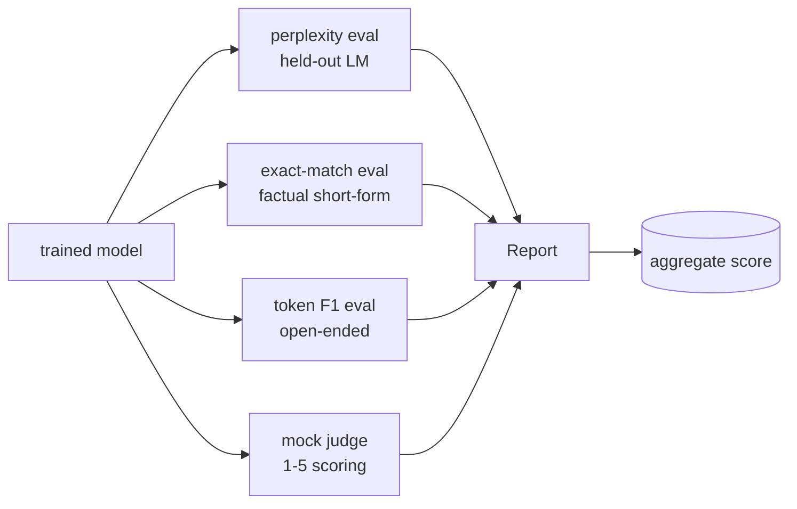
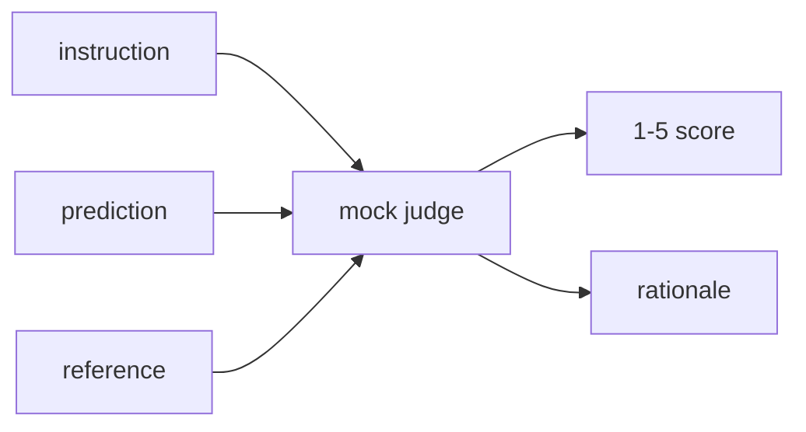
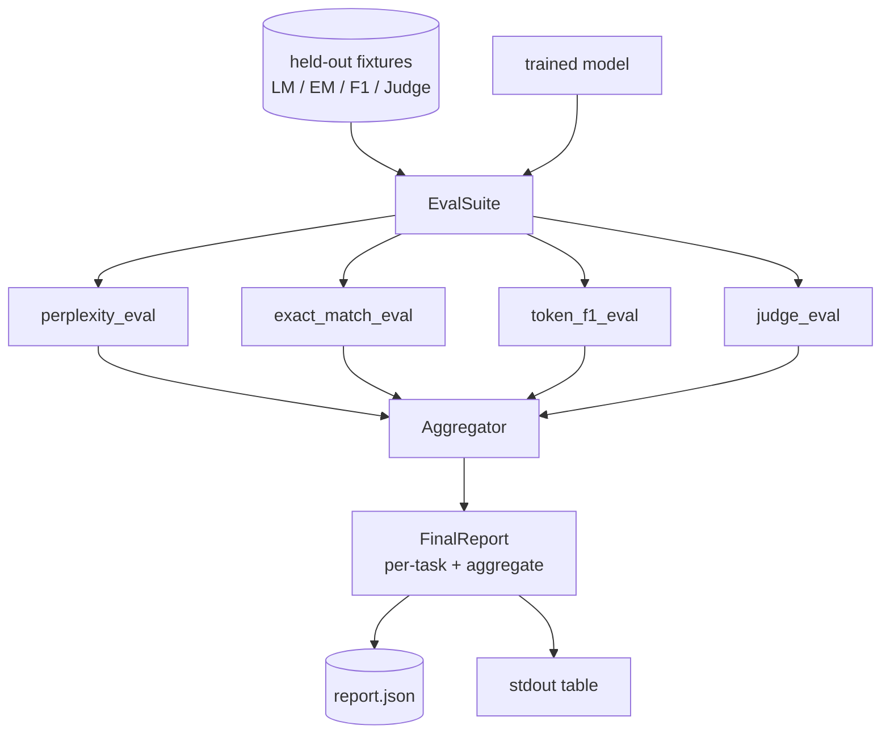

# Capstone 第 41 课：完整评估流水线

> 训练是你可以用 loss 曲线监控的部分。评估是你必须设计的部分。本课构建一个统一的 eval 流水线，接受任何训练好的语言模型，在其上运行四种异构评估，将结果聚合为逐任务报告，并提供一个本地 mock LLM-as-judge 使循环无需网络即可运行。四种 eval 覆盖每个发布模型需要的维度：语言建模（perplexity）、短答正确性（exact-match）、开放式相似度（token F1）和定性评分（judge）。

**类型：** 构建
**语言：** Python (torch, numpy)
**前置课程：** Phase 19 第 30-37 课（NLP LLM 轨道：tokenizer、嵌入表、注意力模块、transformer body、预训练循环、checkpoint、生成、perplexity）
**时间：** 约 90 分钟

## 学习目标

- 在小型 transformer 上用 masked-token 计数计算留出集 perplexity。
- 在短答事实 prompt 上运行 exact-match eval。
- 用归一化计算预测和参考字符串之间的 token 级 F1。
- 构建一个本地 mock LLM-as-judge，在 1-5 分制上评分模型输出。
- 将四种 eval 聚合为带逐任务分解的单一加权报告。

## 问题

单一指标永远无法描述一个语言模型。Perplexity 说明模型拟合语言分布的程度，但对它是否能回答问题一无所知。Exact-match 说明模型是否产生了金标准字符串，但惩罚正确的改写。Token F1 容忍改写但会被与错误内容的词汇重叠所欺骗。LLM-as-judge 捕捉定性维度但昂贵且随机。

你真正想要的流水线有全部四种。每种 eval 覆盖其他遗漏的维度。每种在为该指标塑造的不同留出数据子集上运行。最终报告并排显示逐任务数字和聚合值，让审阅者一眼看出模型在做什么权衡。

本课端到端构建该流水线，在一个文件中。

## 概念

每种 eval 是从 `(model, dataset) -> EvalResult` 的函数。结果携带指标值、用于检查的逐样本详情和用于聚合的名称。流水线用配置组合它们，配置说明运行哪些 eval 以及如何加权。

## Perplexity，正确计数

Perplexity 是 `exp(每 token 平均负对数似然)`。实现有两个陷阱：

- 均值必须在实际 token 位置上计算，而非 batch * sequence。Padding token 必须从分母中排除，否则 perplexity 会看起来比实际好。
- 模型预测下一个 token，所以位置 `i` 的 logits 预测位置 `i+1` 的 token。这里的 off-by-one 错误是静默的：loss 仍然训练，但指标变得无意义。

Eval 计算非 pad 位置上的逐 batch `-log p(token)` 总和和逐 batch token 计数，最后相除。这比对逐 batch perplexity 取平均（会低估短序列的权重）在数值上更安全，且匹配教科书定义。

## Exact-match，带归一化

评估框架在比较前对预测和参考都进行归一化：

- 小写。
- 去除周围空白。
- 将内部连续空白折叠为单个空格。
- 如果两边仅在标点上不同，去除尾部终止标点（`.`、`!`、`?`）。

归一化使 exact-match 在实践中有用。说 `"Paris"` 的模型是对的；说 `"Paris."` 的也是对的；说 `"  paris  "` 的也是对的。归一化后指标仍要求答案是相同字符串。

## Token F1，正确的方式

Token F1 是在 bag-of-tokens 上计算的 precision 和 recall 的调和平均。步骤：

1. 归一化预测和参考（与 exact-match 相同规则）。
2. 将每个拆分为 token 列表（空白分词）。
3. 计算多重集交集。
4. Precision = `intersection_count / len(pred_tokens)`。Recall = `intersection_count / len(ref_tokens)`。F1 = 调和平均。

如果预测和参考都为空，F1 为 1（空匹配）。如果只有一个为空，F1 为 0。此模式匹配 SQuAD 评估参考，在改写间产生稳定数字。

## 本地 Mock LLM-as-Judge

真实 judge 是 API 背后的前沿模型。本课中 judge 必须离线运行。Mock judge 是确定性评分器，接受指令、模型预测和参考，返回 `{1, 2, 3, 4, 5}` 中的分数加一行理由。评分规则是显式的：

- 5：归一化预测等于归一化参考。
- 4：预测和参考之间的 token F1 至少 0.8。
- 3：token F1 在 `[0.5, 0.8)` 中。
- 2：token F1 在 `[0.2, 0.5)` 中。
- 1：其他情况。

这不是真实 judge，但它有正确的接口。之后换成真实模型只需改一个函数。流水线不关心。

## 聚合

聚合是归一化 eval 分数的加权平均。每种 eval 报告自己在 `[0, 1]` 中的数字：

- Perplexity：归一化为 `1 / (1 + log(perplexity))`。Perplexity 为 1 映射到 1，无穷映射到 0。
- Exact-match：已在 `[0, 1]` 中。
- Token F1：已在 `[0, 1]` 中。
- Judge：除以 5。

权重可配置。默认混合是 0.2 perplexity、0.3 exact-match、0.3 token F1、0.2 judge。权重选择是产品决策；本课暴露旋钮让你实验。

## 架构

`EvalSuite` 是一个薄编排器。每个单独的 eval 是一个自由函数，接受 `(model, tokenizer, dataset, config)` 并返回 `EvalResult`。`Aggregator` 收集结果并产生最终报告。Demo 打印表格并写入一份 JSON 副本供下游 CI 消费。

## 你将构建什么

实现是一个 `main.py` 加测试。

1. `TinyGPT`：第 38-40 课使用的同一 decoder-only 架构，包含在内使本课独立。
2. `InstructionTokenizer`：带 INST / RESP / PAD 特殊 token 的字节 tokenizer。
3. 四个 fixture：一个 LM 语料、一个 EM 集、一个 F1 集和一个 judge 集。每个二十个样本，确定性。
4. `perplexity_eval`：返回带 perplexity 值和逐 token loss 直方图的 `EvalResult`。
5. `exact_match_eval`：返回平均 EM 和逐样本记录。
6. `token_f1_eval`：返回平均 token F1 和逐样本记录。
7. `mock_judge` 和 `judge_eval`：逐样本分数和理由，集合上的平均分。
8. `Aggregator.normalise`：逐 eval 归一化规则。
9. `Aggregator.aggregate`：加权平均和组装的报告。
10. `run_demo`：简短训练小模型，运行全部四种 eval，打印报告表格并写入 JSON，成功退出零。

## 阅读报告

报告有三层。顶层是聚合分数。下面是四个逐 eval 数字。再下面是用于诊断的逐样本分解。失败的 CI 运行通常想要聚合值，但追踪回归的审阅者想要逐样本分解以查看模型在哪些输入上出错。

JSON 转储使用稳定的 key，使 CI 仪表板可以跨版本绘制趋势线。美化打印的表格是给训练运行后盯着终端的人看的。

## 扩展目标

- 添加校准 eval：模型的 softmax 概率是否匹配其准确率？按置信度分桶预测并报告每桶的经验准确率。
- 添加鲁棒性 eval：给每个样本标记扰动（错别字、改写、干扰项）并报告每种扰动的指标下降。
- 将 mock judge 替换为 HTTP 调用背后的真实模型。函数签名不变。
- 添加逐任务权重学习：不用固定权重，拟合权重到模型间的目标偏好顺序。

实现给你提供了四种 eval、聚合器和报告。真实评估流水线在此之上叠加更多维度；模式保持不变：每种 eval 一个函数，一个聚合器，一份报告。
