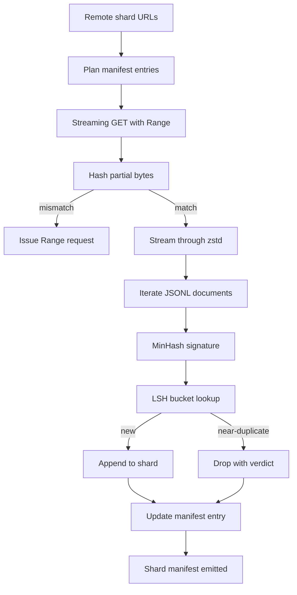

# 大规模语料下载器

> 训练语言模型远在第一次前向传播之前就开始了。语料必须落盘、解压、去重、可寻址，而且在网络在 4% 处断开之前就要把恢复方案想好。本课构建一个流式下载器，拉取压缩分片，用 Zstandard 即时解压，通过 MinHash 加局部敏感哈希对近似重复进行指纹识别，并写入一个流水线其余部分可以信任的分片清单。

**类型：** 构建
**语言：** Python
**前置课程：** Phase 19 第 30-37 课
**时间：** 约 90 分钟

## 学习目标

- 用 `urllib` 流式拉取远程分片，用 `zstandard` 解压，不将整个文件缓冲到内存。
- 通过对已验证字节偏移发起 HTTP `Range` 请求来恢复部分下载。
- 为每个文档构建 MinHash 签名并用 LSH 分桶，使近似重复发生碰撞。
- 输出带内容哈希、字节大小、文档数和去重判定的分片清单。

## 问题

第一次在 200 GB 语料上训练时，网络在 41% 处断开，脚本以 `urllib` 异常退出。第二次在 78% 处断开。到 99% 时你已经重写了三次循环。从第一分钟就必须为之设计的两个失败是部分下载恢复和重复文档移除。两者都有成熟方案；两者都经常被跳过，因为流水线始于一行 `requests.get` 调用然后逐渐长出了牙齿。

恢复是 HTTP 问题。服务器必须支持 `Range`，客户端必须追踪已验证偏移对应的磁盘记录，已验证偏移必须在进程死亡后存活。如果偏移和文件哪怕差一个字节，恢复的下载就写入垃圾，语料以一种只在分词时才暴露的方式被损坏。

去重是签名问题。精确哈希去重会漏掉近似重复：同一篇维基百科文章带三种不同的样板页脚，同一代码文件带不同的许可证头，同一博客文章每个链接带不同的追踪参数。MinHash 加 LSH 以亚线性代价捕捉这些。代价是每个文档一个签名和每个签名一次桶查找。

## 概念



### 用 `urllib` 流式传输

标准库 `urllib.request.urlopen` 返回类文件对象。将其包装在 `zstandard.ZstdDecompressor().stream_reader` 中，字节从网络流经解压器进入文档迭代器，永远不会将压缩分片或解压分片整体物化到内存中。唯一的内存开销是行缓冲区、当前文档的 MinHash 签名和 LSH 索引。

### 用 `Range` 恢复

下载器为每个分片写两个文件：分片本身和一个 `.partial.json` checkpoint。Checkpoint 记录 `verified_bytes`、`expected_size`、`sha256_prefix`（在前 `verified_bytes` 字节上计算）和源 URL。启动时下载器读取 checkpoint，在磁盘字节上重新计算 `sha256_prefix`，只有重新计算的哈希匹配时才恢复。如果哈希错误，部分文件被丢弃，下载从字节零重新开始。静默损坏不可能发生，因为已验证字节是被检查的，而非假设的。

### MinHash 加 LSH

MinHash 在固定空间中估计两个集合的 Jaccard 相似度。对于文档，集合是其文本的 shingle（重叠 n-gram）。签名是 `k` 个最小哈希值，每个独立哈希函数一个。Jaccard 相似度为 `s` 的两个文档在签名的任何单个分量上一致的概率为 `s`。

LSH 然后将 `k` 个分量分为 `b` 个 band，每个 `r` 行，其中 `k = b * r`。两个文档在至少一个 band 中碰撞的概率为 `1 - (1 - s^r)^b`，这是围绕你调节 `(b, r)` 的 `s` 值的尖锐阈值。典型语料去重的阈值是 `s = 0.8`，LSH 研究文献用 `k = 128`、`b = 32`、`r = 4` 达到。

### 分片清单作为约定

下载器唯一的持久输出是清单。清单为每个分片持有 URL、解压字节数、文档数、去重后的唯一文档数和最终分片文件的 sha256。下游分词读取清单，而非目录列表。如果分片缺失或其 sha256 错误，清单告诉下一阶段拒绝启动。清单是"数据已下载"和"数据已下载且可验证"之间的决定性边界。

## 构建

`code/main.py` 实现了：

- `ShardPlanner` - 读取分片 URL 列表并产生计划的清单条目。
- `StreamingDownloader` - 打开带可选 `Range` 的 `urllib` 流，写入临时文件，每个 chunk 更新 `.partial.json` checkpoint，恢复时验证 sha256 前缀。
- `ZstdDocIterator` - 将类文件流包装在 `zstandard.ZstdDecompressor` 中，逐行 yield 一个文档。
- `MinHasher` - 使用固定哈希种子族为字符串产生 `k` 分量签名。
- `LSHIndex` - 按 band 分桶签名并报告碰撞。
- `Dedup` - 组合 hasher 和 index，为每个文档标记 `keep` 或 `near_duplicate` 及匹配的分片 id。
- `ManifestWriter` - 收集逐分片统计并写入 `manifest.json`。

文件底部的 demo 在磁盘上构建小型合成语料，用 `zstandard` 压缩，通过 `file://` URL 下载，去重，并打印清单。

运行：

```bash
python3 code/main.py
```

脚本退出零并打印清单摘要。

## 生产模式

四个模式将本课扩展到真实语料。

**写入前先 checkpoint。** `.partial.json` 必须在字节追加到分片之前 `fsync`。否则断电会颠倒顺序：分片字节在磁盘上，checkpoint 没有它们，下次恢复认为已验证字节比实际少，重复的后缀字节损坏文件。先 checkpoint，再写入。这与预写日志是同一纪律。

**分片 LSH 索引。** 整个语料上的单一 LSH 索引在 200 GB 规模下不适合 RAM。按第一个 band 哈希分区 LSH 索引，将分区存储在磁盘上，只查询新签名会落入的分区。代价是每个文档多一次磁盘读取；收益是 LSH 索引不再是硬内存上限。

**墓碑，不删除。** 被丢弃的重复在清单中以 `near_duplicate` 判定和碰撞文档的分片 id 记录。删除它们会丢失重复与保留者之间的链接。墓碑保留审计轨迹，让下游步骤可以改变阈值决定。

**清单中的逐分片 sha256，加清单 sha256。** 清单本身获得内容哈希。下游阶段在信任逐分片条目之前验证清单哈希。没有这个，清单就是静默攻击面：能编辑单个文件的攻击者可以损坏整个流水线。

## 使用

生产模式：

- **每次 CI 运行都恢复。** CI runner 是临时的。下载器必须假设每次运行都是全新磁盘，从缓存或远程恢复。`--cache-dir` 是一等标志。
- **分词前去重。** 分词很昂贵。对同一文档运行两次是相同 loss 曲线的两倍代价。去重在分词上游，不在下游。
- **清单作为合并门。** 训练运行从固定 commit 读取清单 sha256。新数据集版本需要新清单 commit。代码和数据之间的链接是 git，不是口头传说。

## Ship It

`outputs/skill-corpus-downloader.md` 在真实项目中会描述哪些 URL 馈入下载器、checkpoint 目录如何布局、去重使用什么 shingle 宽度和 `(k, b, r)` 三元组、清单在版本控制中的位置。本课提供引擎。

## 练习

1. 添加 `--shingle-width` 标志并测量宽度 3、5、9 时去重判定如何变化。为选择的默认值辩护。
2. 在 zstd 旁边添加 gzip 支持，通过嗅探 magic bytes。下载器不应要求调用者指定编解码器。
3. 添加 `--resume-only` 模式，如果没有找到 checkpoint 则拒绝启动新下载。在 CI 中有用，防止一次运行意外重新拉取 200 GB。
4. 将 LSH 索引移到 shelf 或 sqlite 文件并测量吞吐量 vs 内存变体。
5. 启动时添加清单 sha256 检查。如果磁盘上的清单与 `manifest.lock` 中的清单哈希不一致，下载器应该 fail closed。

## 关键术语

| 术语 | 常见说法 | 实际含义 |
|------|----------|----------|
| 分片 | "一个文件" | 语料的自包含切片，有自己的 sha256，用作恢复和去重的单元 |
| MinHash 签名 | "指纹" | 集合的 `k` 分量草图，每个分量是一个独立哈希在集合上的最小值 |
| LSH band | "桶" | 一组 `r` 个签名分量，用作碰撞检测的单一桶键 |
| 已验证字节 | "恢复偏移" | 磁盘上 sha256 前缀与 checkpoint 匹配的字节；唯一安全的恢复偏移 |
| 清单 | "索引" | 下载器产出的单一持久记录，包含内容哈希 |

## 延伸阅读

- [RFC 7233](https://datatracker.ietf.org/doc/html/rfc7233) - HTTP Range 请求，恢复协议
- [Zstandard 格式规范](https://datatracker.ietf.org/doc/html/rfc8478) - 使流式解压安全的帧格式
- [MinHash](https://en.wikipedia.org/wiki/MinHash) - 本课使用的签名族
- [局部敏感哈希](https://en.wikipedia.org/wiki/Locality-sensitive_hashing) - 去重阈值背后的 banding 方案
- Phase 19 · 43 - 下载器馈入的 HDF5 分词语料
- Phase 19 · 44 - 在语料上训练的 cosine 调度
- Phase 19 · 45 - 消费调度的 AMP 循环
