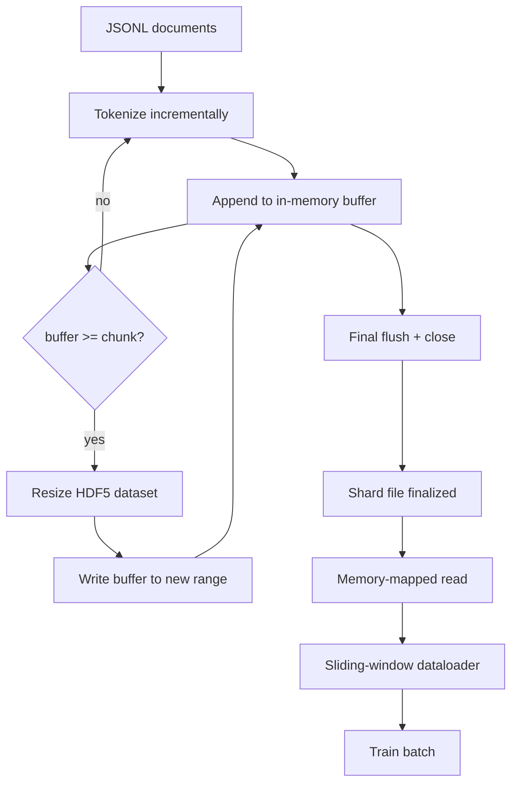

# HDF5 分词语料

> 下载的语料必须落在训练器能以线速流式读取的布局中。磁盘上的 JSONL 撑不过 16 个 dataloader worker。带可调整大小、分块整数数据集的 HDF5 可以。本课构建流式分词写入可调整大小的 HDF5 数据集、跨多文件的分片写入、训练时的内存映射读取，以及产生固定长度序列并正确打包的滑动窗口 dataloader。

**类型：** 构建
**语言：** Python
**前置课程：** Phase 19 第 30-37 课
**时间：** 约 90 分钟

## 学习目标

- 将文档流式写入带确定性分块的可调整大小 HDF5 整数数据集。
- 跨多个 HDF5 文件分片写入，使故障有界且并行成为可能。
- 通过 HDF5 的 page-cache 支持的分块布局读回 token，使 dataloader 仅在 batch 时才复制到 batch 缓冲区。
- 实现滑动窗口 dataloader，发出带显式打包规则的固定长度训练序列。

## 问题

现代语言模型训练运行跨数十个 worker 以每秒数十万样本的速度读取 token。磁盘上的 JSONL 在第一次冷缓存页错误时就死了：JSON 解析器慢，文档边界不可寻址，寻找"样本 4,217,884"需要扫描文件。即使 Parquet 压缩良好，也不适合，因为训练器不想要列；它想要一个 O(1) 随机访问的平坦 token 流。

HDF5 适合因为它提供分块、可调整大小、仅整数的数据集，其 chunk 在读取时对 page cache 友好。训练器请求 `tokens[3,200,000 : 3,200,8192]` 的切片，HDF5 从 page cache 将请求的 hyperslab 复制到新分配的 NumPy 数组。代价是每个 worker 一个打开的文件句柄和一个 chunk 大小的 page-cache 占用，与解码 JSONL 的代价相比可以忽略。

构建问题是让写入端诚实。可调整大小的数据集容易误用：每次写一个文档，HDF5 文件碎片化到不可用。一次 resize 写入所有文档，进程死亡丢失整个分片。正确的纪律是 buffer-then-extend，缓冲区大小匹配 chunk 大小，分片写入将工作负载分散到多个文件，使崩溃最多丢失一个分片。

## 概念



### 正确使用可调整大小的 HDF5

Token 数据集以 `maxshape=(None,)` 和固定 `chunks=(chunk_size,)` 创建。写入通过在长度为 `chunk_size` 的 NumPy 数组中缓冲 token 进行。当缓冲区满时，数据集恰好 resize `chunk_size`，缓冲区写入新范围。分片结束时残余缓冲区写入最终的部分范围。除最后一次外，每次写入都是连续且 chunk 对齐的，读取器被告知在分片 HDF5 属性中记录的 `token_count` 处截断。

### 分片写入

单个 HDF5 文件是单点故障。流水线并行写入分片：Phase 19 第 42 课的每个输入分片产生一个 HDF5 输出分片。`shards.json` 索引为每个分片记录文件路径、token 数、文档数和 token 上的 sha256。训练器读取 `shards.json` 来计算全局偏移并验证语料。

### 内存映射读取

训练时每个 worker 以 `swmr=True` 模式打开其份额的 HDF5 文件并请求 `tokens[start:stop]`。HDF5 的 chunk 布局使其在 chunk 热后成为 page-cache 支持的读取。Worker 永远不会物化整个文件：切片被复制到 dataloader 的 batch 缓冲区，dataloader 然后在 batch 时将其复制到 pinned-memory 训练张量。热路径每次 chunk 转换一个 syscall；其余都是 RAM 访问。

### 滑动窗口 dataloader

Dataloader 是唯一知道训练序列长度的阶段。它在全局 token 流中选择随机起始索引，读取 `window_size + 1` 个 token，返回 `(input, target) = (tokens[:-1], tokens[1:])`。文档边界不强制：窗口可能跨越两个文档，中间有显式 `boundary_token_id` 使模型学会使用分隔符。这是标准打包规则；也是初学者忘记的规则，最终得到 8% 训练边界 token 和 92% 自然文本的语料。

## 构建

`code/main.py` 实现了：

- `Tokenizer` - 字节级确定性 tokenizer，足以用于 demo。接口是 `encode(text) -> list[int]` 和 `vocab_size`。
- `HDF5ShardWriter` - 打开可调整大小的整数数据集，将 token 缓冲到 chunk 大小，以固定步幅 resize 和写入，关闭时记录 `token_count` 和 `sha256` 为 HDF5 属性。
- `ShardedTokenizationPipeline` - 迭代输入文档，路由到 writer，输出 `shards.json` 索引。
- `MmapTokenStore` - 打开分片文件进行内存映射读取，计算全局偏移，暴露单一 `get_slice(start, stop)` API。
- `SlidingWindowDataloader` - 从全局流中选择随机窗口，yield `(input_ids, target_ids)` NumPy 数组。

文件底部的 demo 构建小型内存语料，分词到两个分片，通过内存映射打开，运行 dataloader 10 个 batch，打印逐 batch 形状和校验和。

运行：

```bash
python3 code/main.py
```

脚本退出零并打印 batch 校验和。

## 生产模式

四个模式将本课扩展到真实训练运行。

**Chunk 大小等于典型读取。** 训练器每个样本读取 `window_size + 1` 个 token。将 HDF5 chunk 设为 `window_size` 的倍数，读取就是 page-cache 对齐的。不匹配的 chunk 使吞吐量减半，因为每个样本触及两个 chunk。

**Token 数在属性中，不在数据集中。** 数据集的尾部切片可能部分填充，因为 chunk 大小不整除文档边界。将真实 `token_count` 存储为数据集的 HDF5 属性，让读取器在该值处截断。没有这个，读取器会走到末尾进入零填充的 token，模型学会预测零。

**分片 sha256 加并行验证。** 每个分片有自己在 token 字节上的 sha256。训练器可以在训练开始前并行验证所有分片。错误的 sha256 使运行早期失败，而非在十六小时后的第三个 epoch。

**两端都用 `swmr=True`，writer 端用 `libver="latest"`。** Single-Writer-Multiple-Reader 模式要求 writer 以 `libver="latest"` 打开，预先创建所有数据集，然后设置 `file.swmr_mode = True`。之后 writer 必须在每次 resize 后调用 `dataset.flush()`，使 reader worker（以 `swmr=True` 打开）看到一致数据。跳过 `libver="latest"` 或在结构变更后启用 SWMR 是"file is locked"失败的常见来源。

## 使用

生产模式：

- **每个源分片一个 HDF5。** 下载器（第 42 课）每个 URL 输出一个分片；分词（本课）每个源分片输出一个 HDF5。1:1 映射使恢复和部分故障恢复变得简单。
- **边界 token id。** 边界 token 是 tokenizer 词表的一部分，是 dataloader 注入的唯一 token。如果模型应该忽略它，训练 loss mask 边界 token；否则它学会将其用作序列分隔符。
- **`shards.json` 作为真相来源。** 添加新分片意味着写入 HDF5、计算其 sha256、追加一个条目。训练器启动时读取该文件一次，永远不触碰目录列表。

## Ship It

`outputs/skill-hdf5-tokenized-corpus.md` 在真实项目中会描述哪个 tokenizer 馈入流水线、什么 chunk 大小匹配训练器的窗口、`shards.json` 在版本控制中的位置、dataloader worker 如何跨文件分片。本课提供引擎。

## 练习

1. 给 HDF5 writer 添加 `--compression gzip` 标志并测量 demo 语料上的吞吐量代价。为选择的默认值辩护。
2. 给滑动窗口 dataloader 添加确定性种子，验证相同种子的两次运行产生相同 batch。
3. 添加 `--validate` 模式，读取每个分片，重新计算其 token 上的 sha256，与 `shards.json` 比较。CI 应在训练开始前运行此模式。
4. 比较 chunk 大小等于、一半和两倍窗口大小时的 dataloader 吞吐量。报告 page-cache 效应。
5. 添加 `--max-document-tokens` 标志，在写入时截断很长的文档。为该权衡 vs 在读取时决定进行辩护。

## 关键术语

| 术语 | 常见说法 | 实际含义 |
|------|----------|----------|
| 可调整大小数据集 | "Append-only" | 带 `maxshape=(None,)` 的 HDF5 数据集，通过 chunk 大小步幅的 `resize` 调用增长 |
| 分块布局 | "HDF5 如何存储" | 固定大小的磁盘页，内核可以内存映射，dataloader 可以连续读取 |
| `swmr` 模式 | "边写边读" | Single-Writer-Multiple-Reader 模式，让 dataloader worker 安全共享文件 |
| 分片索引 | "shards.json" | 所有 token 分片的持久索引，带偏移和内容哈希 |
| 滑动窗口 | "训练样本" | 全局 token 流的固定长度切片，训练器将其与右移一位的目标配对 |

## 延伸阅读

- [HDF5 分块文档](https://docs.hdfgroup.org/hdf5/v1_14/) - 本课使用的分块、可调整大小数据集布局
- [h5py 用户指南](https://docs.h5py.org/en/stable/) - HDF5 的 Python 绑定
- [NumPy 内存映射](https://numpy.org/doc/stable/reference/generated/numpy.memmap.html) - h5py 通过 HDF5 暴露的读取端原语
- Phase 19 · 42 - 本课分词其输出的下载器
- Phase 19 · 44 - 消费此 dataloader 的 cosine 调度
- Phase 19 · 45 - 包装训练步骤的 AMP 循环
