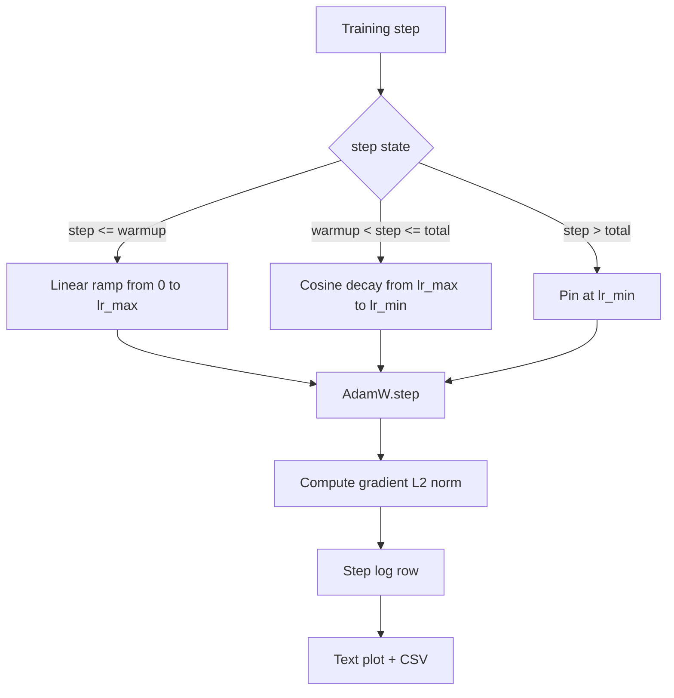

# 余弦学习率与线性 Warmup

> 学习率调度是仅次于损失函数的第二重要决策。AdamW 配合余弦衰减和线性 warmup 是现代语言模型训练的默认方案——它让模型在脆弱的前一千步使用较小的有效步长，逐步升至配置的峰值，再平滑衰减回零附近。本课构建该调度器，绘制训练步数上的曲线，将梯度范数与调度一起记录，并验证调度器在 warmup、峰值和衰减边界处的正确性。

**Type:** Build
**Languages:** Python
**Prerequisites:** Phase 19 lessons 30-37
**Time:** ~90 minutes

## 学习目标

- 实现一个 AdamW 优化器，连接带线性 warmup 的余弦学习率调度。
- 在任意步数精确计算调度值，跨运行无浮点漂移。
- 将梯度 L2 范数与学习率并排记录，使训练健康状态可观测。
- 将调度渲染为肉眼可读的文本图和任何工具可消费的 CSV。

## 问题

训练的前一千步是最嘈杂的。模型权重仍接近初始化。优化器的二阶矩估计尚未稳定。梯度范数大且噪声高。如果学习率在这些更新期间处于峰值，模型要么直接发散，要么陷入永远无法逃脱的 loss 平台。两个广为人知的修复方案是梯度裁剪（Phase 19 lesson 45 的主题）和一个从小值开始逐步升高的学习率调度。

余弦加 warmup 调度有三个区域。从第零步到第 `warmup_steps` 步，学习率从零线性增长到配置的峰值 `lr_max`。从第 `warmup_steps` 步到第 `total_steps` 步，学习率沿余弦曲线的上半部分从 `lr_max` 衰减到 `lr_min`。超过 `total_steps` 后，学习率固定在 `lr_min`，这样配置错误的训练器即使超出步数也不会悄悄退出调度。

构建的难点在于调度器很容易出现 off-by-one 错误。这种错误会在训练运行六小时后表现为学习率在模型开始过拟合的时刻偏高或偏低 1%，除非在边界处做了穷举测试，否则完全不可见。

## 概念



### Warmup 公式

对于 `step` 在 `[0, warmup_steps]` 且 `warmup_steps > 0` 的情况，学习率为 `lr_max * step / warmup_steps`。退化情况 `warmup_steps = 0` 被视为"无 warmup"：调度在第零步直接从 `lr_max` 开始，立即进入余弦衰减。某些测试框架会传入 `warmup_steps = 0` 来检查调度是否仍能产生可用曲线。

### 余弦公式

对于 `step` 在 `(warmup_steps, total_steps]` 的情况，学习率为 `lr_min + 0.5 * (lr_max - lr_min) * (1 + cos(pi * progress))`，其中 `progress = (step - warmup_steps) / max(1, total_steps - warmup_steps)`。在 `step = warmup_steps` 时余弦求值为 `cos(0) = 1`，得到 `lr_max`，与 warmup 终点精确匹配。在 `step = total_steps` 时余弦求值为 `cos(pi) = -1`，得到 `lr_min`，与衰减终点精确匹配。

两个端点的连续性不是巧合。这正是调度被实现为关于 `step` 的单一函数而非三个拼接函数的原因。拼接式调度在第一次修改 `lr_max` 时就会丢失一个边界。

### 超过总步数后的下限

对于 `step > total_steps`，学习率保持在 `lr_min`。契约是明确的：调度不会报错也不会外推；它固定在下限并让训练器记录一条警告。需要延长训练的训练器应修改调度的 `total_steps`，而不是循环本身。

### 梯度范数与学习率并排记录

调度是训练健康的一半。梯度范数是另一半。训练循环每步记录两者。发散的训练运行会在 loss 之前显示梯度范数飙升；调优良好的 warmup 使范数随学习率线性上升；过于激进的峰值表现为 warmup 后范数持续偏高。磁盘上的数据集为 `step, lr, grad_l2_norm, loss`。CSV 是唯一的持久记录。

## 构建

`code/main.py` 实现：

- `CosineWithWarmup` - 一个无状态函数 `lr(step) -> float`，基于配置的调度。
- `TrainState` - 将模型、`AdamW` 优化器和调度封装为单一 step 函数。
- `TrainState.step` - 运行一次前向传播、一次反向传播，记录梯度 L2 范数，并将 `lr(step)` 应用到优化器。
- `plot_schedule_ascii` - 将调度渲染为肉眼可读的文本图。
- `write_schedule_csv` - 每步输出一行学习率。

文件底部的 demo 构建一个小型 `nn.Linear` 模型，在固定输入批次上训练 20 步，打印每步的学习率、梯度范数和 loss。调度也被渲染为文本图用于视觉检查。

运行：

```bash
python3 code/main.py
```

脚本以零退出码结束，打印每步训练日志和调度图。

## 生产模式

四个模式将调度提升为生产级制品。

**调度存在于配置中，而非代码中。** 训练器从提交到 git 的 YAML 或 JSON 配置中读取 `warmup_steps`、`total_steps`、`lr_max`、`lr_min`。调度可复现是因为配置是内容寻址的；调度可审计是因为配置是 PR diff 的一部分。

**步数计数器是单调的，与 epoch 解耦。** 某些框架在数据集分片或 dataloader 重启时混淆 step 和 epoch。调度从训练器的 checkpoint 读取 `global_step`，而非本地计数器。恢复的运行能在正确的调度位置继续，因为步数计数器是持久轴。

**调度图在运行目录中。** 每次训练运行将 `outputs/lr_schedule.png`（本课中为文本图）写入其运行目录。浏览目录的审阅者无需重新运行即可检查调度。这在 PR 阶段就能捕获调度配置错误类的 bug。

**日志行 schema 固定。** `step, lr, grad_l2_norm, loss` 按此顺序。下游 notebook 或 dashboard 读取该 schema；不升版本就重命名列会使所有现有 dashboard 失效。

## 使用

生产模式：

- **先扫峰值再扫其他。** `lr_max` 是最敏感的旋钮。先在小模型上扫描；最优 `lr_max` 与模型大小弱相关，所以小模型扫描是一个强先验。
- **Warmup 是总步数的比例，不是绝对数。** 一个 2 亿步的运行配 2,000 步 warmup 几乎立即到达峰值；一个 20,000 步的运行配同样的数字则 warmup 占 10%。将 warmup 配置为比例（典型值：1-3%），使调度随训练时长缩放。
- **`lr_min` 非零是有意为之。** 设为 `lr_max` 的 10% 的下限让优化器在长尾阶段继续学习。`lr_min = 0` 的调度产生的训练曲线在图上看起来很好，但模型实际上并未完成训练。

## 交付

`outputs/skill-cosine-warmup.md` 在真实项目中会描述哪个配置承载调度、训练器从哪个步骤读取全局计数器、以及 `lr_max` 扫描产生了什么部署值。本课交付的是引擎。

## 练习

1. 添加一个逆平方根变体的调度，在 200 步的 toy 训练运行上比较。哪条曲线产生更低的最终 loss？
2. 添加 `--restart` 标志，在 `total_steps / 2` 处加入第二次 warmup。论证 warm restarts 在 toy 运行上是改善还是损害。
3. 添加单元测试验证调度连续性：对于 `[0, total_steps]` 中的每一步，差值 `|lr(step+1) - lr(step)|` 被 `lr_max / warmup_steps` 所界。
4. 将调度接入 `torch.optim.lr_scheduler.LambdaLR` 使其与框架代码组合。本课使用普通 step 函数；wrapper 改变了什么？
5. 添加 `--plot-png` 标志通过 `matplotlib` 写入真实图表。论证本课的文本图还是 PNG 更适合作为 CI 运行的默认选项。

## 关键术语

| 术语 | 口语说法 | 实际含义 |
|------|----------|----------|
| Warmup | "慢启动" | 在前 `warmup_steps` 次更新中从零线性升至 `lr_max` |
| Cosine decay | "平滑下降" | 在剩余步数中从 `lr_max` 到 `lr_min` 的上半余弦曲线 |
| Floor | "训练后" | 超过 `total_steps` 后调度固定的 `lr_min` 值 |
| Gradient norm | "梯度的 L2" | 拼接梯度向量的欧几里得范数，每步记录 |
| Global step | "调度轴" | 一个跨重启存活并驱动调度的单调步数计数器 |

## 延伸阅读

- [Loshchilov and Hutter, SGDR: Stochastic Gradient Descent with Warm Restarts (arXiv 1608.03983)](https://arxiv.org/abs/1608.03983) - 余弦调度的参考论文
- [Loshchilov and Hutter, Decoupled Weight Decay Regularization (arXiv 1711.05101)](https://arxiv.org/abs/1711.05101) - AdamW 的参考论文
- [PyTorch torch.optim.lr_scheduler](https://docs.pytorch.org/docs/stable/optim.html#how-to-adjust-learning-rate) - step 函数如何与框架调度器组合
- Phase 19 · 42 - 本调度消费其语料的下载器
- Phase 19 · 43 - 与本调度共同演进的 dataloader
- Phase 19 · 45 - 梯度裁剪和 AMP，循环中的下一层
