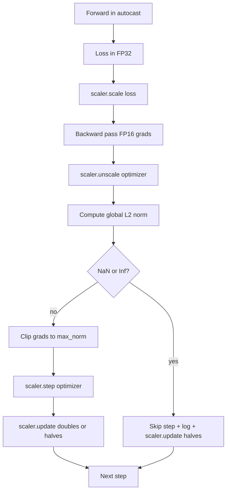

# 梯度裁剪与混合精度训练

> 前一课的优化器和调度假设梯度是正常的。它们通常不是。一个坏批次就能让梯度范数飙升三个数量级。混合精度训练通过在 loss 端引入 FP16 溢出使问题更加严重。本课构建生产训练不可或缺的两条安全带：将梯度裁剪到配置的全局 L2 范数，以及一个带 autocast 和 GradScaler 的混合精度循环——它能检测 NaN 和 Inf、干净地跳过该步、并记录 scaling factor 以供事后分析。

**Type:** Build
**Languages:** Python
**Prerequisites:** Phase 19 lessons 30-37
**Time:** ~90 minutes

## 学习目标

- 计算所有参数梯度的全局 L2 范数，超过配置阈值时就地裁剪。
- 用 autocast 加 GradScaler 包装训练步，使 FP16 前向和反向传播能承受溢出。
- 检测 loss 或梯度中的 NaN 和 Inf，跳过优化器步骤并记录跳过事件。
- 每步报告 GradScaler 的 scaling factor，使长序列的跳过立即可见。

## 问题

昨天还正常运行的训练在第 8,217 步产生了垂直上升的 loss 曲线。罪魁祸首是一个梯度范数为 4,200 的批次，是之前峰值的二十倍。没有裁剪的话，优化器会应用一个步骤，重置模型在前一小时学到的所有东西。有了全局 L2 裁剪（范数 1.0），同一批次贡献一个单位范数的更新；loss 保持在趋势线上；运行存活了。

混合精度训练通过在 FP16 中计算前向传播和大部分反向传播，将吞吐量提升 2-3 倍。代价是 FP16 的指数范围很窄。一个在 FP16 中溢出的典型梯度求值为 Inf，通过后续层传播为 NaN，在下一个优化器步骤将每个权重设为 NaN。PyTorch 的 GradScaler 通过在反向传播前将 loss 乘以一个大的 scaling factor、在优化器步骤前将梯度除以同一 factor 来解决这个问题。如果在 unscale 时任何梯度是 Inf 或 NaN，scaler 跳过该步并将 scaling factor 减半；如果前 N 步是干净的，scaler 将 factor 加倍。在训练过程中，factor 会找到 FP16 范围允许的最高值。

构建的难点是正确连接两者。在 unscale 之前裁剪，阈值作用于缩放后的梯度；在 unscale 之后裁剪，GradScaler 的操作顺序很重要。正确的顺序是：`scaler.scale(loss).backward()`，然后 `scaler.unscale_(optimizer)`，然后 `clip_grad_norm_`，然后 `scaler.step(optimizer)`，然后 `scaler.update()`。任何其他顺序都会产生一个静默损坏的循环。

## 概念



### 全局 L2 范数

全局 L2 范数是拼接梯度向量的欧几里得范数，不是逐参数范数。PyTorch 将其实现为 `torch.nn.utils.clip_grad_norm_(parameters, max_norm)`。该函数返回裁剪前的范数，这样本课可以同时记录自然值和裁剪后的值——这对于"我们每步都在裁剪"的诊断是必要的。

### autocast 和 GradScaler

`torch.amp.autocast(device_type)` 是选择性地在 FP16 中运行合格操作（大多数 matmul 类操作）的上下文管理器。`torch.amp.GradScaler(device_type)` 是在反向传播前缩放 loss、在优化器步骤前反向缩放梯度的辅助器。两者是配套设计的；只用其中一个而不用另一个是测试应该捕获的配置错误。

本课使用 CPU autocast，因为这是 CI 中能运行的；同样的模式通过将 `device_type="cpu"` 改为 `device_type="cuda"` 即可逐字迁移到 CUDA。CPU 上的 GradScaler 是一个 stub（CPU autocast 默认已在 BF16 中操作，不需要 loss scaling），但本课包含了调用点，使接线与 GPU 循环完全一致。

### NaN 和 Inf 检测

检测发生在两个地方。首先，在反向传播前用 `torch.isfinite` 检查 loss 本身；Inf 或 NaN 的 loss 不会产生有用的梯度，直接跳过而不进入优化器。其次，在 `scaler.unscale_(optimizer)` 之后，本课用 `has_non_finite_grad(...)` 扫描 unscale 后的梯度，将任何 Inf 或 NaN 视为跳过。两个检查一起覆盖了前向传播和反向传播的失败模式。

### Scaling factor 诊断

Scaling factor 是 GradScaler 的内部状态。每步本课读取 `scaler.get_scale()` 并与学习率和梯度范数一起记录。健康的运行显示 scaling factor 以 2 的幂次攀升直到饱和在 `2^17` 或 `2^18` 附近。异常的运行显示 factor 在高低值之间振荡，这是模型梯度有时在范围内有时不在的信号。不记录的话这个诊断是不可见的。

## 构建

`code/main.py` 实现：

- `clip_global_l2_norm` - `torch.nn.utils.clip_grad_norm_` 的包装器，返回裁剪前和裁剪后的范数。
- `has_non_finite_grad` - 扫描梯度中 NaN 和 Inf 的辅助函数。
- `AmpTrainState` - 封装模型、`AdamW` 优化器、GradScaler 和 autocast 设备。暴露 `step(inputs, targets)` 运行完整的裁剪、缩放和 NaN 跳过流水线。
- `StepLog` 和 `SkipLog` - 结构化的每步记录。
- 一个 demo，训练小型 `nn.Linear` 模型 20 步，在第 5 步注入 Inf 到梯度中以测试跳过路径，并打印结果日志。

运行：

```bash
python3 code/main.py
```

脚本以零退出码结束，打印每步日志，每行标记为 `STEP` 或 `SKIP`；至少有一行是 `SKIP`。

## 生产模式

四个模式将循环提升为生产级训练步骤。

**跳过计数器是告警，不是日志行。** 每次训练运行中少量跳过步骤是健康的。每个 epoch 数百次跳过是硬告警：模型处于 FP16 无法承载的区域，循环在静默失败。本课跟踪 1,000 步滚动跳过率，在生产中会在超过 5% 时触发告警。

**裁剪阈值存在于配置中。** `max_norm = 1.0` 是语言模型训练的现代默认值。先在小模型上扫描；较大的阈值让模型从真正困难的批次中恢复；较小的阈值以更嘈杂的 loss 曲线为代价限制最坏情况。阈值应与 lesson 44 的调度放在同一个 YAML 或 JSON 配置中。

**范数日志与调度一起写入 CSV。** CSV 列为 `step, lr, grad_l2_pre_clip, grad_l2_post_clip, loss, skipped, skip_reason, scaler_scale`。打开文件的审阅者在一行中看到调度、梯度故事、scaling factor 和跳过结果（及其原因）。将列分散到多个文件是分析错位的根源。

**`scaler.update()` 每步都运行，即使跳过。** 在干净步骤上，scaler 读取其无 inf 计数器，递增，可能将 factor 加倍。在跳过步骤上，scaler 将 factor 减半并重置计数器。在跳过路径上忘记 `update()` 是产生"scaling factor 从未改变"的 bug。

## 使用

生产模式：

- **Autocast 设备匹配优化器设备。** GPU 训练用 `torch.amp.autocast(device_type="cuda")`；CPU 用 `torch.amp.autocast(device_type="cpu")`。混合设备产生静默类型错误，表现为 loss 曲线看起来正常但模型没有在学习。
- **反向传播前检查 loss。** `torch.isfinite(loss).all()` 是一次 tensor reduction；代价可忽略，而在 NaN loss 上的节省是整个训练步骤。始终运行它。
- **`zero_grad` 中使用 `set_to_none=True`。** 将梯度设为 `None` 而非零，让优化器跳过未受影响参数组的计算。该设置是免费的吞吐量提升和轻微的 bug 面减少。

## 交付

`outputs/skill-clip-amp.md` 在真实项目中会描述训练步骤使用哪个裁剪阈值和 autocast 设备、每步 CSV 在版本控制中的位置、以及生产跳过率告警阈值是什么。本课交付的是引擎。

## 练习

1. 用真实的 loss 飙升（将一个批次的 target 乘以 1e8）替换合成的 Inf 注入，验证跳过路径触发。
2. 添加 `--bf16` 模式将 autocast 切换到 BF16 而非 FP16。BF16 比 FP16 有更宽的指数范围，很少需要 loss scaling；验证在同一 demo 上跳过率降为零。
3. 添加单元测试验证梯度裁剪包装器在不发生裁剪时正确返回裁剪前和裁剪后的范数。
4. 添加滚动窗口跳过率计算和一个 CLI 标志，当连续 100 步超过配置阈值时使运行失败。
5. 将循环接线为写入规范 CSV（`step, lr, grad_l2_pre_clip, grad_l2_post_clip, loss, skipped, skip_reason, scaler_scale`），并通过每行刷新确认文件在 Ctrl-C 后存活。

## 关键术语

| 术语 | 口语说法 | 实际含义 |
|------|----------|----------|
| Global L2 norm | "裁剪目标" | 所有可训练参数拼接梯度向量的欧几里得范数 |
| autocast | "混合精度" | 在 `with` 块内选择性地以 FP16（或 BF16）执行合格操作 |
| GradScaler | "Loss scaler" | 在反向传播前乘以 loss、在优化器步骤前反向缩放梯度的辅助器 |
| Skip | "坏步" | 因梯度或 loss 非有限而拒绝的优化器步骤；scaler 将 factor 减半 |
| Scaling factor | "Scaler 状态" | GradScaler 当前的乘数；干净段后加倍，每次跳过时减半 |

## 延伸阅读

- [Micikevicius et al., Mixed Precision Training (arXiv 1710.03740)](https://arxiv.org/abs/1710.03740) - 最初的 loss-scaling 提案
- [Pascanu, Mikolov, Bengio, On the difficulty of training recurrent neural networks (arXiv 1211.5063)](https://arxiv.org/abs/1211.5063) - 梯度裁剪的参考论文
- [PyTorch torch.amp.GradScaler](https://docs.pytorch.org/docs/stable/amp.html) - 本课包装的 scaler API
- [PyTorch torch.nn.utils.clip_grad_norm_](https://docs.pytorch.org/docs/stable/generated/torch.nn.utils.clip_grad_norm_.html) - 本课使用的裁剪原语
- Phase 19 · 42 - 为循环提供语料的下载器
- Phase 19 · 43 - 循环消费的 dataloader
- Phase 19 · 44 - 本循环组合的调度
