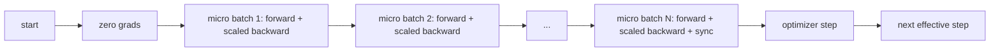
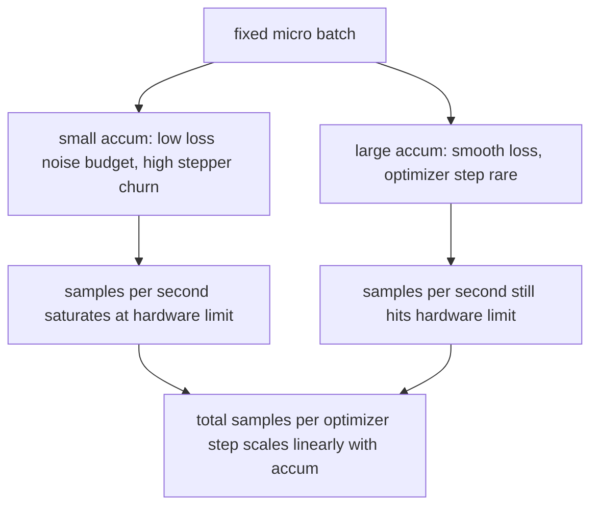

# 梯度累积

> 用你负担不起的 effective batch 训练，一次一个 micro-batch。缩放 loss，暂缓优化器步骤，让梯度堆积起来。

**Type:** Build
**Languages:** Python
**Prerequisites:** Phase 19 lessons 42 to 45
**Time:** ~90 minutes

## 学习目标

- 推导 effective batch 恒等式：`effective_batch = micro_batch * accum_steps`。
- 实现每 micro-batch 的 loss 缩放，使累积梯度与单次 full-batch 反向传播匹配。
- 在最后一个 micro-batch 之前跳过优化器同步（sync-on-last-step）。
- 读取吞吐量与 effective batch 的曲线并解释收益递减。

## 问题

你想用 512 的 effective batch 训练，因为 loss 曲线更平滑，优化器步骤在这个尺度上更有意义。桌上的加速器在内存耗尽前只能容纳 32 个样本。加倍 batch 不是选项。减半模型也不是选项。2017 年以来业界一直使用的技巧是运行 16 次反向传播，让梯度在参数缓冲区中累积，只在计数达到目标时才执行优化器步骤。

风险在于 loss 不再是更大 batch 时的同一个数。16 个 mini-batch 的交叉熵朴素求和是一个 full batch loss 的 16 倍。没有缩放的话，梯度方向正确但幅度错误，优化器步骤大了 16 倍。修复方法是一次除法。这个修复也很容易忘记。

## 概念



契约很简短：

- 每个 micro-batch 的 loss 在 `backward()` 前除以 `accum_steps`。PyTorch 默认将梯度累加到 `param.grad` 中；除法将累加和推回正确的尺度。
- 优化器步骤在最后一个 micro-batch 的反向传播后触发一次。在累积中途执行步骤会扭曲后续运行依赖的每个参数。
- 优化器的状态（动量缓冲区、Adam 矩）每个 effective step 推进一次，而非每个 micro-batch。否则指数移动平均会看到错误的频率并烧穿调度。
- 在单设备上这只是记账。在多 rank 集群上，同样的模式将非最终 micro-batch 包装在 `no_sync` 上下文中跳过梯度 all-reduce；最后一个 micro-batch 在一次传递中 reduce 完整的累积梯度，而不是付 N 次网络代价。

### 代码中的等价性证明

```python
loss = criterion(model(x_full), y_full)
loss.backward()
opt.step()
```

等价于

```python
for x, y in chunks(x_full, y_full, n):
    scaled = criterion(model(x), y) / n
    scaled.backward()
opt.step()
```

差异仅在浮点求和顺序。循环结束时累积的梯度缓冲区与单次 full-batch 反向传播产生的是同一个 tensor。本课代码在 `equivalence_check` 中断言 max-abs 差异小于 1e-4。

### 代价去向

每个 micro-batch 花费一次前向和一次反向。梯度累积是用时间换内存。`outputs/accum-curve.json` 中的吞吐量曲线展示了在固定 micro-batch 下 effective batch 增长时的情况：



没有免费午餐。将 `accum_steps` 加倍会使每个优化器步骤的墙钟时间加倍。改变的是梯度估计的方差：在相同的墙钟预算下，你做了更少的优化器步骤，但每一步都在更多样本上取了平均。文献将大 batch 和小 batch 视为不同的优化问题；本课的重点是机制，不是统计。

## 构建

`code/main.py` 是可运行的制品。它做三件事。

### 步骤 1：等价性检查

`equivalence_check()` 用相同种子构建网络的两个副本。一个在一次前向传播中看到 16 样本的 batch。另一个看到四个 4 样本的 chunk，loss 除以四。函数在优化器步骤前比较梯度缓冲区，步骤后比较参数。断言为 `max_abs_diff < 1e-4`。

### 步骤 2：sync-on-last-step 模式

`train_one_optimizer_step` 遍历 micro-batch。对于除最后一个之外的每个 micro-batch，它进入 `no_sync_context(model)`。在单进程上该上下文是空操作；在 DDP 上这是跳过梯度 all-reduce 的地方。记账方式相同。`sync_counter` 记录我们离开 no_sync 作用域的次数；对于 N 个 micro-batch，计数是每个 effective step 一次，而非 N 次。

### 步骤 3：吞吐量曲线

`sweep_effective_batches` 用固定 micro-batch 和一组累积步数运行同一模型。对每个设置记录：

- `samples_per_sec`：看到的总样本数除以墙钟时间
- `median_step_ms`：每个 effective step 的第 50 百分位
- `sync_calls`：执行的集合点
- `avg_loss`：扫描中优化器步骤的平均值

输出落在 `outputs/accum-curve.json`，可从 notebook 复用。

运行：

```bash
python3 code/main.py
```

脚本打印等价性差异，然后是扫描表，然后是 JSON 路径。退出码为零。

## 使用

在生产训练中，梯度累积隐藏在一个旋钮后面。PyTorch 的模式是 `accumulation_steps = effective_batch // (micro_batch * world_size)`。你不被允许在这里使用的框架包装了同样的循环，但步骤相同：缩放 loss，在非最终 micro 上跳过 sync，累积，步进一次。

实际中的三种模式：

- Micro-batch 大小选择为饱和设备内存。更小浪费加速器周期。更大则崩溃。
- Effective batch 从学习率调度中选择。大 effective batch 需要缩放的学习率和 warmup；这是 2017 年以来讨论的线性缩放规则。
- 累积计数是两者之间的桥梁，也是你在运行时可以自由调整而无需重写 data loader 的唯一旋钮。

## 交付

`outputs/skill-gradient-accumulation.md` 记录了配方，使同事可以将其放入新仓库：将 loss 除以 `accum_steps`，在非最终 micro 上跳过优化器 sync，每个 effective batch 步进一次优化器，将吞吐量与 effective batch 的关系记录为 JSON 使权衡可见。

## 练习

1. 用 `--num-steps 100` 重新运行扫描，绘制每秒样本数与 effective batch 的关系。曲线在哪里变平？
2. 添加一个错误缩放变体（不除法），展示第 1 步与参考的参数差异。
3. 将 SGD 换为 AdamW，确认优化器状态每个 effective step 推进一次，而非每个 micro-batch。
4. 引入真正的 `DistributedDataParallel` 包装器，将 `no_sync_context` 路由到其方法。确认 sync_calls 每个 effective batch 减少 N-1。
5. 修改等价性检查以比较两种不同的 micro 分割（2 乘 8 vs 4 乘 4），解释你需要放宽的任何容差。

## 关键术语

| 术语 | 口语说法 | 实际含义 |
|------|----------|----------|
| Micro batch | 你前向的 batch | 单次前向传播中能放入内存的切片 |
| Accum steps | 每步的反向传播次数 | 一次优化器步骤前累加的反向传播数 |
| Effective batch | 那个 batch | Micro batch 乘以 accum steps 乘以数据并行 world size |
| Loss scaling | 除以 N | 每 micro-batch 的除法使累加梯度匹配 full batch |
| Sync on last | 跳过其余的 | 只在窗口中最后一次反向传播时运行梯度集合操作 |

## 延伸阅读

- PyTorch 文档中 `DistributedDataParallel.no_sync` 的 sync-on-last-step 技巧的生产版本。
- Goyal et al., 2017，关于大 batch 训练的线性缩放，关心 effective batch 的经典原因。
- PyTorch issue tracker 中梯度累积与混合精度 unscaling 的交互。
- Phase 19 lessons 42 到 45 涵盖本课假设的模型、data loader、优化器和训练器脚手架。
- Phase 19 lesson 47 涵盖检查点和恢复，使长累积运行能在墙钟上限后存活。
