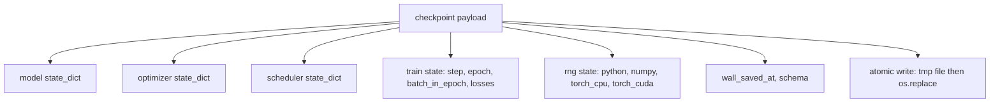
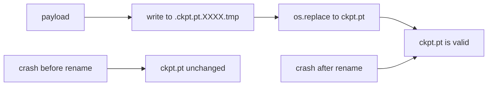
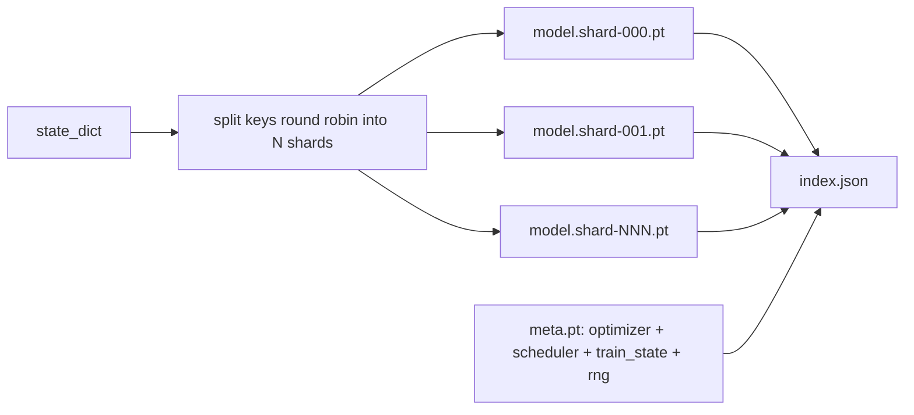

# 检查点保存与恢复

> 训练中断会杀死运行；检查点让它们继续。原子性地保存模型、优化器、调度器、loss 历史、步数计数器和 RNG 状态，使任何时刻的 kill 都在磁盘上留下一个有效文件。

**Type:** Build
**Languages:** Python
**Prerequisites:** Phase 19 lessons 42 to 45
**Time:** ~90 minutes

## 学习目标

- 将完整训练状态捕获到一个可以在新进程中重新加载的单一 payload 中。
- 实现原子保存：先写临时文件再重命名，使崩溃永远不会留下半写的文件。
- 恢复 Python、NumPy 和 PyTorch 的 RNG 状态，使恢复后的 loss 与未中断的基线匹配。
- 为不再适合单文件的模型构建分片 checkpoint 布局，带哈希验证的分片和 JSON 索引。

## 问题

你设置了一个 18 小时的训练任务。墙钟上限是 4 小时。集群在第 11 小时重启，因为你上级的上级批准了内核升级。没有检查点你就得从头开始。没有恢复你还会丢失前 11 小时学到的优化器状态，所以即使模型权重存活了，AdamW 的矩也没了，下一步会朝着训练轨迹已经走过的方向猛冲。

正确的制品是一个包含继续所需一切的单一文件：模型参数、优化器状态、调度器状态、用于绘图的 loss 历史、当前步数和 epoch 和 batch-in-epoch 计数器、以及每个随机性来源的 RNG 状态。没有 RNG 状态，恢复后的 loss 曲线是一条不同的曲线。同一模型，同一数据，不同 shuffle，不同 dropout mask，dashboard 上不同的数字。

原子保存是契约的另一半。写入最终文件名意味着写入中途崩溃会留下损坏的文件；恢复读到垃圾。写入同一目录中的临时文件然后重命名意味着写入中途崩溃会让之前的好文件保持不变。重命名在 POSIX 文件系统上是原子的。

## 概念



### 五个状态桶

| 桶 | 为什么重要 |
|-----|------------|
| Model | 权重和缓冲区；模型是什么。 |
| Optimizer | 动量和自适应矩；没有这些，下一步是一个不同的优化问题。 |
| Scheduler | 学习率在曲线上的位置；余弦调度尤其在意。 |
| Train counters | 步数、epoch、batch-in-epoch，加上绘制 dashboard 的 loss 历史。 |
| RNG state | dropout、数据 shuffle 和模型内任何采样的确定性。 |

### 原子保存



两条规则。第一，临时文件与目标在同一目录中，使重命名保持在同一文件系统内；跨设备重命名不是原子的。第二，临时名称每次尝试唯一，使两个写入者不会互踩。

### 分片检查点

当模型变大时，单文件 payload 变得加载太慢、检查太难、网络共享中途打嗝时太痛苦。修复方法是将参数状态分成分片，写一个小索引将它们关联起来。



索引记录分片数量、每个分片的 sha256、以及 meta 文件的 sha256。加载器在任何哈希不匹配时大声失败。分片可以落在不同的物理磁盘上；meta 很小且先读取。

### 恢复从 epoch 中间继续

恢复时跳到下一个 epoch 开头会浪费几分钟到一天的时间。修复方法是 `(epoch, batch_in_epoch)` 加上 RNG 状态。加载后，训练循环将随机数生成器快进过当前 epoch 中已消费的批次，从 `batch_in_epoch` 继续。本课代码正是这样做的；断言是恢复后的 loss 轨迹与未中断基线在 1e-4 内匹配。

## 构建

`code/main.py` 提供四个原语和一个 demo 驱动器。

### 步骤 1：捕获和恢复 RNG 状态

`capture_rng_state` 返回一个 dict，包含 Python 的 `random.getstate`、NumPy 的 `np.random.get_state`、以及 PyTorch CPU 和 CUDA RNG 字节。`restore_rng_state` 反向操作。CPU tensor 是一个 uint8 字节缓冲区，PyTorch 的 RNG 知道如何消费。

### 步骤 2：原子保存

`atomic_save` 将 payload 写入目标目录中的临时文件，然后 `os.replace` 将其交换到最终名称。`atomic_write_json` 对分片索引做同样的事。

### 步骤 3：完整 checkpoint 往返

`save_checkpoint` 将模型、优化器、调度器、训练状态和 RNG 打包为一个 dict。`load_checkpoint` 反向操作并返回 `TrainState`。schema 字段是升级钩子：未来格式变更升版本字符串，加载器据此分发。

### 步骤 4：分片变体

`save_sharded_checkpoint` 将参数键以 round-robin 方式分配到 N 个分片，每个分片用自己的原子保存写入，写入包含优化器和调度器和训练状态的 meta 文件，并写入带分片 sha256 的 JSON 索引。`load_sharded_checkpoint` 在合并前验证每个分片。

### 步骤 5：恢复 demo

`run_resume_demo` 训练一个小模型 `total_steps` 步，在 `interrupt_at` 保存检查点，然后继续。第二个进程恢复检查点并运行剩余步骤。函数返回中断点之后两条 loss 轨迹的最大绝对差异。恢复 RNG 后，差异为零或浮点噪声。

运行：

```bash
python3 code/main.py
```

单文件和分片 demo 都断言 max-diff 小于 1e-4。摘要落在 `outputs/resume-demo.json`。

## 使用

生产训练栈将检查点作为训练器的一部分。形状相同：model + optimizer + scheduler + counters + RNG，原子写入，按步数命名使最新的容易找到。分片布局通过并行读取驱动大模型加载；index.json 是使其工作的关键。

三个要执行的模式：

- **Schema 是 payload 中的字符串。** 迁移基于它分支。没有它你无法在不破坏旧运行的情况下演进格式。
- **对每个分片做 sha256。** 静默截断的下载是最糟糕的 bug；加载器要么快速失败，要么晚期失败。
- **保持检查点节奏诚实。** 每 N 步和每墙钟分钟保存一次，取较短者。否则崩溃的长步骤会浪费整个窗口的工作。

## 交付

`outputs/skill-checkpoint-save-resume.md` 是任何新训练脚本的配方：payload 形状、原子写入、RNG 捕获、分片索引。将技能放入仓库，在周期性保存点接线 `save_checkpoint`，在启动时接线 `load_checkpoint`，运行就能在 kill 后存活。

## 练习

1. 用按参数组分片（以 `.weight` 结尾的层 vs `.bias`）替换 round-robin 分片。每种布局何时更优？
2. 扩展保存循环以保留最近 K 个检查点并修剪旧的。磁盘小时正确的 K 是多少？
3. 添加 `--ckpt-every-seconds` 标志，在墙钟间隔而非仅步数计数时触发保存。
4. 添加一个校验和验证路径，在启动时运行，扫描目录中的每个检查点，报告哪些损坏。
5. 实现 `migrate_v1_to_v2` 函数，向 payload 添加新字段并升版本字符串。使 load 容忍两个版本。

## 关键术语

| 术语 | 口语说法 | 实际含义 |
|------|----------|----------|
| Atomic save | "写了祈祷" | 写入同一目录中的临时文件，然后 os.replace 到目标名称 |
| State dict | "权重" | 模型参数和缓冲区，按参数名称索引 |
| Sharded checkpoint | "大模型文件" | 多个文件，每个分片一个，加上 meta 文件和带 sha256 的 JSON 索引 |
| RNG state | "随机种子" | Python random、numpy、torch CPU、torch CUDA 的捕获状态；不只是种子 |
| Mid-epoch resume | "重启" | 快进 RNG 并从同一 epoch 的下一个 batch 继续 |

## 延伸阅读

- POSIX `rename` 语义，`os.replace` 依赖的原子性声明。
- PyTorch 文档中 `torch.save` 和 `torch.load`，包括跨设备恢复的 `map_location`。
- Phase 19 lesson 46 涵盖本课 checkpoint payload 跨越的梯度累积。
- Phase 19 lesson 48 涵盖本方案适配其 state dict 格式的分布式包装器。
- Linux 内核 `fsync` 文档，原子重命名背后的持久性保证。
