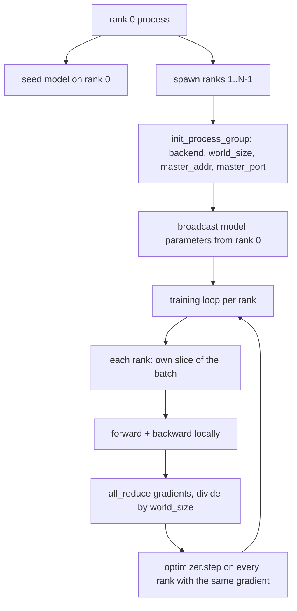
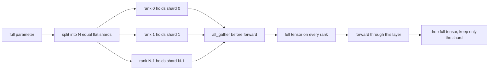

# 从零实现分布式数据并行与 FSDP

> 多 rank 训练就是两个集合操作和一条规则。启动时广播参数，反向传播后平均梯度，永远不让 rank 之间对当前步数产生分歧。

**Type:** Build
**Languages:** Python
**Prerequisites:** Phase 19 lessons 42 to 45
**Time:** ~90 minutes

## 学习目标

- 使用 `gloo` 后端在 N 个 rank 之间建立进程组，无需特殊硬件。
- 实现一个最小 DDP 包装器，在构造时广播参数，在反向传播后 all-reduce 梯度。
- 证明逐 rank 梯度的 all-reduce 与在拼接输入上的单进程梯度匹配。
- 勾勒 FSDP 参数分片：每个 rank 持有一个切片，前向传播时 gather 完整 tensor，之后丢弃。

## 问题

模型能放在一个设备上。数据集不能。优化预算说你想每墙钟秒看到 N 倍的样本。第一个杠杆是数据并行：每个 rank 在 batch 的不同切片上运行同一模型，然后在优化器步骤前平均梯度。第二个杠杆是 FSDP：模型也放不下一个设备，所以每个 rank 持有每个参数的一部分，在前向传播时逐层重建完整 tensor。

痛点在于记账。如果参数在 rank 之间漂移，运行就静默损坏了。如果你平均了梯度但没平均 loss，dashboard 就在说谎。如果集合后端无法就拓扑达成一致，运行就永远挂起。修复方法是手写一次集合操作，永远不信任你无法复现的包装器。

本课在 CPU 上运行。不假设 CUDA。`gloo` 后端随每个 PyTorch 构建一起发布，接受 `torch.multiprocessing` worker；同样的代码在多 GPU 节点上只需切换到 `nccl` 而不改变结构。

## 概念



### 两个重要的集合操作

| 集合操作 | 做什么 | 何时 |
|----------|--------|------|
| `broadcast` | 将一个 tensor 从一个 rank 复制到所有其他 rank | 参数初始化、调度器状态、任何一对多同步 |
| `all_reduce` | 跨所有 rank 对 tensor 求和（或均值、或最大值），每个 rank 得到结果 | 反向传播后的梯度平均 |
| `all_gather` | 每个 rank 贡献一个 tensor，每个 rank 得到拼接结果 | Logits 收集、FSDP 参数 unshard |

DDP 的契约是构造时 `broadcast`，反向传播后 `all_reduce`。FSDP 草图在每层前向传播前添加 `all_gather`。

### 梯度平均匹配单进程梯度

一个在 N 个 rank 上用 B 个样本的 batch 训练的模型必须产生与单进程在 N*B batch 上训练相同的梯度。技巧在于对逐 rank 梯度求和再除以 N 得到平均 loss 梯度，这正是 cross entropy 在 full batch 上用 mean reduction 会产生的。本课代码断言手动 all-reduce 梯度与参考单进程梯度之间的 `max-abs-diff < 1e-3`。

### FSDP 草图



内存收益是精确的：每 rank 的参数内存降至 1/N。代价是 gather，每次前向传播都要付出。生产 FSDP 将 gather 与前一层的计算重叠，使墙钟代价远小于朴素计算预测的。本课对每个参数做往返并断言重建与原始 bit-equal。

### CPU 和 gloo 后端

CUDA 是生产目标，但相同的代码路径存在于 CPU 上。`gloo` 是 CPU 集合后端。它比 GPU 上的 `nccl` 慢几个数量级，但 API 表面完全相同。本课的进程组用 `backend="gloo"` 初始化，rank 用 `torch.multiprocessing` 而非 `torchrun` 启动；两者最终到达相同的 `torch.distributed` 调用。在多 GPU 节点上，唯一的变化是 `backend="nccl"`、设备 tensor、和用 `torchrun` 启动。

## 构建

`code/main.py` 是可运行的制品。

### 步骤 1：建立进程组

```python
os.environ["MASTER_ADDR"] = "127.0.0.1"
os.environ["MASTER_PORT"] = str(port)
dist.init_process_group(backend="gloo", rank=rank, world_size=world_size)
```

`MASTER_ADDR` 和 `MASTER_PORT` 是会合点：每个 rank 拨打同一主机上的同一端口。本课通过 bind-and-close 技巧选择空闲端口，避免多个运行共享机器时的冲突。

### 步骤 2：构造时广播

`MinimalDDP.__init__` 遍历每个参数和缓冲区并调用 `dist.broadcast(tensor, src=0)`。Rank 0 的值成为规范初始化。没有这个，每个 rank 用自己的种子初始化，rank 从第一步就发散。

### 步骤 3：反向传播后 all-reduce 梯度

```python
def all_reduce_grads_(module, world_size):
    for p in module.parameters():
        if p.grad is None:
            p.grad = torch.zeros_like(p.data)
        dist.all_reduce(p.grad.data, op=dist.ReduceOp.SUM)
        p.grad.data.div_(world_size)
```

每个 rank 最终得到相同的平均梯度。优化器步骤现在是每个 rank 上相同输入的函数，这就是参数在整个运行中保持同步的原因。

### 步骤 4：证明等价性

`manual_all_reduce_matches_single_process` 在 rank 0 上构建同一模型，将 all-reduce 后的梯度与单进程在拼接输入上计算的梯度比较。max-abs-diff 约为 1e-8。

### 步骤 5：FSDP 往返

`fsdp_round_trip_sketch` 将每个参数展平，填充到 `world_size` 的倍数，切片，all-gather，去填充。每个 rank 的重建等于原始值。这是 unshard 步骤；逆操作（前向传播后 re-shard）是从 gathered tensor 上取一个切片。

运行：

```bash
python3 code/main.py
```

默认 world size 为 2。两个 CPU 进程启动，通过 `gloo` 相互通信，以零退出码结束。输出 `outputs/ddp-demo.json` 捕获每 rank 的参数和、all-reduce 后的梯度范数、FSDP 往返结果、以及手动 vs 参考梯度差异。

## 使用

生产训练栈调用相同的原语。PyTorch 的 `DistributedDataParallel` 添加了：将 all-reduce 与反向传播重叠的 post-backward 梯度钩子、将多个小梯度合并为一次集合操作的分桶 all-reduce、以及 lesson 46 使用的 `no_sync` 上下文。

PyTorch 的 FSDP 添加了：每层一个 flat 参数视图使每个 rank 持有一个连续缓冲区、下一层 unshard 与当前层计算的重叠、以及可选的 CPU offload。

形状保持不变：启动时广播，反向传播后 reduce，参数放不下时分片。

## 交付

`outputs/skill-distributed-fsdp-ddp.md` 为新训练脚本提供配方：用 `gloo`（CPU）和 `nccl`（GPU）启动进程组，将模型包装在构造时广播、反向传播后 reduce 的 DDP shell 中，可选地用 FSDP 草图中的 all_gather 模式分片参数。

## 练习

1. 用 `--world-size 4` 运行，确认参数散布在整个运行中保持在 1e-3 以下。
2. 用 `dist.all_reduce(op=dist.ReduceOp.AVG)` 替换手动平均，计时差异。
3. 向 DDP 包装器添加 post-backward 钩子使 all-reduce 与反向传播的其余部分重叠；测量墙钟改善。
4. 实现 FSDP re-shard 步骤：前向传播后用本地分片替换完整 tensor。确认每 rank 内存下降。
5. 在 CUDA 机器上将后端切换到 `nccl`。注意哪些环境变量改变了，哪些保持不变。

## 关键术语

| 术语 | 口语说法 | 实际含义 |
|------|----------|----------|
| Backend | "gloo 或 nccl" | 实现集合操作的库；gloo 用于 CPU，nccl 用于 GPU |
| World size | "总 rank 数" | 组中的进程数；组是集合操作的操作单元 |
| Rank | "Worker id" | 组内的进程标识符，从零开始 |
| All-reduce | "求和梯度" | 跨所有 rank 对 tensor 求和，每个 rank 得到相同结果 |
| Unshard | "Gather 参数" | 通过 all_gather 从逐 rank 切片重建完整 tensor |

## 延伸阅读

- PyTorch `torch.distributed` 文档，本课依赖的集合语义。
- `gloo` 库的集合操作列表，与 CUDA 支持的 `nccl` 原语形状相同。
- Phase 19 lesson 46 的梯度累积模式，将 DDP all-reduce 包装在 `no_sync` 中。
- Phase 19 lesson 47 的 checkpoint 布局，能在 DDP 和 FSDP 运行中存活。
- PyTorch FSDP 文档，本课勾勒的参数分片的生产实现。
