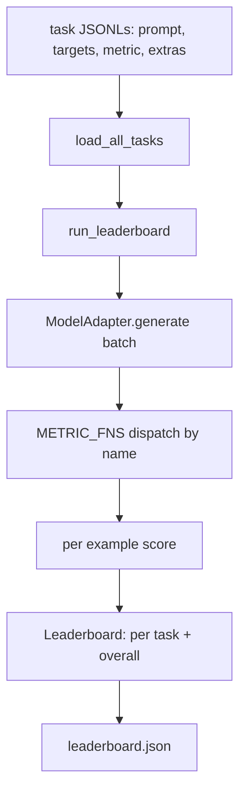
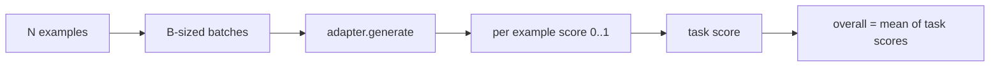

# 语言模型评估框架

> 一个在你无法定义的任务上表现好的模型，是偶然表现好的模型。评估框架就是任务定义、指标、运行器和排行榜，集于一个简短、可替换的形状中。

**Type:** Build
**Languages:** Python
**Prerequisites:** Phase 19 lessons 42 to 45
**Time:** ~90 minutes

## 学习目标

- 将任务定义为 JSONL 文件，每个样本包含 `prompt`、`targets`、`metric` 和可选的 `extras`。
- 实现五个指标：exact match、rouge-l F1、可执行检查、多选题和子串包含。
- 构建一个按任务批处理样本并分发到可替换模型适配器的运行器。
- 输出一个包含每任务分数、延迟和可复现总体平均值的排行榜 JSON。

## 问题

每周都有新的语言模型发布。营销声称它表现好。诚实的问题是：在什么上表现好？诚实的答案是你自己写的排行榜，因为供应商的排行榜是他们调优过的那个。

仓库中没有评估框架，你就靠感觉比较两个模型。有了框架，你在固定任务集上用固定指标比较它们，输出一个可以 diff 的 JSON。框架是昨天运行和今天运行之间的契约。没有它，回归就会上线。

陷阱是将框架过拟合到单一模型。修复方法是同一陷阱的反面：框架小到十五分钟能读完，任务小到能放在仓库中，指标从零写起使同事能审计，适配器是唯一存放模型特定代码的地方。换适配器，排行榜变动；换任务，排行榜变动。其他什么都不应该变。

## 概念



### 任务规范

每个样本是一行 JSONL：

```json
{"id": "arith-00", "prompt": "compute: 2 + 2", "targets": ["4"], "metric": "exact_match"}
```

对于需要评分辅助器的指标，`extras` 携带附加载荷：

```json
{
  "id": "code-00",
  "prompt": "python: write a function f that doubles its input",
  "targets": ["ok"],
  "metric": "code_exec",
  "extras": {"io_pairs": [[1, 2], [3, 6]]}
}
```

任务是 `outputs/tasks/` 下的 `.jsonl` 文件。文件名就是任务名。文件中所有样本共享一个指标。

### 五个固定任务

| 任务 | 指标 | 测试什么 |
|------|------|----------|
| arithmetic | exact_match | 确定性答案上的 token 级正确性 |
| summary | rouge_l | 与单行参考摘要的最长公共子序列 F1 |
| code-exec | code_exec | 可执行测试：预测的函数必须满足输入输出对列表 |
| multiple-choice | multiple_choice | 预测的第一个字母必须匹配允许的字母 |
| generation | substring_contains | 自由文本必须包含至少一个目标子串 |

### 指标契约

每个指标是从 `(prediction, targets, extras) -> float in [0.0, 1.0]` 的函数。框架对每样本分数取平均得到任务分数，再对任务分数取平均得到总体分数。指标函数很小：

- `exact_match`：小写，折叠空白，相等。
- `substring_contains`：同样的归一化，子串测试。
- `multiple_choice`：第一个字符大写。
- `rouge_l`：LCS 长度除以预测和参考的长度，precision 和 recall 的 F1。
- `code_exec`：在受限命名空间中执行预测，对每个输入输出对调用 `f(x)`，计数匹配。

code_exec 指标在剥离 builtins 的命名空间中运行预测。本课的测试断言 `import os` 会失败，因为 `os` 不在命名空间中；你无法从代码预测中访问文件系统。

### 模型适配器

```python
class ModelAdapter(Protocol):
    def generate(self, prompts: Sequence[str]) -> List[str]: ...
    @property
    def name(self) -> str: ...
```

适配器是接缝。本课提供 `ToyAdapter`，一个确定性模式匹配器，为五个固定任务中的每个 prompt 返回正确答案。真实适配器调用模型并返回其输出。框架不关心是哪个。

### 运行器

`run_task` 每次批处理 `batch_size` 个 prompt 并分发到指标函数。`run_leaderboard` 遍历每个任务并取平均。`write_leaderboard` 输出带 schema 字符串的 JSON，使未来格式变更不会静默破坏 dashboard。



## 构建

`code/main.py` 是可运行的制品。

### 步骤 1：种子固定任务

`seed_fixture_tasks(target_dir)` 写入五个 `.jsonl` 文件。`main.py` 首次运行时在目录为空时种子它们。

### 步骤 2：加载任务

`load_all_tasks(task_dir)` 读取每个 `.jsonl` 并返回从任务名到 `Example` 记录列表的 dict。以 `#` 开头的注释行和空行被跳过，使贡献者可以注释文件。

### 步骤 3：实现指标

每个指标是一个带单元测试的小函数。本课的测试套件包含 13 个用例，覆盖归一化、部分重叠、代码执行和不安全代码拒绝。

### 步骤 4：编写运行器

`run_task` 迭代批次并产生包含分数、正确数、总数和延迟的 `TaskResult`。`run_leaderboard` 遍历所有任务并产生包含总体平均值的 `Leaderboard`。

### 步骤 5：输出 JSON

`write_leaderboard` 序列化排行榜。`--include-per-example` 标志转储每样本记录，使你在分数变动时可以 diff 预测与上次运行。

运行：

```bash
python3 code/main.py
```

脚本首次运行时种子固定任务，用 toy 适配器（每个固定任务都答对）评分，并写入 `outputs/leaderboard.json`。toy 适配器的总体分数为 1.0；`test_main.py` 中的 stub 适配器测试展示同一框架在适配器无法回答时产生 0.0。

## 使用

要接入真实模型，写一个适配器。形状：

```python
class HttpAdapter:
    name = "vendor.v1"

    def __init__(self, endpoint, api_key):
        self.endpoint = endpoint
        self.api_key = api_key

    def generate(self, prompts):
        out = []
        for prompt in prompts:
            response = http_post(self.endpoint, prompt, self.api_key)
            out.append(response["text"])
        return out
```

在 `main()` 顶部将 `ToyAdapter` 换为 `HttpAdapter`。框架、任务、指标和排行榜保持不变。

在真实项目中交付框架时要执行的三个模式：

- **固定任务文件。** leaderboard.json 携带哈希固定的任务内容或将 JSONL 放在旁边；否则任务文件变动时分数也变，你无法分辨是哪个。
- **Diff 预测，不只是分数。** `--include-per-example` 标志让你看到分数下降那天模型说了什么。
- **限制 batch size。** 真实适配器有速率限制。小 batch size 使框架跨供应商兼容。

## 交付

`outputs/skill-lm-eval-harness.md` 记录配方：JSONL 任务规范、五个指标、可替换适配器、批处理运行器、带 schema 字符串的排行榜 JSON。`outputs/tasks/` 中的任务文件是固定任务；将它们复制到真实项目中作为起点。

## 练习

1. 添加第六个任务，使用你从零写的自定义指标（类 BLEU 重叠、类 BLEURT 参考评分，任何有清晰契约的）。
2. 扩展 `code_exec` 以捕获 stdout 并接受预期 stdout 列表作为 targets。
3. 添加排行榜 diff 命令：给定两个 `leaderboard.json` 文件，打印哪些任务变动了以及变动多少。
4. 限制每样本延迟。将适配器调用包装在超时中；在排行榜中显示单独的 `timeouts` 列。
5. 用 sha256 在排行榜中固定任务内容，使未来读者可以验证他们评分的是相同任务。

## 关键术语

| 术语 | 口语说法 | 实际含义 |
|------|----------|----------|
| Task spec | "评估格式" | 每样本包含 prompt、targets、metric、可选 extras 的 JSONL 文件 |
| Metric | "怎么评分" | 从 (prediction, targets, extras) 到 [0, 1] 浮点数的函数 |
| Adapter | "模型客户端" | 带 generate(prompts) -> list[str] 方法的对象；唯一的模型特定代码 |
| Leaderboard | "记分板" | 包含每任务分数、总数、延迟和总体平均值的 JSON |
| Code exec metric | "运行并检查" | 在受限命名空间中执行预测，与输入输出对比较 |

## 延伸阅读

- 原始 lm-evaluation-harness 作为生产参考，规模更大但形状相同。
- HuggingFace 的 lighteval 作为同一契约的替代实现。
- Phase 19 lesson 46 涵盖框架评分的训练栈中使用的梯度累积模式。
- Phase 19 lesson 47 涵盖你评分的 checkpoint 格式；在排行榜中固定 checkpoint 哈希。
- Phase 19 lesson 48 涵盖产生被测模型的分布式训练栈。
