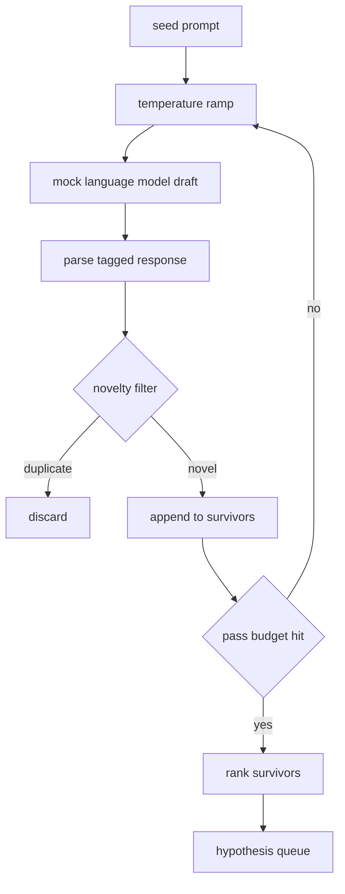

# 假设生成器

> 一个重复问同一个问题的研究 agent 是在浪费 token。技巧在于强制每次草稿落在新的地方。

**Type:** Build
**Languages:** Python
**Prerequisites:** Phase 19 Track A lessons 20-29
**Time:** ~90 minutes

## 学习目标
- 从种子 prompt 驱动采样器，将其输出转化为类型化的假设记录。
- 每次传递提升采样器温度，使下一次草稿比上一次漂移更远。
- 用小型 embedding 模型和余弦距离阈值过滤近似重复。
- 用融合新颖性、具体性和可测试性的评分函数对幸存者排序。
- 保持每一步确定性，使相同种子始终产生相同队列。

## 为什么先生成再过滤

一个只问一次模型的规划器得到一个假设。对于示例来说这没问题。对于研究循环来说形状不对。循环需要一个有深度的排序队列，这样当第一个假设失败时，运行器有下一个准备好的，无需再付一次完整采样的代价。

两个想法结合产生该队列。第一个是温度递增：每次通过采样器时提高温度一档，使后续草稿被鼓励漫游。第二个是新颖性过滤：每次草稿后，生成器测量与所有先前幸存者的 embedding 距离，拒绝落在聚类内的任何东西。

本课提供一个 mock 语言模型，为固定 prompt 返回脚本化的 token 序列。mock 足以测试完整路径：种子 prompt 输入，温度递增应用，候选解析，新颖性过滤运行，排序队列输出。

## Hypothesis 形状

```text
Hypothesis
  id             : int           (monotonic within a run)
  text           : str           (the claim)
  variables      : list[str]     (what changes between conditions)
  metric         : str           (what the runner will measure)
  baseline_ref   : str | None    (which paper or run the comparison cites)
  draft_pass     : int           (which sampler pass produced this)
  temperature    : float         (the sampler setting at draft time)
  novelty_score  : float         (distance from prior survivors, 0..1)
  rank_score     : float         (weighted sum used for ordering)
```

`variables` 和 `metric` 不是自由文本。解析器从标记化响应中提取它们。Lesson 52 的运行器在构建实验配置时直接读取这些字段。

`baseline_ref` 是可选但推荐的。Lesson 53 的评估器需要一个基线来比较。如果假设省略了它，评估器回退到同一指标上的前一次运行。

## 架构



循环很直接。有趣的部分是每个框都有硬契约。

## 温度递增

从 `t_min` 开始，到 `t_max` 结束，步长 `(t_max - t_min) / (n_passes - 1)`。每次传递在当前温度调用采样器，从 `GeneratorConfig.schedule()` 产生 `n_passes` 个均匀间隔的值。mock 模型通过在以 `(prompt, temp_bucket)` 为键的小型脚本化响应集之间切换来响应温度。桶是开区间，所以温度的小变化会选择不同的桶并产生不同的草稿。在生产中，采样器会是一个传入 `temperature=t` 的真实模型。

默认调度是从 `0.2` 到 `1.2` 的六次传递。六次足以填满队列，而不会为新颖性过滤器将要拒绝的样本付费。低于 `0.2` 模型会鹦鹉学舌般重复种子。高于 `1.2` 响应倾向于偏离主题并使解析器失败。

## 新颖性过滤

每次草稿解析后，生成器对文本做 embedding 并与每个已接受的假设比较。embedding 是一个小型哈希词袋 token，归一化到单位长度。两个单位向量之间的余弦距离是 `1 - dot(a, b)`。如果草稿与任何先前幸存者的最小距离高于 `novelty_threshold`，则通过。默认值为 `0.25`。

哈希 embedding 不花哨。它是确定性的，零依赖，足以捕获明显情况：两个共享大部分名词的草稿。生产部署会换入一个小型句子模型。接口保持不变。

## 排序分数

```text
rank_score = w_novelty * novelty_score
           + w_specificity * specificity_score
           + w_testability * testability_score
```

三个子分数。`novelty_score` 是与先前幸存者的最小 embedding 距离。`specificity_score` 是假设中具体变量的数量除以目标数量。`testability_score` 在假设同时指定了指标和基线时为 1，只有指标时为 0.5，否则为 0。

默认权重为 `0.4`、`0.3`、`0.3`。权重在生成器配置中，下游课程可以在不 fork 代码的情况下调整它们。

## Mock 语言模型

```python
class MockLLM:
    def sample(self, prompt: str, temperature: float, seed: int) -> str:
        ...
```

给定 `(prompt, temperature, seed)` 三元组，采样器是确定性的。mock 保持一个以 `(prompt_signature, temperature_bucket)` 为键的脚本化响应表。如果表中没有某个键的条目，采样器返回一个使解析器失败的回退值。回退路径由其中一个测试覆盖。

种子被混入响应中，使相同的 `(prompt, temperature)` 对在不同种子下产生不同草稿。测试中我们固定种子以保持结果可复现。在真实部署中种子来自系统时钟或计数器。

## 输出队列

输出是按 `rank_score` 降序排列的 `Hypothesis` 记录列表。Lesson 52 的运行器弹出队首，运行实验，Lesson 53 的评估器写回裁决。如果裁决说假设错了，运行器弹出下一个。

队列是有限的。当它为空时，编排器可以扩大种子 prompt 并再次运行生成器，或者停止并报告预算耗尽。

## 如何阅读代码

`code/main.py` 定义 `Hypothesis`、`MockLLM`、`HypothesisGenerator` 和一个确定性 demo。生成器暴露单一 `run(seed_prompt)` 方法返回排序队列；传递次数从 `GeneratorConfig.n_passes` 读取而非作为参数传入。embedding 是哈希词袋 token。新颖性过滤是单一函数。排序分数是单一函数。不依赖 `numpy`；embedding 数学是纯 stdlib，使课程保持可移植。

`code/tests/test_generator.py` 覆盖线性路径、重复拒绝路径、解析器失败路径、温度递增边界和排序顺序。

## 在流程中的位置

Lesson 50 产生队列。Lesson 51 取队首并运行文献检索来确认或反驳它。Lesson 52 取同一队首并运行实际实验。Lesson 53 读取两者的输出并写裁决。四课组合成一个无人参与的研究循环；人可以在任何边界介入。
