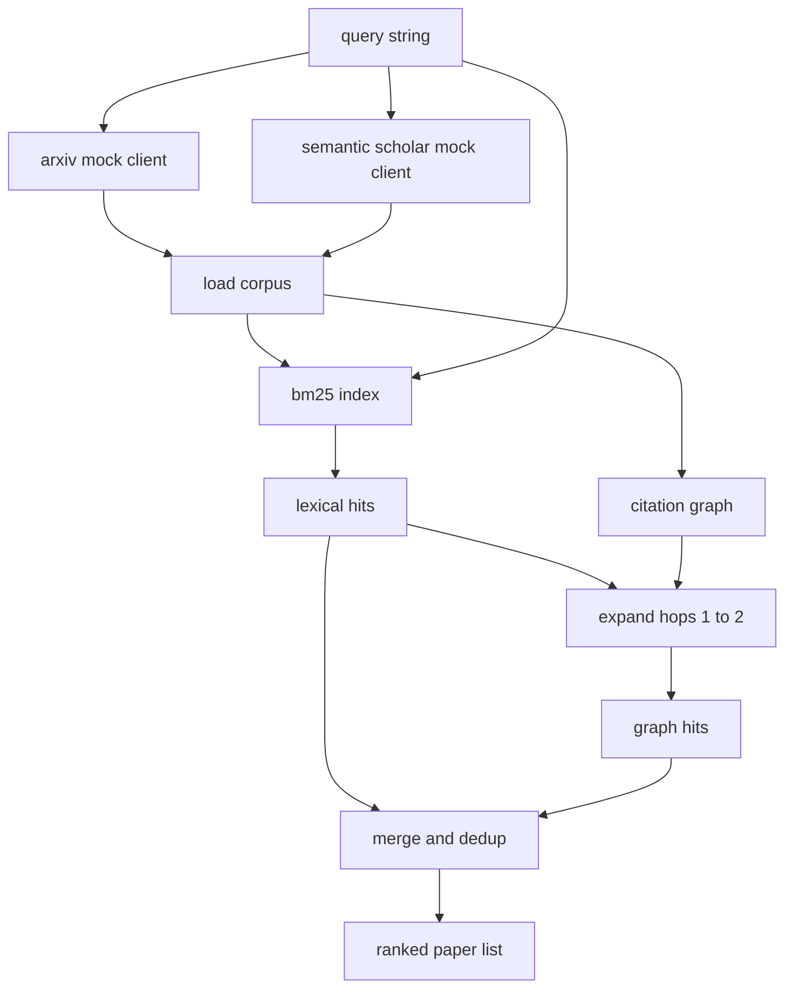

# 文献检索

> 假设很廉价。知道是否有人已经证明了它才是昂贵的部分。构建检索层，在运行器启动沙箱之前回答这个问题。

**Type:** Build
**Languages:** Python
**Prerequisites:** Phase 19 Track A lessons 20-29
**Time:** ~90 minutes

## 学习目标
- 建模一个小型论文记录，包含循环下游将读取的字段。
- 仅用 stdlib 数据结构在摘要上构建 BM25 索引。
- 遍历引用图以发现词法搜索遗漏的论文。
- 通过稳定的论文 id 对词法和图遍历的命中去重。
- 将两个 mock 外部 API 包装在单一客户端后面，使上游调用点在真实端点接入时保持不变。

## 为什么两次检索

对摘要的关键词搜索返回与查询共享词汇的论文。这覆盖了大部分表面。它遗漏两种情况。第一种是基础论文使用不同词汇；例如查询"sparse attention"会遗漏标题为"block selection in transformer routing"的论文。第二种是相关论文是引用已知锚点的后续工作；找到锚点并向前遍历比暴力搜索摘要池更高效。

本课构建两种遍历。BM25 在摘要上捕获词法命中。引用图遍历将种子集向前和向后扩展一到两跳。并集按论文 id 去重并按小型组合分数排序。

## Paper 形状

```text
Paper
  id          : str           (stable identifier, "p001" for the mock corpus)
  title       : str
  abstract    : str
  year        : int
  authors     : list[str]
  references  : list[str]     (paper ids this paper cites)
  citations   : list[str]     (paper ids that cite this paper)
  source      : str           (which mock api supplied it, "arxiv" or "s2")
```

references 和 citations 字段构成有向引用图。两个 mock API 返回重叠但不完全相同的字段，所以语料加载器在 `id` 上取并集。

## 架构



检索客户端拥有两次遍历和合并。调用者传入查询，得到一个排序列表，每个条目携带逐论文的分数字段（`bm25_score`、`graph_distance`、`recency_score`、`final_score`）来解释排名。

## 从零实现 BM25

实现是标准的 Okapi BM25，默认参数 `k1=1.5`、`b=0.75`。索引是两个字典：`term -> doc_frequency` 和 `term -> list of (doc_id, term_count)`。文档长度是摘要的 token 数。平均文档长度在索引构建时计算一次。对查询评分是对查询词的 `idf * tf_norm` 求和，其中 `tf_norm` 是标准 BM25 长度归一化词频。

分词器是 `lower` 然后按非字母数字分割。不做词干提取。生产系统会换入一个小型词干提取器。接口保持不变。

```text
idf(t)      = log((N - df + 0.5) / (df + 0.5) + 1.0)
tf_norm(t)  = (f * (k1 + 1)) / (f + k1 * (1 - b + b * dl / avgdl))
score(d, q) = sum over t in q of idf(t) * tf_norm(t)
```

## 引用图遍历

图从语料构建一次。前向边从论文到其引用。后向边从论文到引用它的论文。遍历是以 BM25 top 命中为种子的广度优先搜索，上限两跳。

两跳是刻意的上限。一跳太浅；agent 经常需要直接祖先或后代。三跳在连通图上会爆炸结果大小并倾向于偏离主题。本课将跳数限制作为配置旋钮暴露，下游循环可以收紧它。

## 去重和排序

两次遍历返回重叠集合。合并以论文 id 为键。对每篇论文，最终分数是加权混合。

```text
final_score = w_bm25 * bm25_score_norm
            + w_graph * graph_score
            + w_recency * recency_score
```

`bm25_score_norm` 是 BM25 分数除以合并集中的最大 BM25 分数（所以字段在零到一之间）。`graph_score` 对直接词法命中为 1，一跳为 `0.6`，两跳为 `0.3`，否则为零。`recency_score` 是从语料最小年份的零到最大年份的一的线性斜坡。

默认权重为 `0.5`、`0.3`、`0.2`。权重是配置；陈旧主题可能调低 recency，快速发展的主题则调高。

## Mock 语料

语料是一百篇论文，由 `build_corpus()` 生成。每篇论文有手写的标题和摘要，涵盖五个主题之一：attention sparsity、retrieval augmentation、low rank adapters、dataset distillation 和 evaluation harnesses。引用和被引被连接使每个主题形成连通子图，带少量跨主题边。

两个 mock API 客户端（`ArxivMockClient`、`SemanticScholarMockClient`）从同一语料读取但暴露不同字段。Arxiv 返回 title、abstract、year、authors。Semantic Scholar 添加 references 和 citations。检索客户端在 id 上取并集；跨客户端字段不一致的处理推迟到后续课程。

## Lesson 52 和 53 读取什么

Lesson 52 的运行器读取 `paper.id`、`paper.title` 和摘要的前三句作为实验上下文。Lesson 53 的评估器读取 `paper.year` 和 `paper.references` 来将基线归因到特定论文。

检索客户端返回 `RetrievalResult`，包含排序列表和每查询指标：命中数、平均分、最高分、总墙钟时间。运行器记录这些，使下游可观测性遍历可以绘制质量随时间的变化。

## 如何阅读代码

`code/main.py` 定义 `Paper`、`ArxivMockClient`、`SemanticScholarMockClient`、`BM25Index`、`CitationGraph`、`RetrievalClient` 和一个确定性 demo。mock 客户端和语料在同一文件中使课程保持可移植。BM25 实现是一个类，六十行。图遍历是一个方法。

`code/tests/test_retrieval.py` 覆盖词法路径、图路径、合并、去重和空查询。

## 在流程中的位置

Lesson 50 产生假设。Lesson 51 搜索文献看该假设是否已被解决。Lesson 52 在未解决时运行实验。Lesson 53 读取检索结果和实验指标来写裁决。检索客户端是四个阶段中最廉价的，在编排器中最先运行。
