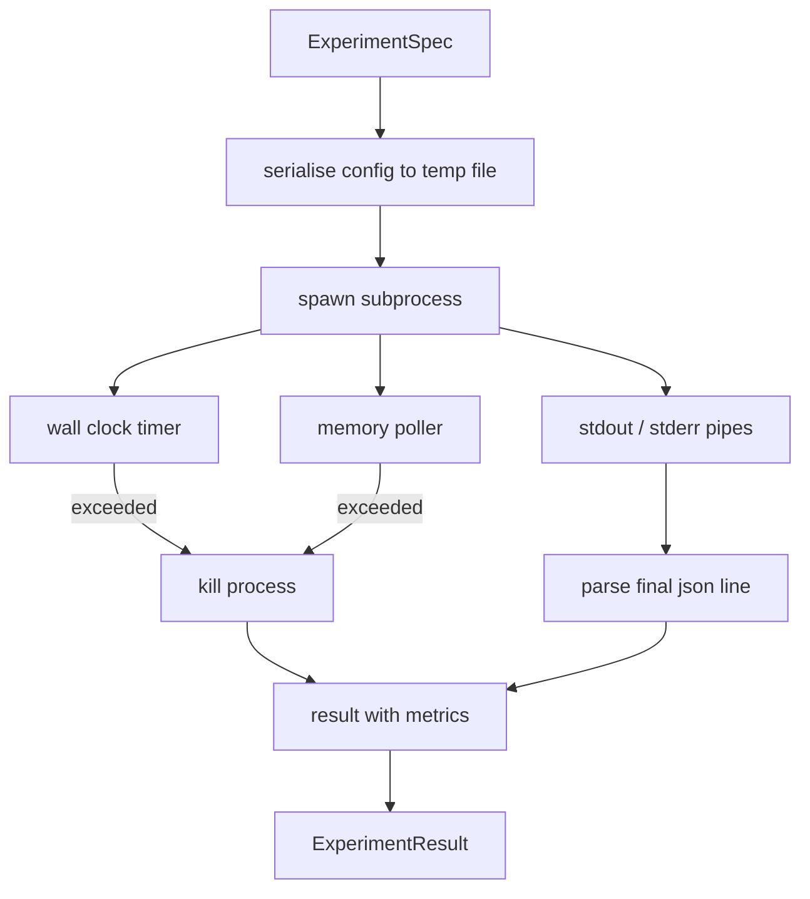

# 实验运行器

> 循环的诚实程度取决于它的测量。构建运行器：接收 spec，在沙箱子进程中执行，输出评估器可以信任的 JSON 指标 blob。

**Type:** Build
**Languages:** Python
**Prerequisites:** Phase 19 Track A lessons 20-29
**Time:** ~90 minutes

## 学习目标
- 将实验编码为运行器可以序列化到子进程的类型化 spec。
- 启动带硬墙钟超时和软内存上限的子进程，并将两者作为终止条件暴露。
- 将 stdout、stderr 和结构化指标 blob 捕获到单一结果记录中。
- 构建消融表，在固定基础 spec 上每次扫描一个配置旋钮。
- 给定种子保持每个结果确定性，使评估器跨运行看到相同数字。

## 为什么用子进程

研究循环运行不受信任的代码。假设来自采样器，实验脚本来自同一路径；将任何一个视为进程内安全是在自找崩溃——会把编排器一起拖垮。子进程是语言提供的最简单隔离：独立进程、独立地址空间、父端的信号句柄。

这里的运行器没有实现完整沙箱。没有 cgroup，没有 seccomp 过滤器，没有命名空间重映射。它有的是墙钟超时、内存增长的轮询循环、以及在任一限制上终止进程的 kill 路径。这是每个更精细沙箱扩展的运行时契约。本课将契约保持在一次能读完的大小。

## ExperimentSpec 形状

```text
ExperimentSpec
  spec_id        : str            (stable id, "exp_001")
  hypothesis_id  : int            (link back to the queue from lesson 50)
  script_path    : str            (path to the python script to run)
  config         : dict           (passed to the script as one json arg)
  seed           : int            (deterministic seed for the experiment)
  wall_timeout_s : float          (hard timeout, killed on exceed)
  memory_cap_mb  : int            (soft cap, polled; killed on exceed)
  metric_keys    : list[str]      (which fields the evaluator will read)
```

脚本在磁盘上；运行器将 config 写入临时文件路径供脚本读取。脚本应在 stdout 上打印一行 JSON，其键是 `metric_keys` 的超集。stdout 上的其他内容被捕获但被指标解析器忽略。

## 架构



运行器是一个类一个主方法。轮询器是一个小线程，每隔轮询间隔唤醒一次，在可用时从 proc 文件系统读取子进程的 `psutil` 等价物，在平台不暴露时回退到空操作。

## 为什么是软内存上限

硬内存上限需要 `resource.setrlimit` 且只在 POSIX 上工作。本课提供可移植方案：从平台轮询驻留集大小，超过上限时 kill 子进程。上限是软的因为轮询器有非零间隔；进程可以在两次轮询之间飙升超过上限然后回落。运行器记录观察到的最大 RSS，使评估器能看到运行离限制有多近。

在没有进程检查支持的系统上，轮询器记录一次性警告并禁用自身。墙钟超时仍然适用。本课测试覆盖两条路径。

## 捕获 stdout 和 stderr

运行器在完成时读取两个管道的排空内容。Stdout 逐行扫描；最后一行能解析为包含所有必需 `metric_keys` 的 JSON 的被作为指标 blob。更早的 JSON 行保留在结果中作为 `intermediate_metrics`；评估器可以用这些做学习曲线。

Stderr 被逐字捕获到结果中。运行器从不在非零退出码上抛异常；而是在结果中记录退出码。任何非零退出被标记为 `"crash"`，即使脚本打印了指标，所以评估器默认将部分运行视为失败。

## 消融表

```python
def ablate(base: ExperimentSpec, knob: str, values: list[Any]) -> list[ExperimentSpec]:
    ...
```

给定基础 spec 和旋钮名称，辅助函数返回每个值一个 spec，`config[knob]` 被覆盖。每个 spec 得到派生的 `spec_id`（`f"{base.spec_id}_{knob}_{value}"`）。运行器提供 `AblationRunner`，按顺序运行它们并返回以旋钮值为键的 `AblationTable`。

为什么每次一个旋钮。全因子扫描指数爆炸并产生评估器无法解释的结果。每次一个旋钮产生评估器可以绘制的干净轴。本课仅支持多旋钮扫描作为重复的单旋钮消融，由调用者组合。

## 确定性

每个 spec 携带种子。运行器通过 config dict 将种子转发给脚本（`config["__seed"] = spec.seed`）。`code/experiments/` 中的 mock 实验脚本遵守种子并跨运行产生相同指标。Lesson 53 的评估器依赖于此；没有确定性，"回归"可能只是不同的随机初始化。

## Mock 实验脚本

本课提供一个实验脚本：`code/experiments/sparsity_experiment.py`。它是一个真实脚本，读取其配置文件，用 numpy 随机传递模拟小型训练运行，并打印 JSON 指标 blob。脚本遵守 `sleep_s` 旋钮用于测试超时，`allocate_mb` 旋钮用于测试内存轮询器。

模拟没有训练任何真实的东西。它是一个模仿训练循环形状的数值计算：loss 曲线、最终 perplexity、墙钟时间。本课的重点是运行器，不是模拟。真实实验脚本会导入模型。

## Result 形状

```text
ExperimentResult
  spec_id              : str
  hypothesis_id        : int
  exit_code            : int
  terminal             : "ok" | "timeout" | "oom" | "crash"
  wall_time_s          : float
  peak_rss_mb          : float | None
  metrics              : dict
  intermediate_metrics : list[dict]
  stdout_tail          : str
  stderr_tail          : str
```

评估器首先读取 `metrics` 和 `terminal`。如果 terminal 不是 `"ok"`，实验计为失败运行，评估器的裁决是自动的。否则指标通过显著性检验。

## 如何阅读代码

`code/main.py` 定义 `ExperimentSpec`、`ExperimentResult`、`ExperimentRunner`、`AblationRunner` 和一个确定性 demo。子进程管理是一个类。内存轮询器是一个小线程。消融辅助函数是单一函数。

`code/experiments/sparsity_experiment.py` 是测试中使用的 mock 实验。它从 argv 读取配置文件路径，完成时写入单行 JSON 指标。

`code/tests/test_runner.py` 覆盖成功路径、超时路径、崩溃路径、消融表和跨两次运行的确定性检查。

## 在流程中的位置

Lesson 50 生成假设。Lesson 51 过滤掉文献已解决的。Lesson 52 对剩余的运行实验。Lesson 53 读取结果，运行显著性检验，写入编排器存储在假设 id 上的裁决。
