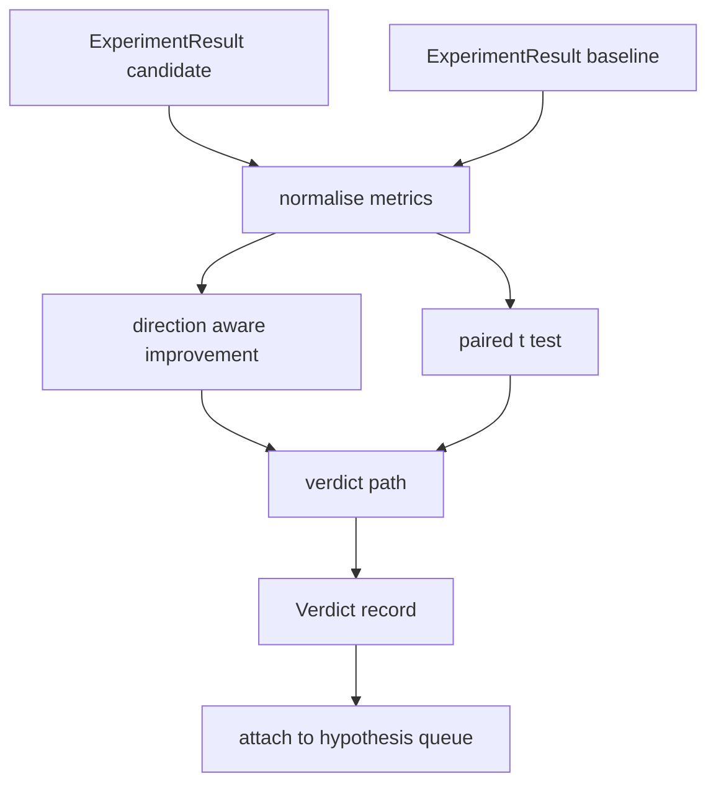

# 结果评估器

> 运行器产生了数字。评估器决定这些数字是改善、回归还是噪声。构建将指标转化为一行结论的裁决路径。

**Type:** Build
**Languages:** Python
**Prerequisites:** Phase 19 Track A lessons 20-29
**Time:** ~90 minutes

## 学习目标
- 使用方向感知的改善度和固定阈值将候选运行与基线比较。
- 从零实现逐种子指标的配对 t 检验并读取结果 p 值。
- 归一化对数尺度指标，使下游报告可以将它们与线性指标混合。
- 输出编排器可以附加到 lesson 50 队列上的逐假设裁决。
- 保持每一步纯函数，使相同输入始终产生相同裁决。

## 为什么用配对检验

运行器的单一数字不能说明变化是否真实。相同配置用不同种子给出不同的 perplexity。变化可能是噪声。正确的比较是配对的：相同种子相同数据，候选和基线各运行一次。每个种子贡献一个差值。这些差值的均值是效应。这些差值的标准误差是噪声底线。

本课从零实现检验。没有 `scipy.stats`。数学小到一屏能读完。

```text
diffs    = [a_i - b_i for i in seeds]
mean     = sum(diffs) / n
variance = sum((d - mean) ** 2 for d in diffs) / (n - 1)
t_stat   = mean / sqrt(variance / n)
df       = n - 1
p_value  = two_sided_p(t_stat, df)
```

双侧 p 值使用正则化不完全 beta 函数。本课提供一个使用 Lentz 连分数的小型实现。整个东西是六十行 stdlib 数学。

## 方向感知的改善度

有些指标上升时改善（accuracy、throughput）。有些下降时改善（loss、perplexity、墙钟时间）。评估器在每个指标上携带 `direction` 字段。

```text
if direction == "higher_is_better":
    improvement = (candidate - baseline) / abs(baseline)
elif direction == "lower_is_better":
    improvement = (baseline - candidate) / abs(baseline)
```

改善度是有符号的。higher_is_better 指标上的负改善度意味着候选更差。裁决路径同时读取符号和幅度。

一个固定阈值（`improvement_threshold=0.02`，百分之二）决定变化是否大到值得判定。低于此阈值裁决为"noise"，无论 p 值如何；循环对用户无法测量的变化不感兴趣。

## 架构



评估器运行三个独立计算并在裁决路径中汇合。每个计算是无共享状态的纯函数。

## 对数归一化

Perplexity 是 loss 的指数。Loss 下降 0.1 对应 perplexity 大得多的下降。直接比较两个配置的 perplexity 没问题，但在单一报告中将它与线性指标混合需要归一化。

本课对 `scale` 字段为 `"log"` 的任何指标在计算改善度前取自然对数。阈值然后在对数空间中应用。Perplexity 从 32 降到 28 是 `log(28) - log(32) = -0.133`，在 lower_is_better 指标上远超百分之二的阈值。

```text
if scale == "log":
    a = log(candidate)
    b = log(baseline)
else:
    a = candidate
    b = baseline
```

`scale="linear"`（默认）的指标跳过变换。同一代码路径处理两者。

## 逐种子配对检验

Lesson 52 的运行器每次运行输出一个最终指标 blob。对于配对检验，评估器需要候选每个种子一个 blob，基线每个种子一个 blob。编排器在两种配置下跨种子列表运行同一实验，并将两个 `ExperimentResult` 记录列表交给评估器。

评估器按种子配对（种子在 `result.metrics["seed"]` 中）并遍历请求的指标。如果两个列表的种子不匹配，评估器抛出 `PairingError`。编排器应重新运行。

## Verdict 形状

```text
Verdict
  hypothesis_id          : int
  metric                 : str
  direction              : "higher_is_better" | "lower_is_better"
  scale                  : "linear" | "log"
  candidate_mean         : float
  baseline_mean          : float
  improvement            : float       (signed, fraction; see direction rules)
  p_value                : float | None  (None if n < 2)
  significance_threshold : float
  improvement_threshold  : float
  verdict                : "improved" | "regressed" | "noise" | "failed"
  rationale              : str
```

裁决路径是一个小决策表：

```text
1. If any candidate result has terminal != "ok": verdict = "failed"
2. else if |improvement| < improvement_threshold:  verdict = "noise"
3. else if p_value is None or p_value > significance: verdict = "noise"
4. else if improvement > 0:                          verdict = "improved"
5. else:                                             verdict = "regressed"
```

Rationale 是一行人类可读的句子，编排器可以将其记录在假设 id 旁。

## 如何阅读代码

`code/main.py` 定义 `MetricSpec`、`Verdict`、`Evaluator`、t 统计量和不完全 beta 辅助函数、以及一个确定性 demo。t 检验用纯 stdlib 数学实现；numpy 仅用于读取指标列表和计算均值与方差。

`code/tests/test_evaluator.py` 覆盖改善路径、回归路径、噪声路径（小改善）、噪声路径（低 n）、失败终止路径、对数归一化路径、t 检验与已知参考值的对比、以及配对错误。

## 在流程中的位置

Lesson 50 产生假设队列。Lesson 51 过滤掉文献已解决的。Lesson 52 在候选和基线配置下跨种子运行实验。Lesson 53 读取这些运行并写裁决。编排器将四者缝合在一起：

```text
for hypothesis in queue:
    literature = retrieval.search(hypothesis.text)
    if literature_settles(hypothesis, literature):
        attach(hypothesis, verdict="settled")
        continue
    candidates = runner.run_all(specs_for(hypothesis))
    baselines  = runner.run_all(baseline_specs_for(hypothesis))
    metric_spec = MetricSpec("perplexity", direction=LOWER, scale=LOG)
    verdict = evaluator.evaluate(hypothesis.id, metric_spec, candidates, baselines)
    attach(hypothesis, verdict)
```

该编排器不在本课中；四课通过各自定义的 dataclass 组合成它，无需额外胶水。
