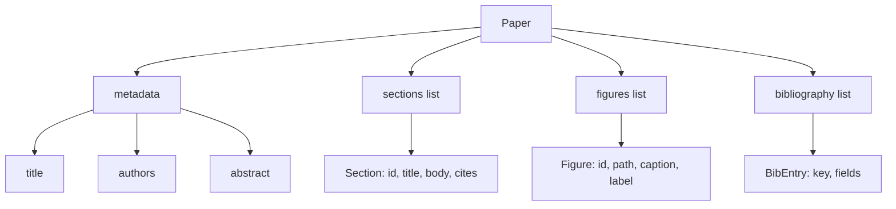
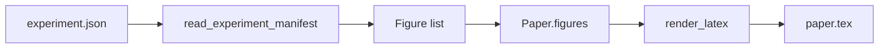
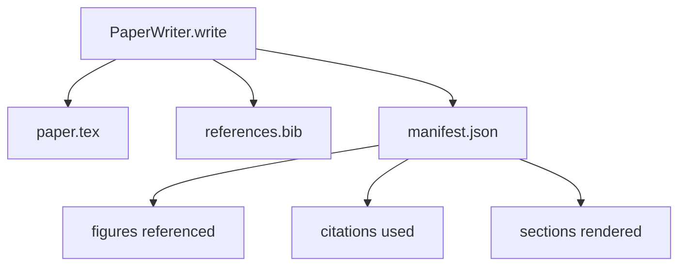

# 论文撰写器

> LaTeX 骨架是研究者与排版者之间的契约。如果契约被打破，文档无法编译，失败是响亮的。先构建骨架，再填充内容。

**Type:** Build
**Languages:** Python
**Prerequisites:** Phase 19 lessons 50-53
**Time:** ~90 minutes

## 学习目标

- 将研究论文视为具有已知 section 图的结构化制品，而非自由格式文档。
- 生成一个 LaTeX 骨架，在任何正文写入之前声明其摘要、章节、图表槽位和参考文献键。
- 通过确定性槽位机制将实验输出的图表（路径和标题）注入骨架。
- 接线一个 mock 正文生成器，从结构化大纲填充每个章节，使框架无需模型即可测试。
- 输出单一 `paper.tex` 加 `references.bib` 加一个列出所有引用图表和使用引文的 manifest。

## 为什么先骨架

从正文开始的草稿会积累结构债务。引言长出三段本应在相关工作中的内容。图表在定义前被引用。参考文献最终有三个键指向同一篇论文。等作者注意到时，重写代价已高于写作代价。

骨架反转了这一点。结构作为数据预先声明。章节是带名称和顺序的槽位。图表是带 id 和标题的槽位。参考文献键在顶部与其指向的条目一起声明。正文逐个生成到这些槽位中。框架可以在任何正文写入之前验证：每个图表有槽位，每个引文有条目，每个章节出现在目录中。

这与早期课程对计划、工具调用和 trace 应用的纪律相同。结构就是契约。

## Paper 形状

每个字段都是普通 Python 数据。渲染器是从 `Paper` 到 LaTeX 字符串的纯函数。框架可以在渲染前内省论文：计数章节、列出缺失的图表文件、检查每个 `\cite{key}` 有匹配的 `BibEntry`。

## 渲染契约

渲染器保证三个属性。第一，骨架中的每个图表槽位输出一个带稳定标签 `fig:<id>` 的 `\begin{figure}` 块。第二，每个章节输出一个带稳定标签 `sec:<id>` 的 `\section{}`，使交叉引用工作。第三，参考文献输出一个 `\bibliography` 块，其 `references.bib` 恰好包含论文上声明的条目，不多不少。

违反任何一条是渲染错误，不是警告。骨架是契约；静默丢弃图表的渲染是契约违反。

## 从实验注入图表

本 track 早期课程产生的实验输出是 JSON manifest。每个 manifest 携带带路径和短标题的制品列表。论文撰写器读取该 manifest 并产生 `Figure` 记录。

注入是确定性的。Figure id 从实验名称加单调计数器派生。标题来自 manifest。路径相对于论文输出目录归一化，使 LaTeX 即使实验输出在磁盘其他位置也能编译。

## Mock 正文生成器

本课不调用模型。`MockProseGenerator` 读取大纲形状并确定性地输出正文。大纲形状是每章节一个短字符串。生成器将该字符串扩展为两个短段落，章节标题编织其中。生成的正文在大纲声明时恰好提及图表和引文。

这足以测试撰写器的每个行为。真实实现会将生成器换为模型调用。围绕它的框架不变。这就是将正文生成器声明为 callable 的价值：测试替换确定性的，生产替换模型的，流水线其余部分完全相同。

## Manifest 输出

撰写器向输出目录输出三个文件。

Manifest 是下游评估器或批评循环读取的内容。它不解析 LaTeX；它读 manifest。下一课批评循环将此 manifest 作为输入并产生反馈列表。这就是为什么 manifest 是契约的一部分而 LaTeX 不是。

## 验证门

撰写器在写入任何文件前运行四个门。

1. 每个 figure id 在论文内唯一。
2. 每个章节的 `cites` 字段引用论文上声明的参考文献键。
3. 摘要非空。
4. 标题非空。

失败的门抛出带精确原因的 `PaperValidationError`。框架将原因作为失败模式暴露。没有部分写入：要么三个文件全部输出，要么一个都不输出。

## 如何阅读代码

`code/main.py` 定义 `Paper`、`Section`、`Figure`、`BibEntry`、`PaperValidationError`、`MockProseGenerator`、`PaperWriter` 和 `render_latex` 函数。`write` 方法接受输出目录并输出 `paper.tex`、`references.bib` 和 `manifest.json`。`read_experiment_manifest` 辅助函数将实验 manifest 列表转换为 `Figure` 记录。

`code/tests/test_paper_writer.py` 覆盖：无章节的骨架渲染、带两个章节和两个图表的完整渲染、缺失引文门、重复 figure-id 门、manifest 内容、以及 LaTeX 字符串契约（每个章节输出 `\section{}`，每个图表输出 `\begin{figure}`）。

## 进一步扩展

真实实现会想要两个扩展。第一，多格式渲染：同一 `Paper` 形状编译为博客文章的 Markdown 和预览的 HTML。渲染器成为 `Paper` 上的策略。第二，引文丰富：撰写器从引文键获取 BibTeX 条目，给定 DOI 的本地缓存。两者都增加价值，都可以在不触碰骨架契约的情况下添加。

骨架是赌注。章节、图表和引文声明为数据，正文生成到槽位中，manifest 与 LaTeX 一起输出。每个后续改进都在此基础上组合。
