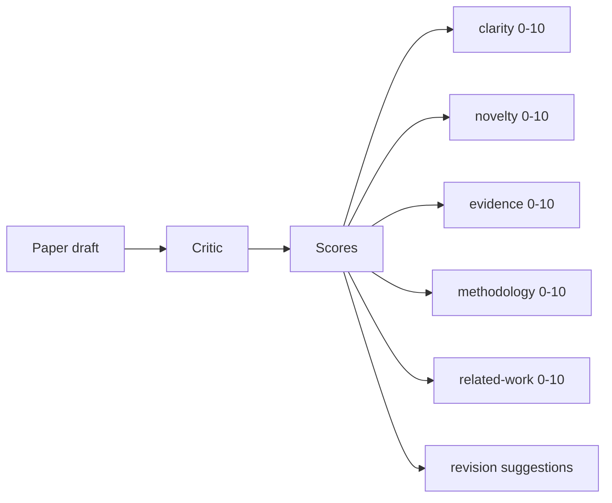
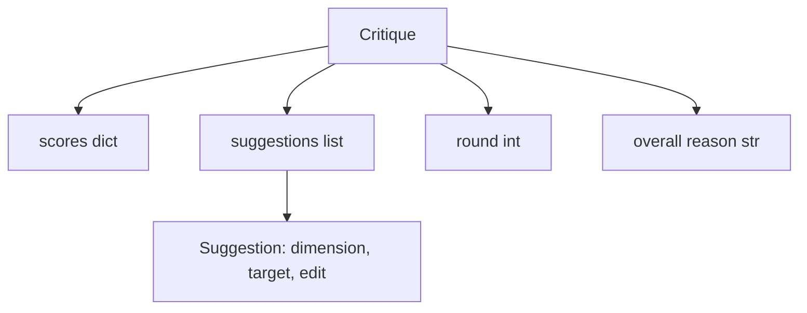
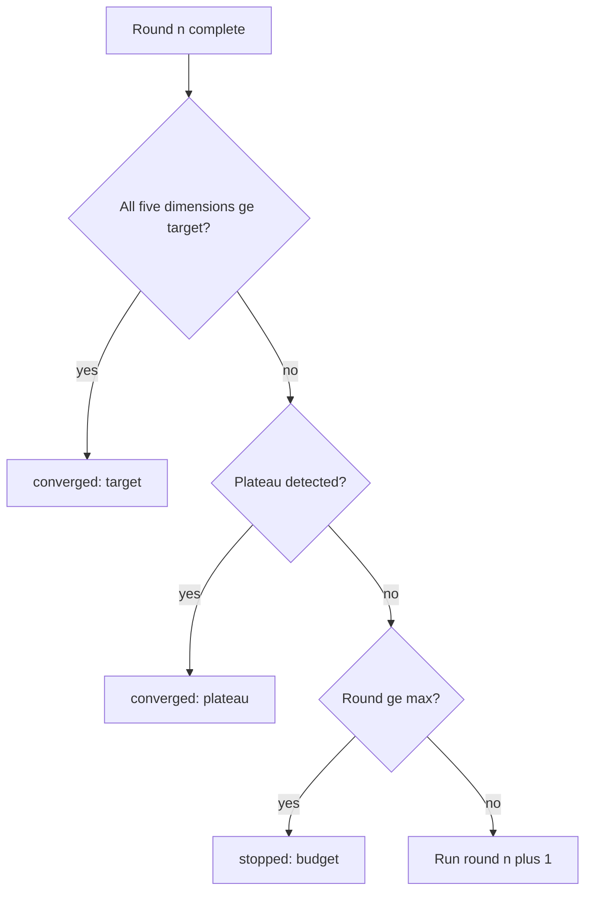
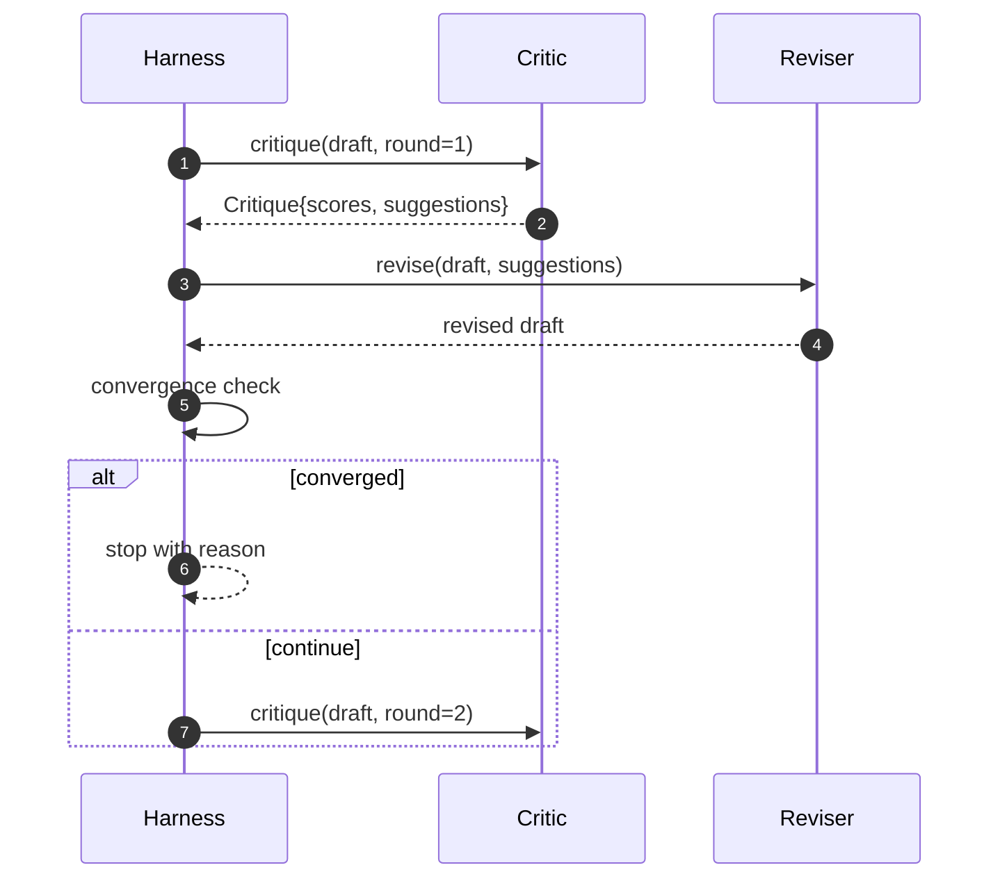

# 批评循环

> 第一次就返回"看起来不错"的批评者是坏的。总是返回"需要修改"的批评者也是坏的。有趣的批评者是会收敛的那个，而你必须工程化收敛。

**Type:** Build
**Languages:** Python
**Prerequisites:** Phase 19 lessons 50-53
**Time:** ~90 minutes

## 学习目标

- 在五个固定维度上对论文草稿评分：clarity、novelty、evidence、methodology、related-work。
- 将每轮批评作为结构化修订 diff 而非自由格式重写来应用。
- 通过比较跨轮分数检测收敛；在平台期、目标达成或预算耗尽时停止。
- 用最大迭代预算限制轮数，使不收敛的批评者不会永远运行。
- 输出逐轮 trace，使 dashboard 或下一阶段可以渲染分数轨迹。

## 为什么五个固定维度

自由格式批评者是一个返回一段建议的模型。下一轮的修订将该段落作为环境上下文。重写是否解决了批评是不可验证的，因为批评从未有过结构。

五个维度给框架一个契约。



分数是一个向量。框架跨轮监视每个维度。一个提升 clarity 但拉低 evidence 的修订是 evidence 上的回归，收敛检查能看到它。纯模型批评者无法提供这个保证。

## Critique 形状



每个建议携带它改善的维度、它针对的章节、以及修订者可以应用的 `edit` 指令。修订者也是一个 callable。本课提供一个确定性修订者，将 edit 指令解释为 append-to-section 操作。模型驱动的修订者会将同一字段解释为 prompt。契约不变。

## 收敛规则，按顺序

批评循环在以下三个条件中任一触发时终止。



目标是最严格的情况：五个维度（clarity、novelty、evidence、methodology、related_work）每一个都必须达到 `>= target_score`（默认 `8.0`）循环才返回成功。高均值但有一个弱维度是不够的。平台期检测比较当前轮的均值与上一轮的均值。如果改善低于 `plateau_epsilon`（默认 `0.1`）连续两轮，循环以 `plateau` 退出。预算是轮数的硬上限（默认 `5`），以 `budget` 退出。

顺序很重要。目标优先于平台期优先于预算。如果第三轮在同一迭代中既达到目标又会触发平台期，结果是 `target`，不是 `plateau`。

## 为什么平台期检测跨两轮运行

单轮平台期是噪声。真实批评者即使在固定草稿上每次迭代也返回略有不同的分数，因为确定性评分仍然取决于哪些建议被应用以及以什么顺序。要求连续两轮平台期过滤掉该噪声。如果框架报告平台期，草稿确实已停止改善。

## 本课中的确定性批评者

本课不调用模型。提供的批评者是一个 callable，基于三个信号对草稿评分：平均章节正文长度（clarity）、图表数和引文数（evidence）、以及论文元数据上的 `originality_tag` 字段（novelty）。修订者知道如何推高每个分数。

```text
clarity      grows when the average section body length increases
novelty      grows when originality_tag is set to "high"
evidence     grows when a section's figure_refs is non-empty
methodology  grows when a section titled "Method" exists with body
related-work grows when a section titled "Related Work" exists with body
```

修订者将每个建议解释为定向追加。第一轮后，框架可以观察到分数上升。测试用这个属性断言循环缩小了差距。

## 完整循环契约



框架拥有轮数计数器、trace 和收敛检查。批评者拥有分数。修订者拥有 diff。三者都不触碰其他的状态。

## Trace 输出

每轮输出一个 trace 事件，包含轮数、分数向量、建议数和收敛裁决。完整 trace 与最终草稿一起返回。下游 dashboard 可以渲染分数-每轮图表。下一课迭代调度器读取 trace 来决定分支是否值得保留。

## 保护免受坏批评者的预算

产生永远不改善分数的建议的批评者会将循环锁定在最大迭代上限。Trace 使这可见：五轮，分数平坦，裁决 `budget`。用户将其读为批评者 bug，而非草稿 bug。替代方案——只暴露最终草稿——隐藏了诊断。Trace 优先设计暴露它。

## 如何阅读代码

`code/main.py` 定义 `Critique`、`Suggestion`、`Critic` protocol、`Reviser` protocol、`CriticLoop`、以及返回确定性批评者和匹配修订者的 `make_deterministic_critic_pair` 工厂。包含一个最小 `Paper` 形状使课程独立。

`code/tests/test_critic_loop.py` 覆盖：第一轮后的单调改善、调优草稿上的目标收敛、两轮平坦后的平台期检测、无建议改善时的预算耗尽、修订者的建议应用、以及 trace 形状。

## 进一步扩展

真实实现会想要两个扩展。第一，维度权重：workshop 论文对 novelty 权重高于 methodology；期刊反之。收敛检查变为加权均值。第二，配对批评者：一个批评者评分，第二个批评者在修订者看到建议之前裁决它们。两者都增加价值，都在同一 `Critique` 形状上组合。

赌注是分数向量。一旦批评是结构化的，每个后续改进——收敛规则、dashboard、配对批评者——都可以在不改变循环的情况下接入。
