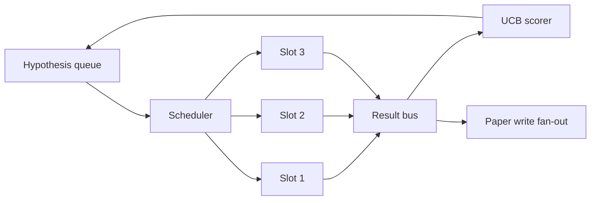
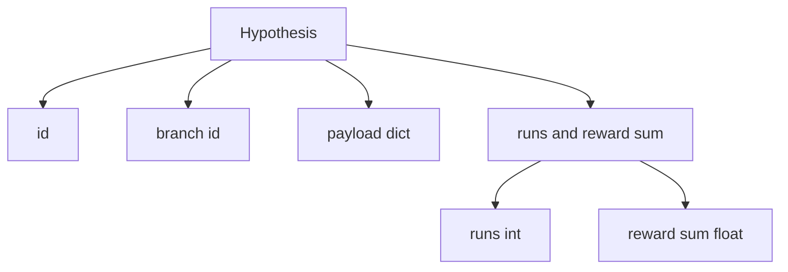
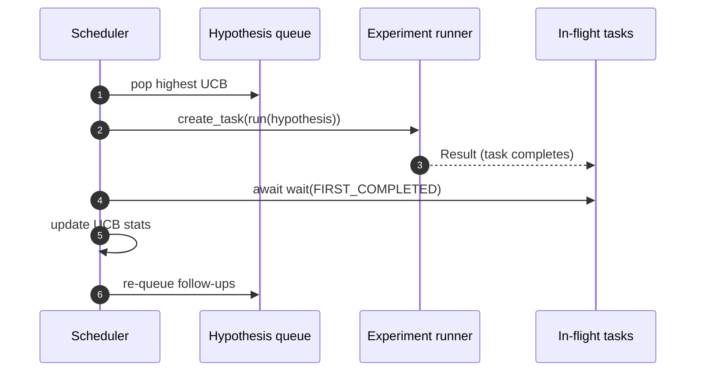

# 迭代调度器

> 没有调度器的研究循环只是一个自以为是的队列。调度器是循环决定停止探索什么的地方，而这个决定就是整个博弈。

**Type:** Build
**Languages:** Python
**Prerequisites:** Phase 19 lessons 50-53
**Time:** ~90 minutes

## 学习目标

- 将研究工作流建模为假设队列，馈入并行实验槽位，结果扇入回流。
- 使用 asyncio 并发运行多个实验，使调度器能保持所有槽位忙碌。
- 用 UCB 对每个假设分支评分，使调度器能在不放弃探索的前提下剪枝低收益分支。
- 将完成的结果扇出到论文写作阶段和重新入队阶段，使高收益分支产生后续假设。
- 呈现每次迭代的 trace，包含分支分数、槽位占用率和剪枝决策。

## 为什么是调度器，而不是工作列表

扁平的工作列表按提交顺序运行任务。当每个任务独立时这没问题。研究不是独立的：实验三的发现会改变实验四和五的优先级。一个读取结果扇入并重排队列的调度器，在每单位算力上能完成更多有用的工作。

有趣的设计选择是评分规则。贪心评分器总是选当前领先者，永远不探索。均匀评分器永远不利用。UCB（upper confidence bound）是中间路线：利用领先者的同时为尝试较少的分支保留容量。

## 系统形态



队列持有假设。当槽位空闲时，调度器选择 UCB 最高的假设。每个槽位异步运行一个实验。完成的实验将结果扇出到 bus。Bus 更新源分支的 UCB 统计，并在分支收益超过阈值时扇出到论文写作阶段。

## Hypothesis 的形态



`branch` 是 UCB 统计的 key。多个假设可以共享一个 branch（branch 是研究方向；hypothesis 是该方向内的一次试验）。`runs` 是该分支已完成实验的计数，`reward_sum` 是累积奖励。UCB 读取两者。

## UCB 评分

本课程使用的 UCB 公式是经典的 UCB1。

```text
ucb(branch) = mean_reward(branch) + c * sqrt( ln(total_runs) / runs(branch) )
```

`total_runs` 是所有分支已完成实验的总计数。`c` 是探索权重；本课程默认为 `sqrt(2)`。零次运行的分支得到 `+inf`，因此未尝试的分支总是被优先调度。高平均奖励的分支保持高分直到其他分支追上；运行多次但奖励不高的分支会被尝试较少的替代方案超越。

剪枝门控与选择器分离。当分支的平均奖励在至少 `prune_after_runs` 次试验（默认 `3`）后低于绝对下限（默认 `0.2`）时，剪枝将其从未来调度中移除。这保持队列有界。

## 使用 asyncio 的并行槽位

调度器通过 `asyncio.create_task` 驱动实验。每个 task 运行实验 runner（一个 `async def` callable），返回一个 `Result`。主循环通过 `asyncio.wait(..., return_when=asyncio.FIRST_COMPLETED)` 等待 in-flight tasks 集合，并在每次完成时触发评分更新。



三个槽位并发运行。主循环永远不会阻塞在单个实验上。调度器在槽位空闲时立即启动新 task，直到队列为空且没有 task 在飞行中。

## 扇出：论文触发

当分支的平均奖励超过 `paper_threshold`（默认 `0.7`）且该分支尚未产出论文时，调度器将 `paper.trigger` 事件扇出到输出列表。下游第五十四课的 paper writer 会接收这个事件。在本课程中，trigger 被捕获为列表以便测试可以断言。

## 扇出：后续假设

当高收益结果到达时，调度器可以调用用户提供的 `expander` 来产生同一分支上的一个或多个后续假设。Expander 是从 `Result` 到 `list[Hypothesis]` 的纯函数。本课程提供一个确定性 expander，对任何奖励超过 paper threshold 的结果产生两个后续假设。

## 预算

两个预算保护调度器免于失控循环。

```text
max_experiments    : 所有分支运行的实验总计数
max_seconds        : 挂钟时间上限（asyncio time）
```

当任一触发时，调度器停止调度新 task，等待 in-flight 的完成，并返回最终 trace。Trace 包含 `stop_reason`。

## Trace 和最终报告

每个调度决策（pick、dispatch、result、prune、fan-out）发射一个事件。最终报告汇总每分支统计、总运行次数、总挂钟时间、以及触发的论文 triggers。下一课（端到端 demo）读取此报告来驱动 paper writer。

## 如何阅读代码

`code/main.py` 定义了 `Hypothesis`、`Result`、`BranchStats`、`IterationScheduler`，以及 `make_deterministic_runner` 工厂函数，返回一个具有可预测奖励的 asyncio 实验 runner。Runner sleep 固定的 `delay_ms`（默认 `5ms`）以使并发可观察。

`code/tests/test_scheduler.py` 覆盖：UCB 优先选择未尝试的分支、并行槽位占用、阈值超过时的论文触发、低收益试验后的分支剪枝、扇出后续假设、以及预算退出（实验计数和挂钟时间两种）。

## 进一步扩展

真实实现需要三个扩展。第一，跨 session 持久化 UCB 统计：当前统计存在内存中；真实调度器会做 checkpoint 以保留已花费的探索预算。第二，多目标评分：每个结果发射向量而非标量奖励，UCB 变为 Pareto 风格的选择器。第三，contextual bandits：选择器基于假设特征（长度、复杂度）做条件化，使相似假设共享探索。

调度器是研究从工作列表升级的地方。一旦 UCB 接好且槽位并行运行，所有其他改进都在此基础上组合。
