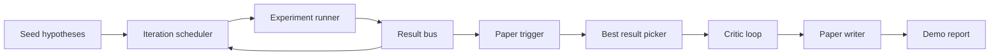
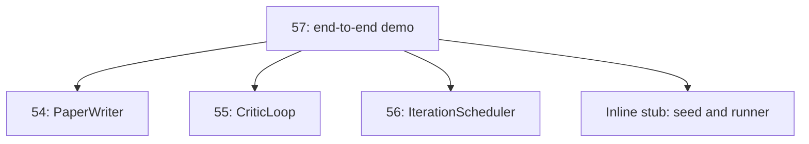
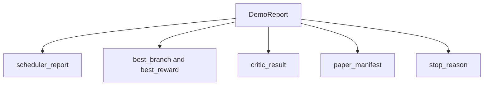

# 端到端研究 Demo

> Demo 是你之前写的每个 contract 必须组合在一起的地方。如果任何一个泄漏，demo 就是捕获它的课程。

**Type:** Build
**Languages:** Python
**Prerequisites:** Phase 19 lessons 50-53
**Time:** ~90 minutes

## 学习目标

- 端到端串联自动研究循环：假设种子、实验 runner、调度器、critic 循环、论文 writer。
- 通过普通 Python import 组合前四课 Track D 的原语，而非框架。
- 运行循环到自终止结束，并输出一份列出每个阶段输出的 demo 报告。
- 保持 demo 确定性，使测试套件可以断言最终形态。
- 当任何阶段的 contract 破坏时呈现清晰的失败模式，使下一阶段不会在破损输入上运行。

## 这里组合了什么



五个阶段。种子是三个假设的列表。调度器用三个并行槽位跨它们运行六个实验。Bus 报告一个或多个论文触发。Picker 选择单个最佳结果。Critic 循环在基于该结果构建的草稿上迭代。Paper writer 输出最终的 LaTeX、BibTeX 和 manifest。

## 为什么是 import，而不是 copy

每个前置课程提供一个 `main.py`，包含公开的 dataclasses 和函数。Demo 通过调整 `sys.path` 到每个课程的父目录来 import 它们。这不是框架接线；这与前置课程的测试文件已经使用的 import 方式相同。



Inline stub 代替第五十到五十三课：一个小型种子假设生成器和一个同步奖励函数。用户可以通过调整两个 import 将 inline stub 替换为那些课程的真实原语。

## 确定性保证

Demo 在构造上是确定性的。实验 runner 使用 seeded numpy。Critic 循环的 reviser 按固定顺序遍历固定维度。Paper writer 的 prose generator 是第五十四课的 mocked 版本。调度器的 UCB picker 按迭代顺序打破平局，而非随机选择。

给定相同的种子，demo 输出相同的报告。测试通过运行 demo 两次并比较 manifest 来断言此属性。

## Demo 报告形态



每个字段原样来自上游阶段。Demo 不转换任何输出；它组合它们。这就是 demo 所做的测试。

## 失败模式处理

每个阶段要么成功，要么抛出类型化错误。

```text
Scheduler ........ 返回带 stop_reason 的 SchedulerReport
                   stop_reason in {queue_empty, max_experiments, deadline}
Best-result pick . 如果没有论文触发则抛出 NoTriggerError
Critic loop ...... 返回带 status converged 或 stopped 的 LoopResult
Paper writer ..... 在 contract 破坏时抛出 PaperValidationError
```

任何阶段的失败都会以类型化异常短路 demo。测试固定了此 contract：`test_no_triggers_raises_typed_error` 和 `test_best_picker_raises_when_no_triggers` 断言当没有分支触发 trigger 时 picker 抛出 `NoTriggerError` / `BestResultError`，且 writer 永远不会被调用。

## 最佳结果选择器

调度器按分支发射论文触发。Picker 选择所有触发中平均奖励最高的分支。平局按 branch id 字母序打破以保持 demo 确定性。Picker 是一个小型纯函数；测试在固定的调度器报告上固定它。

## 接入 critic 循环

第五十五课的 critic 循环操作 `MiniPaper`。Demo 从选中的分支构建 `MiniPaper`：用 branch id 填充 abstract，种入两个 section（Introduction 和 Results），并根据分支的平均奖励设置 `originality_tag`（`>= 0.8` 为 high，`>= 0.6` 为 medium，否则为 low）。

然后 reviser 将草稿迭代到收敛。输出进入 paper writer。

## 接入 paper writer

第五十四课的 paper writer 操作完整的 `Paper` 形态，包含 figures 和 bibliography。Demo 通过 `mini_to_full_paper` 升级收敛的 `MiniPaper`，为选中的分支附加一个 figure，并从 critic 建议的 cite keys 的并集构建一个小型合成 bibliography。Demo 添加的每个 cite 也被添加到 bibliography 列表中，因此 validation 通过。

## 如何阅读代码

`code/main.py` 定义了 `BestResultError`、`NoTriggerError`、`DemoReport`、`pick_best_branch`、`build_mini_paper`、`mini_to_full_paper` 和 `run_demo`。顶部的 import 调整一次 `sys.path`，从各自课程中拉取 `PaperWriter`、`CriticLoop` 和 `IterationScheduler`。

`code/tests/test_e2e.py` 覆盖：demo 端到端运行并输出所有五个字段填充的报告、两次运行的确定性、没有分支超过阈值时的 NoTriggerError、writer 的 contract 破坏时的 PaperValidationError、paper manifest 包含选中分支的 figure、以及调度器 stop reason 是预期值之一。

## 进一步扩展

三个值得在 demo 通过后接入的扩展。第一，持久化状态：每个阶段的结果写入小型 JSON store，使重启可以恢复而无需重新运行廉价阶段。第二，dashboard：调度器和 critic 循环的 trace 事件渲染为单一时间线。第三，真实模型调用：将 mocked prose generator 和确定性 critic 替换为模型驱动的版本；接线不变。

Demo 的职责是证明组合就是架构。五课，四个 import，一份报告。下次你添加一个阶段时，接线恰好增长一行。
